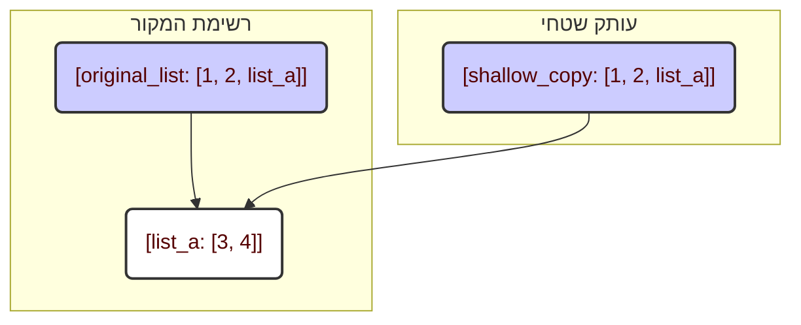
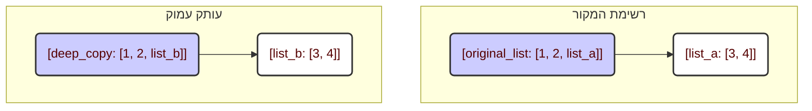

**מדוע נחוץ `copy`?**

בפייתון, כאשר מבצעים השמה של משתנה אחד למשתנה אחר (`list_b = list_a`), למעשה לא נוצר עותק חדש. במקום זאת, שני המשתנים מפנים לאותו אובייקט בזיכרון. משמעות הדבר היא שאם תשנה את `list_a`, השינויים יבואו לידי ביטוי גם ב-`list_b`. כדי להימנע מכך, עלינו ליצור *עותקים* של אובייקטים.

**שני סוגי העתקה**

מודול `copy` מספק שתי פונקציות עיקריות:

1.  `copy.copy()`: יוצר עותק *שטחי*.
2.  `copy.deepcopy()`: יוצר עותק *עמוק*.

ההבדל ביניהם נעוץ באופן הטיפול באובייקטים מקוננים (Nested objects), למשל, רשימות בתוך רשימות. כעת ננתח זאת בפירוט.

**העתקה שטחית (`copy.copy()`)**

העתקה שטחית יוצרת אובייקט חדש, אך היא מעתיקה רק *הפניות* לאובייקטים המקוננים. משמע, אם באובייקט המקור שלך יש, למשל, רשימה, אז בעותק תאוחסן *הפניה* לאותה רשימה בדיוק, ולא עותק שלה.

```python
import copy

# Исходный список
original_list = [1, 2, [3, 4]]

# Поверхностная копия
shallow_copy = copy.copy(original_list)

print(f"Исходный список: {original_list}")  # Выведет: Исходный список: [1, 2, [3, 4]]
print(f"Поверхностная копия: {shallow_copy}") # Выведет: Поверхностная копия: [1, 2, [3, 4]]

# Изменяем вложенный список в исходном объекте
original_list[2][0] = 5

print(f"Исходный список после изменения: {original_list}") # Выведет: Исходный список после изменения: [1, 2, [5, 4]]
print(f"Поверхностная копия после изменения: {shallow_copy}")  # Выведет: Поверхностная копия после изменения: [1, 2, [5, 4]]
```

כפי שניתן לראות, בעת שינוי הרשימה המקוננת ב-`original_list`, שינוי זה בא לידי ביטוי גם ב-`shallow_copy`. זאת מכיוון ששתי הרשימות מכילות *הפניה* לאותה רשימה מקוננת `[3, 4]`.

**העתקה עמוקה (`copy.deepcopy()`)**

העתקה עמוקה, בניגוד להעתקה שטחית, יוצרת באופן רקורסיבי עותקים חדשים של כל האובייקטים המקוננים. משמעות הדבר היא שאם יש לך רשימה בתוך רשימה, `deepcopy()` תיצור עותק עצמאי לחלוטין, לרבות כל האלמנטים המקוננים.

```python
import copy

# Исходный список
original_list = [1, 2, [3, 4]]

# Глубокая копия
deep_copy = copy.deepcopy(original_list)

print(f"Исходный список: {original_list}")  # Выведет: Исходный список: [1, 2, [3, 4]]
print(f"Глубокая копия: {deep_copy}")  # Выведет: Глубокая копия: [1, 2, [3, 4]]

# Изменяем вложенный список в исходном объекте
original_list[2][0] = 5

print(f"Исходный список после изменения: {original_list}") # Выведет: Исходный список после изменения: [1, 2, [5, 4]]
print(f"Глубокая копия после изменения: {deep_copy}")  # Выведет: Глубокая копия после изменения: [1, 2, [3, 4]]
```

במקרה זה, שינוי הרשימה המקוננת ב-`original_list` לא השפיע על `deep_copy`. זאת מכיוון ש-`deep_copy` יצרה עותק עצמאי לחלוטין של הרשימה המקוננת.

**מתי להשתמש בכל סוג העתקה?**

*   **`copy.copy()`** מתאים כאשר יש צורך להעתיק אובייקט, אך אין חשיבות לכך שאובייקטים מקוננים הניתנים לשינוי (mutable) יהיו משותפים. זה עשוי להיות מהיר יותר מ-`deepcopy()`, שכן אין צורך להעתיק כל אובייקט באופן רקורסיבי.
*   **`copy.deepcopy()`** נחוץ כאשר נדרשת עצמאות מלאה של העותק מהמקור, במיוחד אם האובייקט מכיל אובייקטים מקוננים הניתנים לשינוי, כגון רשימות או מילונים.

**דיאגרמה עבור העתקה שטחית:**



**דיאגרמה עבור העתקה עמוקה:**



בדיאגרמה הראשונה ניתן לראות שגם `original_list` וגם `shallow_copy` מפנים לאותה רשימה מקוננת `list_a`. ואילו בדיאגרמה השנייה, ל-`deep_copy` יש עותק עצמאי משלה של הרשימה המקוננת, `list_b`.