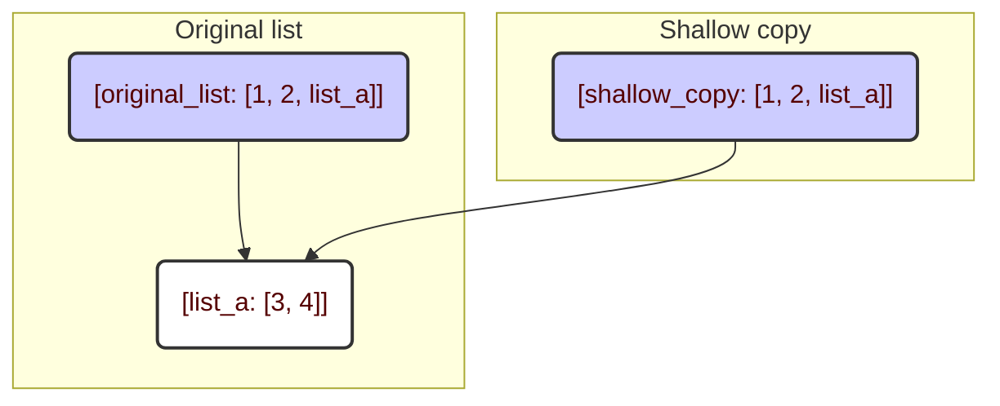
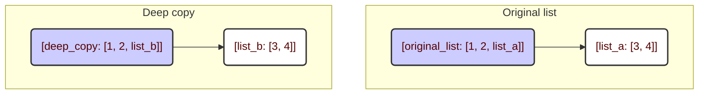

**מדוע נחוץ `copy`?**

בשפת Python, כאשר מקצים משתנה אחד למשתנה אחר (`list_b = list_a`), למעשה לא נוצרת עותק חדש. במקום זאת, שני המשתנים מפנים לאותו אובייקט בזיכרון. משמעות הדבר היא שאם משנים את `list_a`, השינויים ישתקפו גם ב־`list_b`. כדי להימנע מכך, עלינו ליצור *עותקים* של אובייקטים.

**שני סוגי העתקה**

המודול `copy` מספק שתי פונקציות עיקריות:

1.  `copy.copy()`: יוצר עותק *רדוד* (shallow copy).
2.  `copy.deepcopy()`: יוצר עותק *עמוק* (deep copy).

ההבדל ביניהם טמון באופן הטיפול באובייקטים מקוננים (לדוגמה, רשימות בתוך רשימות). כעת נפרט על כך.

**העתקה רדודה (`copy.copy()`)**

עותק רדוד יוצר אובייקט חדש, אך מעתיק רק את *ההפניות* לאובייקטים המקוננים. משמעות הדבר היא שאם באובייקט המקורי שלך קיימת, לדוגמה, רשימה, הרי שבעותק תישמר *הפניה* לאותה רשימה עצמה, ולא עותק שלה.

```python
import copy

# רשימה מקורית
original_list = [1, 2, [3, 4]]

# עותק רדוד
shallow_copy = copy.copy(original_list)

print(f"רשימה מקורית: {original_list}")  # פלט: רשימה מקורית: [1, 2, [3, 4]]
print(f"עותק רדוד: {shallow_copy}") # פלט: עותק רדוד: [1, 2, [3, 4]]

# שינוי הרשימה המקוננת באובייקט המקורי
original_list[2][0] = 5

print(f"רשימה מקורית לאחר שינוי: {original_list}") # פלט: רשימה מקורית לאחר שינוי: [1, 2, [5, 4]]
print(f"עותק רדוד לאחר שינוי: {shallow_copy}")  # פלט: עותק רדוד לאחר שינוי: [1, 2, [5, 4]]
```

כפי שניתן לראות, בעת שינוי הרשימה המקוננת ב־`original_list`, שינוי זה השתקף גם ב־`shallow_copy`. הסיבה לכך היא ששתי הרשימות מכילות *הפניה* לאותה רשימה מקוננת `[3, 4]`.

**העתקה עמוקה (`copy.deepcopy()`)**

עותק עמוק, בניגוד לעותק רדוד, יוצר באופן רקורסיבי עותקים חדשים של כל האובייקטים המקוננים. משמעות הדבר היא שאם קיימת רשימה בתוך רשימה, `deepcopy()` תיצור עותק בלתי תלוי לחלוטין, כולל כל האלמנטים המקוננים.

```python
import copy

# רשימה מקורית
original_list = [1, 2, [3, 4]]

# עותק עמוק
deep_copy = copy.deepcopy(original_list)

print(f"רשימה מקורית: {original_list}")  # פלט: רשימה מקורית: [1, 2, [3, 4]]
print(f"עותק עמוק: {deep_copy}")  # פלט: עותק עמוק: [1, 2, [3, 4]]

# שינוי הרשימה המקוננת באובייקט המקורי
original_list[2][0] = 5

print(f"רשימה מקורית לאחר שינוי: {original_list}") # פלט: רשימה מקורית לאחר שינוי: [1, 2, [5, 4]]
print(f"עותק עמוק לאחר שינוי: {deep_copy}")  # פלט: עותק עמוק לאחר שינוי: [1, 2, [3, 4]]
```

במקרה זה, שינוי הרשימה המקוננת ב־`original_list` לא השפיע על `deep_copy`. הסיבה לכך היא ש־`deep_copy` יצרה עותק בלתי תלוי לחלוטין של הרשימה המקוננת.

**מתי להשתמש בכל סוג העתקה?**

*   **`copy.copy()`** מתאים כאשר יש צורך להעתיק אובייקט, אך אין חשיבות לכך שאובייקטים מקוננים וניתנים לשינוי יהיו משותפים. זה עשוי להיות מהיר יותר מ־`deepcopy()`, שכן אין צורך להעתיק כל אובייקט באופן רקורסיבי.
*   **`copy.deepcopy()`** נחוץ כאשר נדרשת עצמאות מלאה של העותק מהמקור, במיוחד אם האובייקט מכיל אובייקטים מקוננים וניתנים לשינוי, כמו רשימות או מילונים.

**תרשים להעתקה רדודה:**



**תרשים להעתקה עמוקה:**



בתרשים הראשון ניתן לראות שגם `original_list` וגם `shallow_copy` מפנים לאותה רשימה מקוננת `list_a`. ואילו בתרשים השני ל־`deep_copy` יש עותק עצמאי משלה של הרשימה המקוננת, `list_b`.