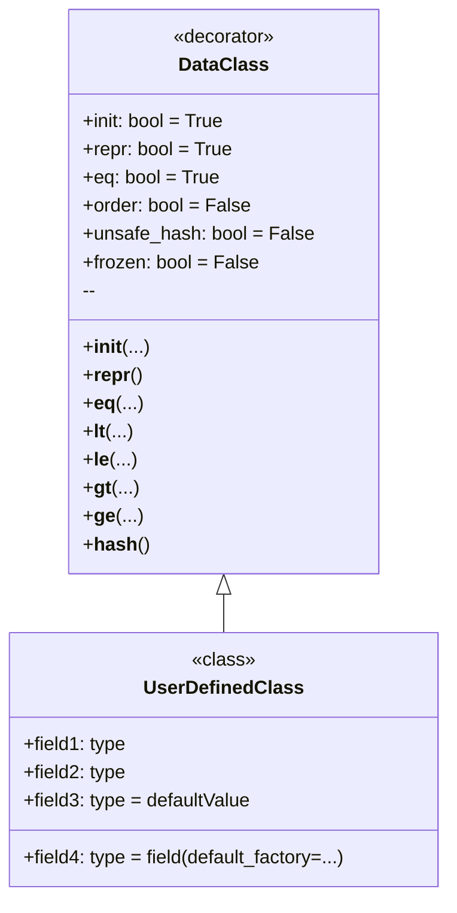

**מה זה `dataclass`?**

`dataclass` הוא דקורטור שהוצג ב-Python 3.7, אשר מייצר באופן אוטומטי שיטות מיוחדות (כגון `__init__`, `__repr__`, `__eq__` ואחרות) עבור מחלקות שמשמשות בעיקר כמיכלים לנתונים. זה חוסך לך את הצורך לכתוב הרבה קוד שבלוני.

**למה להשתמש ב-`dataclass`?**

1.  **קיצור קוד:** במקום להגדיר ידנית את השיטות `__init__`, `__repr__`, `__eq__` וכו', אתה פשוט מצהיר על שדות הנתונים, ו-`dataclass` יעשה את כל השאר.
2.  **שיפור קריאות:** המחלקות הופכות לתמציתיות וברורות יותר, מכיוון שהן מתרכזות בנתונים ולא במימוש הטכני.
3.  **הפחתת שגיאות:** קוד שנוצר אוטומטית הוא בדרך כלל אמין יותר מקוד שנכתב ידנית.
4.  **האצת פיתוח:** אתה יכול ליצור מחלקות לעבודה עם נתונים מהר יותר, מבלי לבזבז זמן על רוטינה.

**איך להשתמש ב-`dataclass`?**

ראשית, עליך לייבא את הדקורטור `dataclass` מהמודול `dataclasses`:

```python
from dataclasses import dataclass
```

לאחר מכן, אתה מסמן את המחלקה באמצעות הדקורטור `@dataclass`, ומגדיר את שדות הנתונים כמשתני מחלקה רגילים עם הערות טיפוסים:

```python
from dataclasses import dataclass

@dataclass
class Point:
    x: int
    y: int
```

בדוגמה זו, `Point` היא `dataclass` שיש לה שני שדות: `x` ו-`y`, שניהם מטיפוס שלם. `dataclass` ייצור אוטומטית:
*   קונסטרוקטור `__init__`, המאפשר יצירת מופעי מחלקה, למשל `Point(1, 2)`.
*   `__repr__`, המחזיר ייצוג מחרוזתי של האובייקט, למשל `Point(x=1, y=2)`.
*   `__eq__`, המאפשר השוואת אובייקטים, למשל `Point(1, 2) == Point(1, 2)`.

**דוגמה לשימוש פשוט**
```python
from dataclasses import dataclass

@dataclass
class Point:
    x: int
    y: int

# יצירת מופע של המחלקה
point1 = Point(1, 2)
point2 = Point(1, 2)
point3 = Point(3, 4)

# הדפסה למסך
print(point1) # יודפס: Point(x=1, y=2)
print(point1 == point2) # יודפס: True
print(point1 == point3) # יודפס: False
```

**אפשרויות של `dataclass`**

`dataclass` מספק מספר פרמטרים להתאמת ההתנהגות:

*   `init`: אם `True` (ברירת מחדל), שיטת `__init__` נוצרת. אם `False`, שיטת `__init__` אינה נוצרת.
*   `repr`: אם `True` (ברירת מחדל), שיטת `__repr__` נוצרת. אם `False`, שיטת `__repr__` אינה נוצרת.
*   `eq`: אם `True` (ברירת מחדל), שיטת `__eq__` נוצרת. אם `False`, שיטת `__eq__` אינה נוצרת.
*   `order`: אם `True`, נוצרות שיטות השוואה (`__lt__`, `__le__`, `__gt__`, `__ge__`). ברירת המחדל היא `False`.
*   `unsafe_hash`: אם `False` (ברירת מחדל), שיטת `__hash__` אינה נוצרת. אם `True`, שיטת `__hash__` תינוצר, ו-`dataclass` יהפוך להפיך ל-hash.
*   `frozen`: אם `True`, מופעי המחלקה יהיו בלתי ניתנים לשינוי (read-only). ברירת המחדל היא `False`.

**דוגמאות לשימוש בפרמטרים**
1. ניטרול שיטת `__repr__` והפיכת המחלקה לבלתי ניתנת לשינוי
```python
from dataclasses import dataclass

@dataclass(repr=False, frozen=True)
class Point:
    x: int
    y: int

# יצירת מופע של המחלקה
point1 = Point(1, 2)
# הדפסה למסך
print(point1) # יודפס: <__main__.Point object at 0x000001D8322F6770> (מכיוון ש- __repr__ אינה מוגדרת)

# שינוי מופע יגרום לשגיאה
try:
    point1.x = 10
except Exception as e:
    print (e) # יודפס: cannot assign to field 'x'
```
2. הגדרת סדר, הוספת שיטת hash והפיכת המחלקה לבלתי ניתנת לשינוי
```python
from dataclasses import dataclass

@dataclass(order=True, unsafe_hash=True, frozen=True)
class Point:
    x: int
    y: int

# יצירת מופע של המחלקה
point1 = Point(1, 2)
point2 = Point(3, 4)
point3 = Point(1, 2)
# הדפסה למסך
print(point1 < point2) # יודפס: True
print(point1 == point3) # יודפס: True

# כעת ניתן להשתמש במחלקה כמפתח במילון
my_dict = {point1: "first", point2: "second"}
print(my_dict) # יודפס: {Point(x=1, y=2): 'first', Point(x=3, y=4): 'second'}
```

**ערכי ברירת מחדל**

אתה יכול להגדיר ערכי ברירת מחדל עבור שדות:

```python
from dataclasses import dataclass

@dataclass
class Point:
    x: int = 0
    y: int = 0

# יצירת מופע של המחלקה
point1 = Point()
point2 = Point(1, 2)

# הדפסה למסך
print(point1) # יודפס: Point(x=0, y=0)
print(point2) # יודפס: Point(x=1, y=2)
```
בעת יצירת מופע של המחלקה, אם ערכים אינם מועברים, ייעשה שימוש בערך ברירת המחדל.

**שימוש ב-`dataclass` עם טיפוסים ניתנים לשינוי**

היה זהיר בעת שימוש בטיפוסי נתונים ניתנים לשינוי (רשימות, מילונים) כערכי ברירת מחדל. הם ייווצרו רק פעם אחת וישמשו את כל מופעי המחלקה:

```python
from dataclasses import dataclass
from typing import List

@dataclass
class BadExample:
    items: List[int] = []

bad1 = BadExample()
bad2 = BadExample()

bad1.items.append(1)
print (bad1.items) # יודפס: [1]
print (bad2.items) # יודפס: [1]
```
בדוגמה לעיל, שינויים ב-`bad1.items` משתקפים גם ב-`bad2.items`. זה קורה מכיוון ששני מופעי המחלקה משתמשים באותה רשימה של ברירת מחדל.

כדי להימנע מכך, השתמש ב-`dataclasses.field` וב-`default_factory`:
```python
from dataclasses import dataclass, field
from typing import List

@dataclass
class GoodExample:
    items: List[int] = field(default_factory=list)

good1 = GoodExample()
good2 = GoodExample()

good1.items.append(1)
print (good1.items) # יודפס: [1]
print (good2.items) # יודפס: []
```
במקרה זה, `default_factory=list` תיצור רשימה ריקה חדשה עבור כל מופע מחלקה חדש.

**דיאגרמה**

להלן דיאגרמה המציגה את המושגים העיקריים של `dataclass`:



בדיאגרמה זו:
*   `DataClass` מייצג את הדקורטור `@dataclass` ואת פרמטריו.
*   `UserDefinedClass` — זו המחלקה שאתה מצהיר עליה באמצעות הדקורטור `@dataclass`.
*   החץ מ-`DataClass` ל-`UserDefinedClass` מראה ש-`DataClass` מיושם על `UserDefinedClass`.