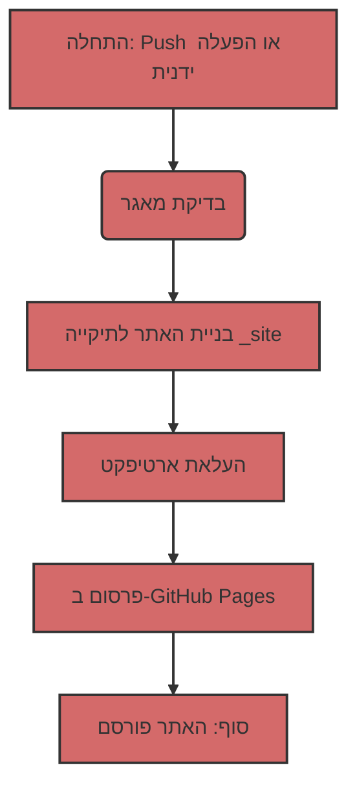

## פריסה אוטומטית של אתר Jekyll ב-GitHub Pages

כדי להפוך את תהליך הפריסה לאוטומטי, נשתמש ב-GitHub Actions, המאפשר לבצע מגוון משימות, כולל בנייה ופרסום אתרים, ישירות במאגר שלך.

### 1: סקירת קובץ Workflow
ראשית, בואו נסקור את קובץ ה-workflow הראשי שמנהל את תהליך הבנייה והפריסה. קובץ זה כתוב בשפת YAML ובדרך כלל ממוקם בתיקייה `.github/workflows`. הנה תוכנו:

```yaml
# Sample workflow for building and deploying a Jekyll site to GitHub Pages
name: Deploy Jekyll with GitHub Pages dependencies preinstalled

on:
  # Runs on pushes targeting the default branch
  push:
    branches: ["master"]

  # Allows you to run this workflow manually from the Actions tab
  workflow_dispatch:

# Sets permissions of the GITHUB_TOKEN to allow deployment to GitHub Pages
permissions:
  contents: read
  pages: write
  id-token: write

# Allow only one concurrent deployment, skipping runs queued between the run in-progress and latest queued.
# However, do NOT cancel in-progress runs as we want to allow these production deployments to complete.
concurrency:
  group: "pages"
  cancel-in-progress: false

jobs:
  # Build job
  build:
    runs-on: ubuntu-latest
    steps:
      - name: Checkout
        uses: actions/checkout@v4
      - name: Setup Pages
        uses: actions/configure-pages@v5
      - name: Build with Jekyll
        uses: actions/jekyll-build-pages@v1
        with:
          source: ./docs/gemini/consultant/ru/src
          destination: ./_site
      - name: Upload artifact
        uses: actions/upload-pages-artifact@v3

  # Deployment job
  deploy:
    environment:
      name: github-pages
      url: ${{ steps.deployment.outputs.page_url }}
    runs-on: ubuntu-latest
    needs: build
    steps:
      - name: Deploy to GitHub Pages
        id: deployment
        uses: actions/deploy-pages@v4
```

### 2: פירוק מבנה ה-Workflow
כעת נפרוק כל חלק בקובץ זה:

#### 2.1. מידע כללי

-   `name: Deploy Jekyll with GitHub Pages dependencies preinstalled`: שם ה-workflow, כפי שיופיע ברשימת Actions במאגר.
-   `on`: מתאר מתי ה-workflow צריך לפעול:
    -   `push`: ה-workflow פועל בכל push לענף `master`.
    -   `workflow_dispatch`: מאפשר הפעלה ידנית של ה-workflow דרך ממשק GitHub.
-   `permissions`: מגדיר הרשאות להפעלת ה-workflow:
    -   `contents: read`: הרשאה לקרוא את הקוד מהמאגר.
    -   `pages: write`: הרשאה לפרסם ב-GitHub Pages.
    -   `id-token: write`: הרשאה לקבלת אסימון אימות (נדרש עבור GitHub Actions).
-   `concurrency`: מגדיר ביצוע מקביל של ה-workflow:
    -   `group: "pages"`: מבטיח שרק workflow אחד עבור GitHub Pages יפעל בכל רגע נתון.
    -   `cancel-in-progress: false`: מונע ביטול של הפעלת workflow נוכחית בהפעלה חדשה.

#### 2.2. סעיף `jobs`
סעיף זה מתאר אילו משימות יש לבצע. יש לנו שני jobs: `build` ו-`deploy`.

##### 2.2.1. `build`: בניית האתר
    -   `runs-on: ubuntu-latest`: מציין שה-job יבוצע על שרת עם Ubuntu.
    -   `steps`: מפרט את הצעדים שיבוצעו במהלך הבנייה:
        -   `name: Checkout`: שולף את קוד המקור של המאגר.
        -   `uses: actions/checkout@v4`: משתמש בפעולה מוכנה לשליפת הקוד.
        -   `name: Setup Pages`: מגדיר את הסביבה לעבודה עם GitHub Pages.
        -   `uses: actions/configure-pages@v5`: משתמש בפעולה מוכנה להגדרת התצורה.
        -   `name: Build with Jekyll`: מפעיל את בניית אתר ה-Jekyll.
        -   `uses: actions/jekyll-build-pages@v1`: משתמש בפעולה מוכנה לבנייה.
        -   `with:`: מגדיר פרמטרים עבור הפעולה:
            -   `source: ./docs/gemini/consultant/ru/src`: מציין היכן נמצאים קבצי המקור של האתר שלך. **שים לב**: הנתיב לקבצים שלך הוא `docs/gemini/consultant/ru/src`
            -   `destination: ./_site`: מציין היכן למקם את הקבצים שנבנו.
        -   `name: Upload artifact`: מעלה את הקבצים שנבנו כדי להעביר אותם ל-job הבא.
        -   `uses: actions/upload-pages-artifact@v3`: משתמש בפעולה מוכנה להעלאת ארטיפקטים.

##### 2.2.2. `deploy`: פרסום האתר
    -   `environment`: מגדיר את סביבת הפרסום.
        -   `name: github-pages`: שם הסביבה.
        -   `url: ${{ steps.deployment.outputs.page_url }}`: מקבל את ה-URL של האתר המפורסם.
    -   `runs-on: ubuntu-latest`: מציין שה-job יבוצע על שרת עם Ubuntu.
    -   `needs: build`: מציין שה-job `deploy` יופעל רק לאחר שה-job `build` יסתיים בהצלחה.
    -   `steps`: מפרט את הצעדים שיבוצעו במהלך הפרסום:
        -   `name: Deploy to GitHub Pages`: מבצע את פרסום האתר ב-GitHub Pages.
        -   `id: deployment`: מגדיר מזהה עבור הצעד.
        -   `uses: actions/deploy-pages@v4`: משתמש בפעולה מוכנה לפריסה.

### 3: מה עושים קבצי Markdown?

קבצים עם הסיומת `.md` (Markdown) הם הבסיס לאתר Jekyll. Markdown היא שפת סימון פשוטה המאפשרת לך לעצב טקסט.
Jekyll מעבד אוטומטית קבצי `.md` והופך אותם לדפי HTML. הקבצים שלך צריכים להיות ממוקמים בתיקייה המצוינת ב-workflow, `docs/gemini/consultant/ru/src`.

### 4: תרשים זרימה



### 5: איך זה עובד
1.  **שינוי קוד:** אתה מבצע שינויים בקבצי `.md` או `.html` שלך, הנמצאים בתיקייה `docs/gemini/consultant/ru/src`.
2.  **Push:** אתה שולח (push) את השינויים לענף `master` במאגר שלך ב-GitHub.
3.  **הפעלת Workflow:** GitHub Actions מפעיל אוטומטית את ה-workflow המתואר בקובץ ה-YAML.
4.  **בנייה:** ה-workflow מוריד תחילה את הקוד מהמאגר, ולאחר מכן בונה את אתר ה-Jekyll מקבצי המקור שלך לתוך התיקייה `_site`.
5.  **פרסום:** האתר שנבנה מפורסם ב-GitHub Pages.
6.  **האתר מוכן:** לאחר מכן, האתר שלך זמין ב-URL המוגדר בהגדרות GitHub Pages.