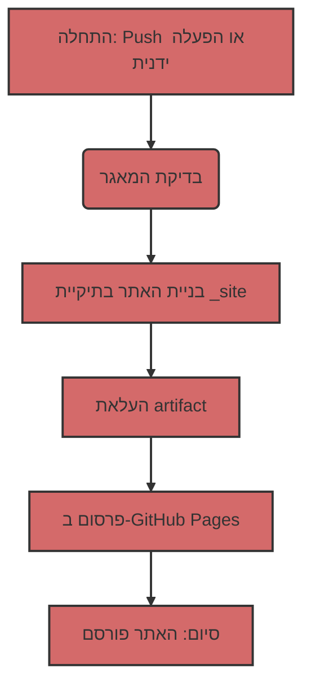

הנחיה מערכתית למודל שפה: התרגום בוצע בהתאם להנחיות שסופקו, תוך שמירה על קטעי קוד מקוריים, תרגום הערות קוד והטקסט הכללי לעברית אקדמית וברורה, ושמירה על מבנה המסמך.

---

## פריסה אוטומטית של אתר Jekyll ב-GitHub Pages

לצורך אוטומציה של תהליך הפריסה נשתמש ב-GitHub Actions, המאפשרים לבצע מגוון משימות, לרבות בנייה ופרסום אתרים, ישירות במאגר ה-repo שלך.

### 1: סקירת קובץ ה-Workflow
ראשית, הבה נסקור את קובץ ה-workflow הראשי, המנהל את תהליך הבנייה והפריסה. קובץ זה כתוב בשפת YAML, ובדרך כלל נמצא בתיקיית `.github/workflows`. להלן תוכנו:

```yaml
# Sample workflow for building and deploying a Jekyll site to GitHub Pages
name: Deploy Jekyll with GitHub Pages dependencies preinstalled

on:
  # Runs on pushes targeting the default branch
  push:
    branches: ["master"]

  # Allows you to run this workflow manually from the Actions tab
  workflow_dispatch:

# Sets permissions of the GITHUB_TOKEN to allow deployment to GitHub Pages
permissions:
  contents: read
  pages: write
  id-token: write

# Allow only one concurrent deployment, skipping runs queued between the run in-progress and latest queued.
# However, do NOT cancel in-progress runs as we want to allow these production deployments to complete.
concurrency:
  group: "pages"
  cancel-in-progress: false

jobs:
  # Build job
  build:
    runs-on: ubuntu-latest
    steps:
      - name: Checkout
        uses: actions/checkout@v4
      - name: Setup Pages
        uses: actions/configure-pages@v5
      - name: Build with Jekyll
        uses: actions/jekyll-build-pages@v1
        with:
          source: ./docs/gemini/consultant/ru/src
          destination: ./_site
      - name: Upload artifact
        uses: actions/upload-pages-artifact@v3

  # Deployment job
  deploy:
    environment:
      name: github-pages
      url: ${{ steps.deployment.outputs.page_url }}
    runs-on: ubuntu-latest
    needs: build
    steps:
      - name: Deploy to GitHub Pages
        id: deployment
        uses: actions/deploy-pages@v4
```

### 2: פירוק מבנה ה-Workflow
כעת נפרק כל סעיף בקובץ זה:

#### 2.1. מידע כללי

-   `name: Deploy Jekyll with GitHub Pages dependencies preinstalled`: שם ה-workflow שיופיע ברשימת ה-Actions ב-repo.
-   `on`: מתאר מתי ה-workflow אמור לרוץ:
    -   `push`: ה-workflow רץ בכל push לענף ה-`master`.
    -   `workflow_dispatch`: מאפשר לך להריץ את ה-workflow ידנית דרך ממשק ה-GitHub.
-   `permissions`: מגדיר הרשאות עבור פעולת ה-workflow:
    -   `contents: read`: הרשאה לקרוא קוד מה-repo.
    -   `pages: write`: הרשאה לפרסם ב-GitHub Pages.
    -   `id-token: write`: הרשאה לקבלת token אימות (נדרש עבור GitHub Actions).
-   `concurrency`: מגדיר הפעלה מקבילה של ה-workflow:
    -   `group: "pages"`: מבטיח שרק workflow אחד עבור GitHub Pages ירוץ בכל פעם.
    -   `cancel-in-progress: false`: מונע ביטול של ריצת workflow נוכחית בעת הפעלה חדשה.

#### 2.2. סעיף `jobs`
סעיף זה מתאר אילו משימות יש לבצע. יש לנו שני jobs: `build` ו-`deploy`.

##### 2.2.1. `build`: בניית האתר
    -   `runs-on: ubuntu-latest`: מציין שה-job ירוץ על שרת עם Ubuntu.
    -   `steps`: מפרט את ה-steps שיבוצעו בעת הבנייה:
        -   `name: Checkout`: מוריד את קוד המקור של ה-repo.
        -   `uses: actions/checkout@v4`: משתמש ב-action מוכן להורדת קוד.
        -   `name: Setup Pages`: מגדיר את הסביבה לעבודה עם GitHub Pages.
        -   `uses: actions/configure-pages@v5`: משתמש ב-action מוכן להגדרה.
        -   `name: Build with Jekyll`: מפעיל את בניית אתר ה-Jekyll.
        -   `uses: actions/jekyll-build-pages@v1`: משתמש ב-action מוכן לבנייה.
        -   `with:`: מגדיר פרמטרים עבור ה-action:
            -   `source: ./docs/gemini/consultant/ru/src`: מציין היכן נמצאים קבצי המקור של האתר שלך. **שים לב**: הנתיב לקבצים שלך הוא `docs/gemini/consultant/ru/src`.
            -   `destination: ./_site`: מציין היכן למקם את הקבצים הבנויים.
        -   `name: Upload artifact`: מעלה את הקבצים הבנויים כדי להעביר אותם ל-job הבא.
        -   `uses: actions/upload-pages-artifact@v3`: משתמש ב-action מוכן להעלאת artifacts.

##### 2.2.2. `deploy`: פרסום האתר
    -   `environment`: מגדיר את הסביבה לפרסום.
        -   `name: github-pages`: שם הסביבה.
        -   `url: ${{ steps.deployment.outputs.page_url }}`: מקבל את ה-URL של האתר שפורסם.
    -   `runs-on: ubuntu-latest`: מציין שה-job ירוץ על שרת עם Ubuntu.
    -   `needs: build`: מציין שה-job `deploy` אמור להתחיל רק לאחר השלמה מוצלחת של job `build`.
    -   `steps`: מפרט את ה-steps שיבוצעו בעת הפרסום:
        -   `name: Deploy to GitHub Pages`: מבצע את פרסום האתר ב-GitHub Pages.
        -   `id: deployment`: מגדיר מזהה עבור ה-action.
        -   `uses: actions/deploy-pages@v4`: משתמש ב-action מוכן לדפלויי.

### 3: מה עושים קובצי Markdown?

קבצים עם סיומת `.md` (Markdown) הם הבסיס לאתר ה-Jekyll. Markdown היא שפת סימון פשוטה המאפשרת לך לעצב טקסט.
Jekyll מעבד אוטומטית קבצי `.md`, והופך אותם לדפי HTML. הקבצים שלך צריכים להיות ממוקמים בתיקייה שצוינה ב-workflow: `docs/gemini/consultant/ru/src`.

### 4: דיאגרמת זרימה



### 5: איך זה עובד
1.  **שינוי קוד:** אתה מבצע שינויים בקבצי `.md` או `.html` שלך, שנמצאים בתיקייה `docs/gemini/consultant/ru/src`.
2.  **Push:** אתה שולח (push) את השינויים לענף ה-`master` של ה-repo שלך ב-GitHub.
3.  **הפעלת ה-Workflow:** GitHub Actions מפעיל אוטומטית את ה-workflow, המתואר בקובץ ה-YAML.
4.  **בנייה:** ה-workflow מוריד תחילה את הקוד מה-repo, ואז בונה את אתר ה-Jekyll מקבצי המקור שלך לתוך תיקיית `_site`.
5.  **פרסום:** האתר הבנוי מתפרסם ב-GitHub Pages.
6.  **האתר מוכן:** לאחר מכן, האתר שלך זמין דרך ה-URL שצוין בהגדרות GitHub Pages.