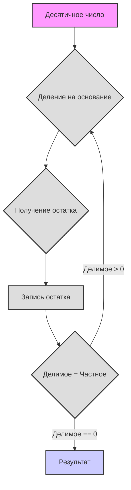

# שיטות ספירה

שלום! אנו מתחילים את הצלילה שלנו לעולם המרתק של שיטות הספירה. התכונן, היום תלמד דברים חדשים ומעניינים!

# שיטות ספירה

**1. שיטת ספירה מופשטת**

דמיין שמספרים הם כמו מילים, שניתן לרשום באמצעות "אותיות" שונות. אין חשיבות לאופן שבו אנו מסמנים את המספרים, העיקר הוא הקפדה על כללים מסוימים:

*   **בסיס:** זוהי כמות הסמלים (הספרות) הייחודיים שבהם אנו משתמשים. נסמן את הבסיס ב-`b`. לדוגמה, בשיטה העשרונית הבסיס הוא 10.
*   **ספרות:** אלו הסמלים שבהם אנו משתמשים כדי לרשום מספרים. בדרך כלל אלו הספרות הערביות (0, 1, 2, 3, ...), אך יכולים להיות גם סמלים אחרים, למשל אותיות לטיניות (I, V, X) או אפילו פירות (🍎, 🍐, 🍉).
*   **מיקום:** לכל ספרה ברישום המספר יש את המיקום שלה, המשפיע על ערכה. משמעות הדבר היא שאותה ספרה יכולה להיות בעלת ערך שונה בהתאם למקומה במספר.
*   **סדרות (מקומות):** כל מיקום נקרא סדרה (לדוגמה, יחידות, עשרות, מאות וכו'). בכל מיקום ערך הספרה מוכפל בבסיס בחזקה התואמת את מספר הסדרה.

**כיצד נבנית שיטת ספירה?**

1.  **בחירת בסיס:** אנו בוחרים מספר שלם `b`, שיהיה בסיס השיטה שלנו.
2.  **בחירת ספרות:** אנו זקוקים ל-`b` ספרות ייחודיות. בדרך כלל אלו 0, 1, 2, ..., `b-1`. לדוגמה, עבור השיטה הבינארית (בסיס 2) יש לנו ספרות 0 ו-1.
3.  **רישום מספר:** המספר נרשם כרצף של ספרות. ערכה של כל ספרה מוכפל בבסיס בחזקה השווה למיקומה (החל מ-0 מימין).

**נוסחה לחישוב ערך של מספר:**

אם יש לנו מספר הרשום ברצף ספרות `dₙ dₙ₋₁ ... d₁ d₀`, אז ניתן לחשב את ערכו בשיטה העשרונית לפי הנוסחה:

`ערך = dₙ * bⁿ + dₙ₋₁ * bⁿ⁻¹ + ... + d₁ * b¹ + d₀ * b⁰`

כאשר:

*   `dᵢ` - הספרה בסדרה i
*   `b` - בסיס שיטת הספירה
*   `i` - מספר הסדרה (מימין לשמאל, החל מ-0)

**דוגמה:**

נניח שיש לנו את המספר 123 בשיטה העשרונית (בסיס 10). לפי הנוסחה:

`1 * 10² + 2 * 10¹ + 3 * 10⁰ = 100 + 20 + 3 = 123`

**סדרי ספירה (מקומות):**

סדרים, כפי שכבר אמרנו, הם מיקומי הספרות במספר, לכל מיקום יש משקל משלו, הנקבע על ידי הבסיס בחזקת מספרו הסידורי.
*   `d₀`: יחידות (`b⁰`)
*   `d₁`: `b` (`b¹`)
*   `d₂`: `b²`
*   `d₃`: `b³`
*   וכך הלאה

**כללים:**

1.  **טווח ספרות:** משתמשים בספרות מ-0 עד `b-1`.
2.  **עיקרון מיקום:** ערך הספרה תלוי במיקומה.
3.  **מעבר לסדרה הבאה:** כאשר בסדרה מושג הערך `b`, מתבצע מעבר לסדרה הבאה (אנלוגי לאופן שבו אחרי 9 בשיטה העשרונית מוסיפים 1 לסדרה הבאה ומקבלים 10).

## דוגמה: שיטת ספירת פירות

בואו נבחן דוגמה לשיטת ספירה מופשטת עם פירות:

*   🍎 (תפוח)
*   🍐 (אגס)
*   🍉 (אבטיח)
*   🧺 (סלסלה)

**כללים:**

1.  3 🍎 = 1 🍐
2.  5 🍐 = 3 🍉
3.  2 🍉 = 1 🧺

**ייצוג מספרים:**

אנו נייצג את כמות הפירות כמחרוזת, כאשר כל תו יוניקוד מתאים לפרי אחד. לדוגמה, "🍎🍎🍎" - זה 3 תפוחים, ו-"🍉🍉" - זה 2 אבטיחים.

**פעולות חשבון:**

אנו יכולים לבצע פעולות חיבור וחיסור. ראשית, נבצע חיבור.

**Python Code:**

```python
def normalize_fruits(fruits: str) -> str:
    """
    מנרמל מחרוזת פירות, ומביא אותה לייצוג מינימלי,
    באמצעות כללי החלפת הפירות.

    Args:
        fruits: מחרוזת עם פירות (🍎, 🍐, 🍉, 🧺).

    Returns:
        מחרוזת עם כמות מנורמלת של פירות.
    """
    apples = fruits.count('🍎')
    pears = fruits.count('🍐')
    melons = fruits.count('🍉')
    baskets = fruits.count('🧺')

    # המרת תפוחים לאגסים
    pears += apples // 3
    apples %= 3

    # המרת אגסים לאבטיחים
    melons += (pears * 3) // 5
    pears %= 5

    # המרת אבטיחים לסלסלות
    baskets += melons // 2
    melons %= 2

    # מרכיבים את המחרוזת בחזרה, קודם סלסלות, אחר כך אבטיחים, אגסים, תפוחים
    return (
        "🧺" * baskets
        + "🍉" * melons
        + "🍐" * pears
        + "🍎" * apples
    )


def add_fruits(fruits1: str, fruits2: str) -> str:
    """
    מחבר שתי מחרוזות פירות.

    Args:
        fruits1: מחרוזת עם פירות.
        fruits2: מחרוזת עם פירות.

    Returns:
        מחרוזת עם סכום הפירות.
    """
    return normalize_fruits(fruits1 + fruits2)


def sub_fruits(fruits1: str, fruits2: str) -> str:
    """
    מחסיר את מחרוזת הפירות השנייה מהראשונה, אם הדבר אפשרי.

    Args:
        fruits1: מחרוזת עם פירות, ממנה מחסירים.
        fruits2: מחרוזת עם פירות, אותה מחסירים.

    Returns:
        מחרוזת עם הפרש הפירות או "Cannot subtract" אם התוצאה שלילית.
    """

    apples1 = fruits1.count('🍎')
    pears1 = fruits1.count('🍐')
    melons1 = fruits1.count('🍉')
    baskets1 = fruits1.count('🧺')

    apples2 = fruits2.count('🍎')
    pears2 = fruits2.count('🍐')
    melons2 = fruits2.count('🍉')
    baskets2 = fruits2.count('🧺')


    # ייצוג זמני ככמות כוללת של תפוחים
    total_apples1 = apples1 + pears1 * 3 + melons1 * 15 // 3 + baskets1 * 30
    total_apples2 = apples2 + pears2 * 3 + melons2 * 15 // 3 + baskets2 * 30

    if total_apples1 < total_apples2:
        return "Cannot subtract"
    else:
        total_apples = total_apples1 - total_apples2

    # מחזירים ייצוג מנורמל של סכום התפוחים
    result_fruits = ""
    baskets = total_apples // 30
    result_fruits += "🧺" * baskets
    total_apples %= 30
    melons = (total_apples*3) // 15
    result_fruits += "🍉" * melons
    total_apples %= 15
    pears = total_apples // 3
    result_fruits += "🍐" * pears
    total_apples %= 3
    result_fruits += "🍎" * total_apples

    return normalize_fruits(result_fruits)


# דוגמאות:
fruits1 = "🍎🍎🍎🍎🍎" # 5 תפוחים
fruits2 = "🍎🍎🍎" # 3 תפוחים
print(f"{fruits1} + {fruits2} = {add_fruits(fruits1, fruits2)}")

fruits3 = "🍐🍐"  # 2 אגסים
fruits4 = "🍎🍎🍎🍎" # 4 תפוחים
print(f"{fruits3} + {fruits4} = {add_fruits(fruits3, fruits4)}")

fruits5 = "🍉🍉" # 2 אבטיחים
fruits6 = "🍎🍎🍎🍎🍎🍎🍎🍎🍎🍎🍎🍎🍎🍎🍎" # 15 תפוחים
print(f"{fruits5} + {fruits6} = {add_fruits(fruits5, fruits6)}")

fruits7 = "🧺🧺" # 2 סלסלות
fruits8 = "🍉🍉🍉" # 3 אבטיחים
print(f"{fruits7} + {fruits8} = {add_fruits(fruits7, fruits8)}")

fruits9 = "🧺🍉🍐🍎" # 1 סלסלה, 1 אבטיח, 1 אגס, 1 תפוח
fruits10 = "🍉🍐🍎" # 1 אבטיח, 1 אגס, 1 תפוח
print(f"{fruits9} - {fruits10} = {sub_fruits(fruits9, fruits10)}")

fruits11 = "🧺🍉" # 1 סלסלה, 1 אבטיח
fruits12 = "🧺🍉🍎🍎🍎" # 1 סלסלה, 1 אבטיח, 3 תפוחים
print(f"{fruits11} - {fruits12} = {sub_fruits(fruits11, fruits12)}")

fruits13 = "🍉🍉🍉" # 3 אבטיחים
fruits14 = "🍎🍎🍎🍎" # 4 תפוחים
print(f"{fruits13} - {fruits14} = {sub_fruits(fruits13, fruits14)}")

fruits15 = "🍐🍐🍐🍐🍐" # 5 אגסים
fruits16 = "🍉" # 1 אבטיח
print(f"{fruits15} - {fruits16} = {sub_fruits(fruits15, fruits16)}")
```

**הסבר הקוד:**

1.  **`normalize_fruits(fruits)`:** פונקציה זו ממירה את מחרוזת הפירות לצורה המינימלית ביותר. היא סופרת תחילה את כמות כל פרי, ולאחר מכן, באמצעות כללי ההחלפה, ממירה אותם ליחידות גדולות יותר (תפוחים לאגסים, אגסים לאבטיחים, אבטיחים לסלסלות), ולאחר ההמרה מחזירה מחרוזת עם סט מינימלי של פירות.
2.  **`add_fruits(fruits1, fruits2)`:** פונקציה זו מבצעת חיבור של שתי מחרוזות פירות. היא פשוט מחברת את שתי המחרוזות (שרשור) ולאחר מכן מנרמלת את התוצאה.
3.  **`sub_fruits(fruits1, fruits2)`:** זוהי פונקציה לחיסור מחרוזת פירות אחת מהשנייה. היא ממירה הכל ל"כמות תפוחים" ולאחר מכן מבצעת את החיסור, ואז ממירה בחזרה את התפוחים לצורה מנורמלת, תוך כדי בדיקת אפשרות החיסור.
4.  **דוגמאות:** בסוף הקוד ניתנות דוגמאות לחיבור וחיסור עם שילובים שונים של פירות והצגת התוצאות.

**משימות:**

1.  נסה להוסיף לקוד פונקציה לכפל פירות במספר שלם (לדוגמה, `multiply_fruits(fruits, n)`).
2.  יישם פונקציה `compare_fruits(fruits1, fruits2)`, המשווה שתי מחרוזות פירות ומחזירה "גדול מ", "קטן מ" או "שווה ל".
3.  המצא כללים משלך להחלפת פירות ושנה את הקוד בהתאם.
4.  הוסף בדיקת תקינות קלט (כדי שהמחרוזת תכיל רק תווי יוניקוד מותרים).
5.  יישם חיסור מתקדם יותר, לדוגמה, לא להחזיר שגיאה "Cannot subtract" אלא להציג תוצאה עם סימן מינוס (משימה מורכבת).

## 2. שיטות ספירה ספציפיות

כעת נעבור לדוגמאות קונקרטיות של שיטות ספירה, המשמשות לעיתים קרובות במדעי המחשב ובחיי היומיום.

### 2.1. שיטה בינארית (בסיס 2)

*   **ספרות:** 0, 1
*   **בשימוש במחשבים:** כל הנתונים במחשבים מיוצגים בקוד בינארי (ביטים).

**דוגמה:**

*   המספר `1011₂` (נקרא כ-"אחד אפס אחד אחד בבסיס 2"). המרה לשיטה העשרונית:
    `1 * 2³ + 0 * 2² + 1 * 2¹ + 1 * 2⁰ = 8 + 0 + 2 + 1 = 11₁₀`

**Python:**

```python
def bin_to_dec(binary: str) -> int:
    """
    ממיר מספר בינארי (מחרוזת) למספר עשרוני.

    Args:
        binary: מספר בינארי כמחרוזת.

    Returns:
        ייצוג עשרוני של המספר (מספר שלם).
    """
    decimal = 0  # מאתחל את הערך העשרוני
    power = 0  # מאתחל את חזקת 2 (מעריך המקום)
    for digit in reversed(binary):  # עובר על הספרות של המספר הבינארי בסדר הפוך
        if digit == '1':
            decimal += 2 ** power  # אם הספרה היא '1', מוסיף 2 בחזקת המקום
        power += 1  # מגדיל את החזקה למקום הבא
    return decimal  # מחזיר את הערך העשרוני

binary_number = "1011"
decimal_number = bin_to_dec(binary_number)
print(f"בינארי {binary_number} = עשרוני {decimal_number}")


def dec_to_bin(decimal: int) -> str:
    """
    ממיר מספר עשרוני (שלם) לייצוג בינארי (מחרוזת).

    Args:
        decimal: מספר עשרוני.

    Returns:
        ייצוג בינארי של המספר (מחרוזת).
    """
    if decimal == 0:  # אם המספר העשרוני שווה ל-0
        return "0"  # מחזיר את המחרוזת "0"
    binary = ""  # מאתחל מחרוזת עבור המספר הבינארי
    while decimal > 0:  # כל עוד המספר העשרוני גדול מ-0
        binary = str(decimal % 2) + binary  # מוסיף את השארית מחלוקה ב-2 לתחילת המחרוזת הבינארית
        decimal = decimal // 2  # מחלק את המספר העשרוני חלוקה שלמה ב-2
    return binary  # מחזיר את המחרוזת הבינארית

decimal_number = 11
binary_number = dec_to_bin(decimal_number)
print(f"עשרוני {decimal_number} = בינארי {binary_number}")
```

### 2.2. שיטה טרנרית (בסיס 3)

*   **ספרות:** 0, 1, 2
*   **מעניינת בתיאוריה:** מיושמת בתחומים מסוימים במתמטיקה ובמדעי המחשב.

**דוגמה:**

*   המספר `210₃` (נקרא כ-"שניים אחד אפס בבסיס 3"). המרה לשיטה העשרונית:
    `2 * 3² + 1 * 3¹ + 0 * 3⁰ = 18 + 3 + 0 = 21₁₀`

**Python:**

```python
def ternary_to_dec(ternary: str) -> int:
    """
    ממיר מספר טרנרי (מחרוזת) למספר עשרוני.

    Args:
        ternary: מספר טרנרי כמחרוזת.

    Returns:
        ייצוג עשרוני של המספר (מספר שלם).
    """
    decimal = 0  # מאתחל את הערך העשרוני
    power = 0  # מאתחל את חזקת 3 (מעריך המקום)
    for digit in reversed(ternary):  # עובר על הספרות של המספר הטרנרי בסדר הפוך
        decimal += int(digit) * (3 ** power)  # מוסיף ספרה * 3 בחזקת המקום
        power += 1  # מגדיל את החזקה למקום הבא
    return decimal  # מחזיר את הערך העשרוני


ternary_number = "210"
decimal_number = ternary_to_dec(ternary_number)
print(f"טרנרי {ternary_number} = עשרוני {decimal_number}")

def dec_to_ternary(decimal: int) -> str:
    """
    ממיר מספר עשרוני (שלם) לייצוג טרנרי (מחרוזת).

    Args:
        decimal: מספר עשרוני.

    Returns:
        ייצוג טרנרי של המספר (מחרוזת).
    """
    if decimal == 0:  # אם המספר העשרוני שווה ל-0
        return "0"  # מחזיר את המחרוזת "0"
    ternary = ""  # מאתחל מחרוזת עבור המספר הטרנרי
    while decimal > 0:  # כל עוד המספר העשרוני גדול מ-0
        ternary = str(decimal % 3) + ternary  # מוסיף את השארית מחלוקה ב-3 לתחילת המחרוזת הטרנרית
        decimal = decimal // 3  # מחלק את המספר העשרוני חלוקה שלמה ב-3
    return ternary  # מחזיר את המחרוזת הטרנרית

decimal_number = 21
ternary_number = dec_to_ternary(decimal_number)
print(f"עשרוני {decimal_number} = טרנרי {ternary_number}")
```

### 2.3. שיטה ספטנרית (בסיס 7)

*   **ספרות:** 0, 1, 2, 3, 4, 5, 6
*   **פחות נפוצה:** בשימוש בתחומים צרים מסוימים, לדוגמה, בחלק ממערכות קידוד. יש לה גם שימוש פרקטי בימי השבוע.

**דוגמה:**

*   המספר `345₇` (נקרא כ-"שלוש ארבע חמש בבסיס 7"). המרה לשיטה העשרונית:
    `3 * 7² + 4 * 7¹ + 5 * 7⁰ = 147 + 28 + 5 = 180₁₀`

**Python:**

```python
def septenary_to_dec(septenary: str) -> int:
    """
    ממיר מספר ספטנרי (מחרוזת) למספר עשרוני.

    Args:
        septenary: מספר ספטנרי כמחרוזת.

    Returns:
        ייצוג עשרוני של המספר (מספר שלם).
    """
    decimal = 0  # מאתחל את הערך העשרוני
    power = 0  # מאתחל את חזקת 7 (מעריך המקום)
    for digit in reversed(septenary):  # עובר על הספרות של המספר הספטנרי בסדר הפוך
        decimal += int(digit) * (7 ** power)  # מוסיף ספרה * 7 בחזקת המקום
        power += 1  # מגדיל את החזקה למקום הבא
    return decimal  # מחזיר את הערך העשרוני


septenary_number = "345"
decimal_number = septenary_to_dec(septenary_number)
print(f"ספטנרי {septenary_number} = עשרוני {decimal_number}")

def dec_to_septenary(decimal: int) -> str:
    """
    ממיר מספר עשרוני (שלם) לייצוג ספטנרי (מחרוזת).

    Args:
        decimal: מספר עשרוני.

    Returns:
        ייצוג ספטנרי של המספר (מחרוזת).
    """
    if decimal == 0: # אם המספר העשרוני שווה ל-0
        return "0" # מחזיר את המחרוזת "0"
    septenary = ""  # מאתחל מחרוזת עבור המספר הספטנרי
    while decimal > 0:  # כל עוד המספר העשרוני גדול מ-0
        septenary = str(decimal % 7) + septenary  # מוסיף את השארית מחלוקה ב-7 לתחילת המחרוזת הספטנרית
        decimal = decimal // 7  # מחלק את המספר העשרוני חלוקה שלמה ב-7
    return septenary  # מחזיר את המחרוזת הספטנרית

decimal_number = 180
septenary_number = dec_to_septenary(decimal_number)
print(f"עשרוני {decimal_number} = ספטנרי {septenary_number}")
```

### 2.4. שיטה עשרונית (בסיס 10)

*   **ספרות:** 0, 1, 2, 3, 4, 5, 6, 7, 8, 9
*   **חיי יומיום:** השיטה הנפוצה ביותר, בה אנו משתמשים מדי יום.

**דוגמה:**

*   המספר `789₁₀`. המרה לשיטה העשרונית: (אין טעם, זהו המספר העשרוני עצמו)
    `7 * 10² + 8 * 10¹ + 9 * 10⁰ = 700 + 80 + 9 = 789₁₀`

### 2.5. שיטה הקסדצימלית (בסיס 16)

*   **ספרות:** 0, 1, 2, 3, 4, 5, 6, 7, 8, 9, A, B, C, D, E, F
    *   A = 10, B = 11, C = 12, D = 13, E = 14, F = 15
*   **בשימוש נרחב בתכנות:** לייצוג צבעים, כתובות זיכרון, קוד מכונה וכו'. משמשת לעיתים קרובות לקיצור רישום מספרים בינאריים.

**דוגמה:**

*   המספר `2AF₁₆` (נקרא כ-"שתיים איי אף בבסיס 16"). המרה לשיטה העשרונית:
    `2 * 16² + 10 * 16¹ + 15 * 16⁰ = 512 + 160 + 15 = 687₁₀`

**Python:**

```python
def hex_to_dec(hexadecimal: str) -> int:
    """
    ממיר מספר הקסדצימלי (מחרוזת) למספר עשרוני.

    Args:
        hexadecimal: מספר הקסדצימלי כמחרוזת.

    Returns:
        ייצוג עשרוני של המספר (מספר שלם).
    """
    decimal = 0  # מאתחל את הערך העשרוני
    power = 0  # מאתחל את חזקת 16 (מעריך המקום)
    for digit in reversed(hexadecimal):  # עובר על הספרות של המספר ההקסדצימלי בסדר הפוך
        if digit.isdigit():  # אם הספרה היא מספר
            decimal += int(digit) * (16 ** power)  # מוסיף ספרה * 16 בחזקת המקום
        elif digit.upper() == 'A':  # אם הספרה היא 'A'
            decimal += 10 * (16 ** power)  # מוסיף 10 * 16 בחזקת המקום
        elif digit.upper() == 'B':  # אם הספרה היא 'B'
            decimal += 11 * (16 ** power)  # מוסיף 11 * 16 בחזקת המקום
        elif digit.upper() == 'C':  # אם הספרה היא 'C'
            decimal += 12 * (16 ** power)  # מוסיף 12 * 16 בחזקת המקום
        elif digit.upper() == 'D':  # אם הספרה היא 'D'
            decimal += 13 * (16 ** power)  # מוסיף 13 * 16 בחזקת המקום
        elif digit.upper() == 'E':  # אם הספרה היא 'E'
            decimal += 14 * (16 ** power)  # מוסיף 14 * 16 בחזקת המקום
        elif digit.upper() == 'F':  # אם הספרה היא 'F'
            decimal += 15 * (16 ** power)  # מוסיף 15 * 16 בחזקת המקום
        power += 1  # מגדיל את החזקה למקום הבא
    return decimal  # מחזיר את הערך העשרוני


hex_number = "2AF"
decimal_number = hex_to_dec(hex_number)
print(f"הקסדצימלי {hex_number} = עשרוני {decimal_number}")

def dec_to_hex(decimal: int) -> str:
    """
    ממיר מספר עשרוני (שלם) לייצוג הקסדצימלי (מחרוזת).

    Args:
        decimal: מספר עשרוני.

    Returns:
        ייצוג הקסדצימלי של המספר (מחרוזת).
    """
    if decimal == 0:  # אם המספר העשרוני שווה ל-0
        return "0"  # מחזיר את המחרוזת "0"
    hex_digits = "0123456789ABCDEF"  # מחרוזת להתאמת שאריות וספרות הקסדצימליות
    hexadecimal = ""  # מאתחל מחרוזת עבור המספר ההקסדצימלי
    while decimal > 0:  # כל עוד המספר העשרוני גדול מ-0
        remainder = decimal % 16  # מקבל את השארית מחלוקה ב-16
        hexadecimal = hex_digits[remainder] + hexadecimal  # מוסיף את הספרה המתאימה לתחילת המחרוזת ההקסדצימלית
        decimal = decimal // 16  # מחלק את המספר העשרוני חלוקה שלמה ב-16
    return hexadecimal  # מחזיר את המחרוזת ההקסדצימלית

decimal_number = 687
hex_number = dec_to_hex(decimal_number)
print(f"עשרוני {decimal_number} = הקסדצימלי {hex_number}")
```

### 2.6. שיטה סקסה-גסימלית (בסיס 60)

*   **ספרות:** 0-59 (בשימוש פרקטי משתמשים בשילובים של סמלים)
*   **היסטורית:** שימשה בבבל העתיקה, וכעת משמשת למדידת זמן (שעות, דקות, שניות) וזוויות.

**דוגמה:**

*   נציג את המספר `25:30:15₆₀` (25 מעלות, 30 דקות, 15 שניות) או
    `25 * 60² + 30 * 60¹ + 15 * 60⁰ = 25 * 3600 + 30 * 60 + 15 * 1 = 90000 + 1800 + 15 = 91815₁₀` (מספר כולל של שניות)

## 3. דוגמאות לשיטות ספירה בחיי היומיום

שיטות ספירה אינן רק מושגים מתמטיים מופשטים, אלא גם דרכים אמיתיות לקדד מידע. הנה כמה דוגמאות:

### 3.1. ספרות רומיות
שיטת הספירה הרומית היא שיטה לא ממוקמת, בה משתמשים באותיות לטיניות לכתיבת מספרים. שיטה זו עדיין בשימוש, לדוגמה, למיספור פרקים בספרים או לציון מאות.

**Python Code:**
```python
import sys

def roman_to_int(roman_str: str) -> int:
    """
    ממיר מספר רומי (מחרוזת) למספר עשרוני.

    Args:
        roman_str: מספר רומי כמחרוזת.

    Returns:
        ייצוג עשרוני של המספר (מספר שלם).
    """
    roman_dict = {
        'I': 1,
        'V': 5,
        'X': 10,
        'L': 50,
        'C': 100,
        'D': 500,
        'M': 1000
    }

    number = 0
    roman_str = roman_str.replace("IV","IIII")
    roman_str = roman_str.replace("IX","VIIII")
    roman_str = roman_str.replace("XL","XXXX")
    roman_str = roman_str.replace("XC","LXXXX")
    roman_str = roman_str.replace("CD","CCCC")
    roman_str = roman_str.replace("CM","DCCCC")
    for char in roman_str:
        number += roman_dict[char]

    return number

# Example usage
if __name__ == '__main__':
    roman_number = sys.argv[1] # Get roman numeral from command line arguments
    decimal_number = roman_to_int(roman_number)
    print(f"רומי {roman_number} = עשרוני {decimal_number}")
```

### 3.2. קוד מורס
קוד מורס הוא שיטה לקידוד סמלים באמצעות שילוב של אותות קצרים וארוכים (נקודות ומקפים). היא שימשה להעברת מסרים בטלגרף.

**Python Code:**

```python
import time
import platform

# Morse code dictionary with cyrillic alphabet
morse_code_dict = {
    'A': '.-',    'А': '.-',
    'B': '-...',   'Б': '-...',
    'C': '-.-.',   'В': '.--',
    'D': '-..',    'Г': '--.',
    'E': '.',      'Д': '-..',
    'F': '..-.',   'Е': '.',
    'G': '--.',    'Ж': '...-',
    'H': '....',   'З': '--..',
    'I': '..',     'И': '..',
    'J': '.---',   'Й': '.---',
    'K': '-.-',    'К': '-.-',
    'L': '.-..',   'Л': '.-..',
    'M': '--',     'М': '--',
    'N': '-.',     'Н': '-.',
    'O': '---',    'О': '---',
    'P': '.--.',   'П': '.--.',
    'Q': '--.-',   'Р': '.-.',
    'R': '.-.',    'С': '...',
    'S': '...',    'Т': '-',
    'T': '-',      'У': '..-',
    'U': '..-',    'Ф': '..-.',
    'V': '...-',   'Х': '....-',
    'W': '.--',    'Ц': '-.-.',
    'X': '-..-',   'Ч': '---.',
    'Y': '-.--',   'Ш': '----',
    'Z': '--..',   'Щ': '--.-',
    '0': '-----',   'Ъ': '--.--',
    '1': '.----',  'Ы': '-.--',
    '2': '..---',  'Ь': '-..-',
    '3': '...--',  'Э': '..-..',
    '4': '....-',  'Ю': '..--',
    '5': '.....',  'Я': '.-.-',
    '6': '-....',
    '7': '--...',
    '8': '---..',
    '9': '----.',
    '.': '.-.-.-',
    ',': '--..--',
    '?': '..--..',
    "'": '.----.',
    '!': '-.-.--',
    '/': '-..-.',
    '(': '-.--.',
    ')': '-.--.-',
    '&': '.-...',
    ':': '---...',
    ';': '-.-.-.',
    '=': '-...-',
    '+': '.-.-.',
    '-': '-....-',
    '_': '..--.-',
    '"': '.-..-.',
    '$': '...-..-',
    '@': '.--.-.',
    ' ': '/'
}

def play_sound(duration):
    """
    מפיק צליל באורך נתון.
    """
    # For Windows
    if platform.system() == 'Windows':
        import winsound
        winsound.Beep(1000, duration)  # Beep at 1000 Hz for 'duration' milliseconds
    # For Linux/macOS
    else:
        import os
        os.system('printf "\a"')  # Produces system beep

def text_to_morse(text):
    """
    ממיר טקסט לקוד מורס.

    Args:
        text: מחרוזת טקסט.

    Returns:
        מחרוזת עם קוד מורס.
    """
    morse_code = ''
    for char in text.upper():
        if char in morse_code_dict:
            morse_code += morse_code_dict[char] + ' '
        else:
            morse_code += '/ '  # If character is not found, consider it as a space
    return morse_code

def morse_to_sound(morse_code):
    """
    משמיע קוד מורס כצלילים.

    Args:
        morse_code: מחרוזת עם קוד מורס.
    """
    for symbol in morse_code:
        if symbol == '.':
            play_sound(100)  # Dot duration: 100 milliseconds
        elif symbol == '-':
            play_sound(300)  # Dash duration: 300 milliseconds
        elif symbol == ' ':
            time.sleep(0.3)  # Pause between characters: 300 milliseconds
        elif symbol == '/':
            time.sleep(0.7)  # Pause between words: 700 milliseconds

if __name__ == '__main__':
    # Get input from user
    text = input("Enter text to convert to Morse code: ")
    
    # Convert text to Morse code
    morse = text_to_morse(text)
    print("Morse Code:", morse)
    
    # Convert Morse code to sound
    morse_to_sound(morse)
```
## 4. משימות

**משימה 1:**


המר את המספרים הבאים משיטה אחת לאחרת:

*   `11011₂` לעשרונית
*   `201₃` לעשרונית
*   `563₇` לעשרונית
*   `2AF₁₆` לעשרונית
*   `45₁₀` לבינארית
*   `34₁₀` לטרנרית
*   `150₁₀` לספטנרית
*   `687₁₀` להקסדצימלית

**משימה 2:**

המצא שיטת ספירה משלך עם בסיס, לדוגמה, 5 (קווינרית). רשום כמה מספרים בשיטה זו והמר אותם לעשרונית.

**משימה 3:**

יישם פונקציות להמרה מהשיטה העשרונית לבינארית, טרנרית, ספטנרית, הקסדצימלית ולהיפך (כמו בדוגמאות לעיל). אתה יכול לארגן פונקציות אלה במחלקה אחת, לדוגמה `NumberConverter`.

**משימה 4:**

כתוב פונקציה לחיבור שני מספרים בינאריים, המיוצגים כמחרוזות. (משימה מורכבת).

**משימה 5:**

נסה להמיר זמן מסוים לשניות, המיוצג בפורמט "ש:ד:ש" (שעות:דקות:שניות), לשיטה העשרונית ולהיפך.

**משימה 6:**

כתוב פונקציה שתקבל שני ימי שבוע ופרק זמן בימים (כמו בדוגמה לעיל), אם פרק הזמן קצר משבוע היא תחזיר כמה ימים יש ביניהם, אם ארוך יותר, היא תחזיר כמה שבועות מלאים והשארית בימים.

**משימה 7:**

שפר את הפונקציה `calculate_day_of_week` כך שתטפל נכון במספר שלילי של ימים שעברו (כלומר, כאשר סופרים ימים אחורה).

## 5. חומר נוסף: ימי השבוע והשיטה הספטנרית

ניתן לראות בימי השבוע דוגמה לשימוש בשיטה ספטנרית, כאשר כל יום הוא ספרה מ-0 עד 6. עם זאת, מאחר שאיננו מתחילים בדרך כלל לספור את ימי השבוע מאפס, אלא מיום שני, ניתן לומר שזוהי שיטה ספטנרית מוזזת.

**דוגמה פשוטה לקוד הסופר ימי שבוע:**

```python
def calculate_day_of_week(start_day: int, days_passed: float) -> int:
    """
    מחשב את יום השבוע לאחר כמות נתונה של ימים.

    Args:
        start_day: יום התחלה של השבוע (0 - שני, 6 - ראשון).
        days_passed: כמות הימים שעברו.

    Returns:
        יום השבוע לאחר כמות הימים הנתונה (0 - שני, 6 - ראשון).
    """
    if not isinstance(start_day, int) or not (0 <= start_day <= 6):
        raise ValueError("יום התחלה של השבוע חייב להיות מספר שלם בין 0 ל-6 (שני-ראשון)")
    if not isinstance(days_passed, (int, float)):
        raise ValueError("כמות הימים שעברו חייבת להיות מספר")
    
    days_passed = int(days_passed)
    new_day = (start_day + days_passed) % 7
    return new_day

def day_number_to_name(day_number: int) -> str:
    """
    ממיר מספר יום בשבוע (0-6) לשמו.

    Args:
        day_number: מספר יום בשבוע (0 - שני, 6 - ראשון).

    Returns:
        שם יום בשבוע (מחרוזת).
    """
    days = ["שני", "שלישי", "רביעי", "חמישי", "שישי", "שבת", "ראשון"]
    return days[day_number]

# דוגמאות:
start_day = 0  # שני
days = 10.5 # שבוע וחצי
new_day = calculate_day_of_week(start_day, days)
print(f"{days} ימים אחרי {day_number_to_name(start_day)}: {day_number_to_name(new_day)}")
days = 120 # ארבעה חודשים (בערך)
new_day = calculate_day_of_week(start_day, days)
print(f"{days} ימים אחרי {day_number_to_name(start_day)}: {day_number_to_name(new_day)}")

# אפשר להתחיל את הספירה מיום אחר
start_day = 4  # שישי
days = 365 # שנה
new_day = calculate_day_of_week(start_day, days)
print(f"{days} ימים אחרי {day_number_to_name(start_day)}: {day_number_to_name(new_day)}")
```

**הסברים:**

1.  הפונקציה `calculate_day_of_week` מקבלת את יום התחלה בשבוע (0-שני, 6-ראשון) וכמות הימים שעברו (יכול להיות גם שבר).
2.  `new_day = (start_day + days_passed) % 7`: מסכמים את הימים ולוקחים את השארית מחלוקה ב-7, מאחר שיש 7 ימים בשבוע. פעולת `% 7` מבטיחה "מחזוריות" כאשר הימים עוברים את יום ראשון.
3.  `day_number_to_name` פונקציה עזר להצגת התוצאות בצורה נוחה לתפיסה.

## 6. דיאגרמה

להמחשת תהליך המרת מספרים משיטת ספירה אחת לאחרת, ניתן להשתמש בדיאגרמה. הנה דוגמה לדיאגרמה המתארת את תהליך ההמרה מהשיטה העשרונית לכל שיטה אחרת (כולל בינארית, טרנרית, ספטנרית, הקסדצימלית):



**מקרא:**

1.  **Десятичное число:** המספר המקורי בשיטה העשרונית.
2.  **Деление на основание:** אנו מחלקים את המספר המקורי בבסיס שיטת היעד (2, 3, 7, 16 וכו').
3.  **Получение остатка:** אנו זוכרים את השארית מחלוקה, מכיוון שהיא תהיה אחת מהספרות במספר בשיטת היעד.
4.  **Запись остатка:** השארית מוספת לתוצאה בסדר הפוך, כלומר מהסוף להתחלה.
5.  **Делимое = частное:** לאחר מכן אנו עוברים למחולק החדש, השווה למנה מהחלוקה הקודמת.
6.  **Проверка на 0:** אם המחולק שלנו אינו שווה ל-0, אנו חוזרים על הלולאה, החל מסעיף 2.
7.  **Результат:** כאשר המחולק שווה ל-0, קיבלנו את התוצאה - המספר בשיטת היעד.

דיאגרמה זו מתארת את העיקרון הכללי של המרת מספרים מהשיטה העשרונית לכל שיטה אחרת. ניתן לבנות דיאגרמה דומה גם להמרה משיטת ספירה שרירותית לשיטה העשרונית (סיכום מכפלות הספרות בבסיס בחזקה).


**טיפים:**

*   התאמן בהמרות של שיטות ספירה. ככל שתתאמן יותר, כך תבין טוב יותר את עקרונות שיטות הספירה.
*   נסה ליצור שיטות ספירה משלך.
*   השתמש ב-Python לבדיקת הפתרונות שלך ואוטומציה של ההמרה.