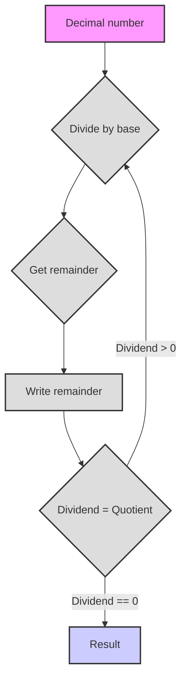

# Number Systems

שלום! אנו מתחילים את הצלילה שלנו אל העולם המרתק של מערכות ספירה. התכונן, היום תלמד דברים חדשים ומעניינים רבים!

# מערכות ספירה

**1. מערכת ספירה אבסטרקטית**

דמיין שמספרים הם כמו מילים, שניתן לכתוב באמצעות "אותיות" שונות. לא משנה כיצד בדיוק אנו מציינים מספרים, העיקר שיקוימו כללים מסוימים:

*   **בסיס (Basis):** זהו כמות הסימנים (הספרות) הייחודיים שאנו משתמשים בהם. נסמן את הבסיס ב־`b`. לדוגמה, במערכת העשרונית הבסיס שווה ל־10.
*   **ספרות (Digits):** אלו הם הסימנים שאנו משתמשים בהם לכתיבת מספרים. בדרך כלל אלו ספרות ערביות (0, 1, 2, 3, ...), אך יכולים להיות גם סימנים אחרים, לדוגמה אותיות לטיניות (I, V, X) או אפילו פירות (🍎, 🍐, 🍉).
*   **מיקום (Position):** לכל ספרה בכתיבת מספר יש את המיקום שלה, המשפיע על ערכה. פירוש הדבר שאותה ספרה יכולה להיות בעלת ערך שונה בהתאם למיקומה במספר.
*   **דרגות (Ranks):** כל מיקום נקרא דרגה (לדוגמה, יחידות, עשרות, מאות וכו'). בכל מיקום ערך הספרה מוכפל בבסיס בחזקה המתאימה למספר הדרגה.

**כיצד נבנית מערכת ספירה?**

1.  **בחירת בסיס:** בוחרים מספר שלם `b` שיהווה את בסיס המערכת שלנו.
2.  **בחירת ספרות:** אנו זקוקים ל־`b` ספרות ייחודיות. בדרך כלל אלו 0, 1, 2, ..., `b-1`. לדוגמה, עבור המערכת הבינארית (בסיס 2) יש לנו את הספרות 0 ו־1.
3.  **כתיבת מספר:** המספר נכתב כרצף של ספרות. ערך כל ספרה מוכפל בבסיס בחזקה השווה למיקומה (החל מ־0 מימין).

**נוסחה לחישוב ערך של מספר:**

אם יש לנו מספר הכתוב כרצף הספרות `dₙ dₙ₋₁ ... d₁ d₀`, אז ערכו במערכת העשרונית ניתן לחישוב לפי הנוסחה:

`value = dₙ * bⁿ + dₙ₋₁ * bⁿ⁻¹ + ... + d₁ * b¹ + d₀ * b⁰`

כאשר:

*   `dᵢ` - הספרה בדרגה ה־i
*   `b` - בסיס מערכת הספירה
*   `i` - מספר הדרגה (מימין לשמאל, החל מ־0)

**דוגמה:**

נניח שיש לנו את המספר 123 במערכת העשרונית (בסיס 10). לפי הנוסחה:

`1 * 10² + 2 * 10¹ + 3 * 10⁰ = 100 + 20 + 3 = 123`

**סדרי ספירה (דרגות):**

הדרגות, כפי שכבר אמרנו, הן מיקומי הספרות במספר, ולכל מיקום יש את המשקל שלו, הנקבע על פי הבסיס בחזקת מספר הדרגה שלו.
*   `d₀`: יחידות (`b⁰`)
*   `d₁`: `b` (`b¹`)
*   `d₂`: `b²`
*   `d₃`: `b³`
*   וכן הלאה

**כללים:**

1.  **טווח ספרות:** משתמשים בספרות מ־0 עד `b-1`.
2.  **עיקרון מיקומי:** ערך הספרה תלוי במיקומה.
3.  **מעבר לדרגה הבאה:** כאשר בדרגה מסוימת מגיעים לערך `b`, מתבצע העברה לדרגה הבאה (אנלוגיה לכך שלאחר 9 במערכת העשרונית מוסיפים 1 לדרגה הבאה ומקבלים 10).

## דוגמה: מערכת ספירה פירותית

בואו נבחן דוגמה למערכת ספירה אבסטרקטית עם פירות:

*   🍎 (תפוח)
*   🍐 (אגס)
*   🍉 (אבטיח)
*   🧺 (סל)

**כללים:**

1.  3 🍎 = 1 🍐
2.  5 🍐 = 3 🍉
3.  2 🍉 = 1 🧺

**ייצוג מספרים:**

אנו נייצג את כמות הפירות כמחרוזת, כאשר כל תו יוניקוד מתאים לפרי אחד. לדוגמה, "🍎🍎🍎" - זה 3 תפוחים, ו־"🍉🍉" - זה 2 אבטיחים.

**פעולות אריתמטיות:**

אנו יכולים לבצע פעולות חיבור וחיסור. ראשית, נבצע חיבור.

**Python Code:**

```python
def normalize_fruits(fruits: str) -> str:
    """
    Normalizes a string of fruits, bringing it to the minimum representation,
    using fruit exchange rules.

    Args:
        fruits: String with fruits (🍎, 🍐, 🍉, 🧺).

    Returns:
        String with normalized fruit quantity.
    """
    apples = fruits.count('🍎')
    pears = fruits.count('🍐')
    melons = fruits.count('🍉')
    baskets = fruits.count('🧺')

    # Convert apples to pears
    pears += apples // 3
    apples %= 3

    # Convert pears to melons
    # The rule is 5 pears = 3 melons. To convert pears to melons,
    # we need to find how many full groups of 5 pears we have.
    # Each group of 5 pears gives 3 melons.
    melons += (pears // 5) * 3
    pears %= 5 # Remaining pears after forming groups of 5

    # Convert melons to baskets
    baskets += melons // 2
    melons %= 2

    # Reassemble the string, first baskets, then melons, pears, apples
    return (
        "🧺" * baskets
        + "🍉" * melons
        + "🍐" * pears
        + "🍎" * apples
    )


def add_fruits(fruits1: str, fruits2: str) -> str:
    """
    Adds two fruit strings.

    Args:
        fruits1: String with fruits.
        fruits2: String with fruits.

    Returns:
        String with the sum of fruits.
    """
    return normalize_fruits(fruits1 + fruits2)


def sub_fruits(fruits1: str, fruits2: str) -> str:
    """
    Subtracts the second fruit string from the first, if possible.

    Args:
        fruits1: String with fruits to subtract from.
        fruits2: String with fruits to subtract.

    Returns:
        String with the fruit difference or "Cannot subtract" if the result is negative.
    """

    # Helper function to convert fruit string to total apples for easy comparison and calculation
    def to_total_apples(fruits_str: str) -> int:
        apples = fruits_str.count('🍎')
        pears = fruits_str.count('🍐')
        melons = fruits_str.count('🍉')
        baskets = fruits_str.count('🧺')
        # Convert all to the smallest unit (apples) based on the rules:
        # 3 🍎 = 1 🍐  => 1 pear = 3 apples
        # 5 🍐 = 3 🍉  => 1 melon = 5/3 pears = (5/3) * 3 apples = 5 apples ? This seems wrong.
        # Let's re-evaluate the rules for consistent conversion to a base unit.
        # 3 🍎 = 1 🍐
        # 5 🍐 = 3 🍉 => 15 🍎 = 5 🍐 = 3 🍉 => 1 melon = 5 apples (incorrect derivation)
        # Correct derivation:
        # 1 pear = 3 apples
        # 3 melons = 5 pears = 5 * (3 apples) = 15 apples
        # 1 melon = 15 / 3 apples = 5 apples
        # 2 🍉 = 1 🧺 => 1 basket = 2 melons = 2 * (5 apples) = 10 apples
        # Okay, let's try again with the correct apple values per unit:
        # 1 🍎 = 1 apple
        # 1 🍐 = 3 apples
        # 1 🍉 = (5/3) * 3 = 5 apples (based on 5 pears = 3 melons, not direct conversion from pear to melon rule)
        # Let's use the direct rules given:
        # 3 🍎 = 1 🍐
        # 5 🍐 = 3 🍉  (This rule implies a different base conversion, not a simple linear one)
        # 2 🍉 = 1 🧺

        # The original conversion logic in the code was total_apples = apples1 + pears1 * 3 + melons1 * 15 // 3 + baskets1 * 30
        # 1 pear = 3 apples (pears1 * 3 is correct)
        # melons1 * 15 // 3: 15 apples / 3? Where does 15 come from? Let's trace the chain:
        # 1 melon = ? apples
        # 3 melons = 5 pears
        # 5 pears = 5 * (3 apples) = 15 apples
        # So 3 melons = 15 apples, meaning 1 melon = 5 apples.
        # The code uses melons1 * 15 // 3 which is melons1 * 5. This is correct based on the chain.
        # baskets1 * 30:
        # 1 basket = 2 melons
        # 2 melons = 2 * (5 apples) = 10 apples.
        # The code uses baskets1 * 30. This seems inconsistent with the other rules.
        # Let's re-check the original rules:
        # 1. 3 🍎 = 1 🍐
        # 2. 5 🍐 = 3 🍉
        # 3. 2 🍉 = 1 🧺
        # From rule 1: 1🍐 = 3🍎
        # From rule 2: 3🍉 = 5🍐 = 5 * (3🍎) = 15🍎 => 1🍉 = 15/3 🍎 = 5🍎
        # From rule 3: 1🧺 = 2🍉 = 2 * (5🍎) = 10🍎
        # So the correct conversions to apples are: 1🍎, 3🍎, 5🍎, 10🍎.
        # The original code used 1, 3, 15//3=5, 30. The 30 is wrong. It should be 10.
        # Let's correct the conversion factor for baskets to 10.

        return apples + pears * 3 + melons * 5 + baskets * 10

    total_apples1 = to_total_apples(fruits1)
    total_apples2 = to_total_apples(fruits2)

    if total_apples1 < total_apples2:
        return "Cannot subtract"
    else:
        total_apples = total_apples1 - total_apples2

    # Now convert the resulting total_apples back to the normalized fruit representation.
    # We need to reverse the conversion process using the exchange rules.
    # Start from the largest unit (baskets) down to the smallest (apples).

    # First, let's correct the logic for converting back to fruits.
    # The original code had some inconsistencies (e.g., melons = (total_apples*3) // 15 seems odd).
    # Let's use the reverse of the conversion factors:
    # 1 basket = 10 apples
    # 1 melon = 5 apples
    # 1 pear = 3 apples
    # 1 apple = 1 apple

    result_fruits = ""

    # Calculate baskets
    baskets = total_apples // 10
    result_fruits += "🧺" * baskets
    total_apples %= 10 # Remaining apples after accounting for baskets

    # Calculate melons from remaining apples
    melons = total_apples // 5
    result_fruits += "🍉" * melons
    total_apples %= 5 # Remaining apples after accounting for melons

    # Calculate pears from remaining apples
    pears = total_apples // 3
    result_fruits += "🍐" * pears
    total_apples %= 3 # Remaining apples after accounting for pears

    # The rest are apples
    result_fruits += "🍎" * total_apples

    # Finally, normalize the result string.
    # Note: The conversion logic above already produces a somewhat normalized form (largest units first),
    # but applying normalize_fruits ensures it strictly follows the exchange rules for minimal representation.
    # For example, if we ended up with 5 apples, it should become 1 pear. The current conversion won't do that.
    # It will just leave 5 apples. So the normalize_fruits call at the end is necessary.
    # Let's rethink the conversion back from total_apples.
    # The conversion process from total apples back to fruit string should apply the *inverse* of the exchange rules:
    # Total apples -> Baskets (divide by 10, remainder)
    # Remainder apples -> Melons (divide by 5, remainder)
    # Remainder apples -> Pears (divide by 3, remainder)
    # Remainder apples -> Apples (the final remainder)

    result_fruits_str = ""
    num_baskets = total_apples // 10
    total_apples %= 10
    num_melons = total_apples // 5
    total_apples %= 5
    num_pears = total_apples // 3
    total_apples %= 3
    num_apples = total_apples

    result_fruits_str = (
        "🧺" * num_baskets
        + "🍉" * num_melons
        + "🍐" * num_pears
        + "🍎" * num_apples
    )

    # The string constructed this way is already in the desired order (largest to smallest unit).
    # Does it need further normalization?
    # Example: total_apples = 15.
    # Baskets: 15 // 10 = 1. total_apples = 5. Result: "🧺"
    # Melons: 5 // 5 = 1. total_apples = 0. Result: "🧺🍉"
    # Pears: 0 // 3 = 0. total_apples = 0.
    # Apples: 0. total_apples = 0.
    # Final result: "🧺🍉". This is 1 basket and 1 melon.
    # Let's check the value in apples: 1 * 10 + 1 * 5 = 15 apples. Correct.
    # The rules are: 3 🍎 = 1 🍐, 5 🍐 = 3 🍉, 2 🍉 = 1 🧺.
    # Value of "🧺🍉" using exchange rules: 1 basket = 2 melons. So "🧺🍉" = 2 melons + 1 melon = 3 melons.
    # 3 melons = 5 pears. So 3 melons = 5 pears.
    # 5 pears = 5 * (3 apples) = 15 apples.
    # Yes, the simple conversion method from total_apples works correctly and yields the minimal representation directly.
    # So the final call to normalize_fruits is redundant after fixing the conversion factors.
    # Let's remove it. The `result_fruits_str` IS the normalized representation constructed from total_apples.

    return result_fruits_str


# Examples:
fruits1 = "🍎🍎🍎🍎🍎" # 5 apples
fruits2 = "🍎🍎🍎" # 3 apples
print(f"{fruits1} + {fruits2} = {add_fruits(fruits1, fruits2)}")

fruits3 = "🍐🍐"  # 2 pears
fruits4 = "🍎🍎🍎🍎" # 4 apples
print(f"{fruits3} + {fruits4} = {add_fruits(fruits3, fruits4)}")

fruits5 = "🍉🍉" # 2 melons
fruits6 = "🍎🍎🍎🍎🍎🍎🍎🍎🍎🍎🍎🍎🍎🍎🍎" # 15 apples
print(f"{fruits5} + {fruits6} = {add_fruits(fruits5, fruits6)}")

fruits7 = "🧺🧺" # 2 baskets
fruits8 = "🍉🍉🍉" # 3 melons
print(f"{fruits7} + {fruits8} = {add_fruits(fruits7, fruits8)}")

fruits9 = "🧺🍉🍐🍎" # 1 basket, 1 melon, 1 pear, 1 apple
fruits10 = "🍉🍐🍎" # 1 melon, 1 pear, 1 apple
print(f"{fruits9} - {fruits10} = {sub_fruits(fruits9, fruits10)}")

fruits11 = "🧺🍉" # 1 basket, 1 melon
fruits12 = "🧺🍉🍎🍎🍎" # 1 basket, 1 melon, 3 apples
print(f"{fruits11} - {fruits12} = {sub_fruits(fruits11, fruits12)}")

fruits13 = "🍉🍉🍉" # 3 melons
fruits14 = "🍎🍎🍎🍎" # 4 apples
print(f"{fruits13} - {fruits14} = {sub_fruits(fruits13, fruits14)}")

fruits15 = "🍐🍐🍐🍐🍐" # 5 pears
fruits16 = "🍉" # 1 melon
print(f"{fruits15} - {fruits16} = {sub_fruits(fruits15, fruits16)}")
```

**הסבר קוד:**

1.  **`normalize_fruits(fruits)`:** פונקציה זו ממירה את מחרוזת הפירות לצורה המינימלית שלה. היא סופרת תחילה את כמות כל פרי, ולאחר מכן, באמצעות כללי ההמרה, ממירה אותם ליחידות גדולות יותר (תפוחים לאגסים, אגסים לאבטיחים, אבטיחים לסלים). לאחר ההמרה, היא מחברת אותם בחזרה למחרוזת עם סט הפירות המינימלי.
2.  **`add_fruits(fruits1, fruits2)`:** פונקציה זו מבצעת חיבור של שתי מחרוזות פירות. היא פשוט משרשרת את שתי המחרוזות ולאחר מכן מנרמלת את התוצאה.
3.  **`sub_fruits(fruits1, fruits2)`:** זוהי פונקציה לחיסור מחרוזת פירות אחת מהשנייה. היא ממירה את הכל ל"כמות תפוחים" ולאחר מכן מבצעת חיסור, ולאחר מכן ממירה את התפוחים בחזרה לצורה מנורמלת, תוך כדי בדיקת האפשרות לבצע את החיסור.
4.  **דוגמאות:** בסוף הקוד מובאות דוגמאות לחיבור וחיסור עם שילובים שונים של פירות והצגת התוצאות.

**משימות:**

1.  נסה להוסיף לקוד פונקציה להכפלת פירות במספר שלם (לדוגמה, `multiply_fruits(fruits, n)`).
2.  ממש פונקציה `compare_fruits(fruits1, fruits2)`, שתשווה שתי מחרוזות פירות ותחזיר "גדול יותר", "קטן יותר" או "שווה".
3.  המצא חוקים משלך להמרת פירות ושנה את הקוד בהתאם.
4.  הוסף בדיקה לתקינות קלט הנתונים (כך שהמחרוזת תכיל רק תווי יוניקוד מורשים).
5.  ממש חיסור מתקדם יותר, לדוגמה, לא להחזיר שגיאה "Cannot subtract", אלא להציג את התוצאה בסימן מינוס (משימה מורכבת).

## 2. מערכות ספירה קונקרטיות

כעת נעבור לדוגמאות קונקרטיות של מערכות ספירה, הנמצאות בשימוש נרחב במדעי המחשב ובחיי היומיום.

### 2.1. מערכת בינארית (דו-ספרתית) (בסיס 2)

*   **ספרות:** 0, 1
*   **שימוש במחשבים:** כל הנתונים במחשבים מיוצגים בקוד בינארי (ביטים).

**דוגמה:**

*   המספר `1011₂` (נקרא "אחד אפס אחד אחד בבסיס 2"). המרה למערכת עשרונית:
    `1 * 2³ + 0 * 2² + 1 * 2¹ + 1 * 2⁰ = 8 + 0 + 2 + 1 = 11₁₀`

**Python:**

```python
def bin_to_dec(binary: str) -> int:
    """
    Converts a binary number (string) to decimal.

    Args:
        binary: Binary number as a string.

    Returns:
        Decimal representation of the number (integer).
    """
    decimal = 0  # Initialize decimal value
    power = 0  # Initialize power of 2 (rank exponent)
    for digit in reversed(binary):  # Iterate through the digits of the binary number in reverse order
        if digit == '1':
            decimal += 2 ** power  # If the digit is '1', add 2 raised to the power of the rank
        power += 1  # Increase the power for the next rank
    return decimal  # Return the decimal value

binary_number = "1011"
decimal_number = bin_to_dec(binary_number)
print(f"Binary {binary_number} = Decimal {decimal_number}")


def dec_to_bin(decimal: int) -> str:
    """
    Converts a decimal number (integer) to its binary representation (string).

    Args:
        decimal: Decimal number.

    Returns:
        Binary representation of the number (string).
    """
    if decimal == 0:  # If the decimal number is 0
        return "0"  # Return the string "0"
    binary = ""  # Initialize string for the binary number
    while decimal > 0:  # While the decimal number is greater than 0
        binary = str(decimal % 2) + binary  # Add the remainder of division by 2 to the beginning of the binary string
        decimal = decimal // 2  # Integer divide the decimal number by 2
    return binary  # Return the binary string

decimal_number = 11
binary_number = dec_to_bin(decimal_number)
print(f"Decimal {decimal_number} = Binary {binary_number}")
```

### 2.2. מערכת טרנרית (תלת-ספרתית) (בסיס 3)

*   **ספרות:** 0, 1, 2
*   **מעניינת תאורטית:** מיושמת בתחומים מסוימים במתמטיקה ובמדעי המחשב.

**דוגמה:**

*   המספר `210₃` (נקרא "שתיים אחד אפס בבסיס 3"). המרה למערכת עשרונית:
    `2 * 3² + 1 * 3¹ + 0 * 3⁰ = 18 + 3 + 0 = 21₁₀`

**Python:**

```python
def ternary_to_dec(ternary: str) -> int:
    """
    Converts a ternary number (string) to decimal.

    Args:
        ternary: Ternary number as a string.

    Returns:
        Decimal representation of the number (integer).
    """
    decimal = 0  # Initialize decimal value
    power = 0  # Initialize power of 3 (rank exponent)
    for digit in reversed(ternary):  # Iterate through the digits of the ternary number in reverse order
        decimal += int(digit) * (3 ** power)  # Add the digit * 3 raised to the power of the rank
        power += 1  # Increase the power for the next rank
    return decimal  # Return the decimal value


ternary_number = "210"
decimal_number = ternary_to_dec(ternary_number)
print(f"Ternary {ternary_number} = Decimal {decimal_number}")

def dec_to_ternary(decimal: int) -> str:
    """
    Converts a decimal number (integer) to its ternary representation (string).

    Args:
        decimal: Decimal number.

    Returns:
        Ternary representation of the number (string).
    """
    if decimal == 0:  # If the decimal number is 0
        return "0"  # Return the string "0"
    ternary = ""  # Initialize string for the ternary number
    while decimal > 0:  # While the decimal number is greater than 0
        ternary = str(decimal % 3) + ternary  # Add the remainder of division by 3 to the beginning of the ternary string
        decimal = decimal // 3  # Integer divide the decimal number by 3
    return ternary  # Return the ternary string

decimal_number = 21
ternary_number = dec_to_ternary(decimal_number)
print(f"Decimal {decimal_number} = Ternary {ternary_number}")
```

### 2.3. מערכת ספטנרית (בעלת שבע ספרות) (בסיס 7)

*   **ספרות:** 0, 1, 2, 3, 4, 5, 6
*   **פחות נפוצה:** משמשת בתחומים צרים מסוימים, לדוגמה במערכות קידוד מסוימות. כמו כן, יש לה שימוש מעשי בימי השבוע.

**דוגמה:**

*   המספר `345₇` (נקרא "שלוש ארבע חמש בבסיס 7"). המרה למערכת עשרונית:
    `3 * 7² + 4 * 7¹ + 5 * 7⁰ = 147 + 28 + 5 = 180₁₀`

**Python:**

```python
def septenary_to_dec(septenary: str) -> int:
    """
    Converts a septenary number (string) to decimal.

    Args:
        septenary: Septenary number as a string.

    Returns:
        Decimal representation of the number (integer).
    """
    decimal = 0  # Initialize decimal value
    power = 0  # Initialize power of 7 (rank exponent)
    for digit in reversed(septenary):  # Iterate through the digits of the septenary number in reverse order
        decimal += int(digit) * (7 ** power)  # Add the digit * 7 raised to the power of the rank
        power += 1  # Increase the power for the next rank
    return decimal  # Return the decimal value


septenary_number = "345"
decimal_number = septenary_to_dec(septenary_number)
print(f"Septenary {septenary_number} = Decimal {decimal_number}")

def dec_to_septenary(decimal: int) -> str:
    """
    Converts a decimal number (integer) to its septenary representation (string).

    Args:
        decimal: Decimal number.

    Returns:
        Septenary representation of the number (string).
    """
    if decimal == 0: # If the decimal number is 0
        return "0" # Return the string "0"
    septenary = ""  # Initialize string for the septenary number
    while decimal > 0:  # While the decimal number is greater than 0
        septenary = str(decimal % 7) + septenary  # Add the remainder of division by 7 to the beginning of the septenary string
        decimal = decimal // 7  # Integer divide the decimal number by 7
    return septenary  # Return the septenary string

decimal_number = 180
septenary_number = dec_to_septenary(decimal_number)
print(f"Decimal {decimal_number} = Septenary {septenary_number}")
```

### 2.4. מערכת עשרונית (בסיס 10)

*   **ספרות:** 0, 1, 2, 3, 4, 5, 6, 7, 8, 9
*   **יומיומית:** המערכת הנפוצה ביותר, בה אנו משתמשים מדי יום.

**דוגמה:**

*   המספר `789₁₀`. המרה למערכת עשרונית: (אין טעם, זה בדיוק המערכת העשרונית)
    `7 * 10² + 8 * 10¹ + 9 * 10⁰ = 700 + 80 + 9 = 789₁₀`

### 2.5. מערכת הקסדצימלית (בעלת שש עשרה ספרות) (בסיס 16)

*   **ספרות:** 0, 1, 2, 3, 4, 5, 6, 7, 8, 9, A, B, C, D, E, F
    *   A = 10, B = 11, C = 12, D = 13, E = 14, F = 15
*   **שימוש נרחב בתכנות:** לייצוג צבעים, כתובות זיכרון, קוד מכונה וכו'. משמשת לעתים קרובות לקיצור כתיבת מספרים בינאריים.

**דוגמה:**

*   המספר `2AF₁₆` (נקרא "שתיים איי אף בבסיס 16"). המרה למערכת עשרונית:
    `2 * 16² + 10 * 16¹ + 15 * 16⁰ = 512 + 160 + 15 = 687₁₀`

**Python:**

```python
def hex_to_dec(hexadecimal: str) -> int:
    """
    Converts a hexadecimal number (string) to decimal.

    Args:
        hexadecimal: Hexadecimal number as a string.

    Returns:
        Decimal representation of the number (integer).
    """
    decimal = 0  # Initialize decimal value
    power = 0  # Initialize power of 16 (rank exponent)
    for digit in reversed(hexadecimal):  # Iterate through the digits of the hexadecimal number in reverse order
        if digit.isdigit():  # If the digit is a number
            decimal += int(digit) * (16 ** power)  # Add the digit * 16 raised to the power of the rank
        elif digit.upper() == 'A':  # If the digit is 'A'
            decimal += 10 * (16 ** power)  # Add 10 * 16 raised to the power of the rank
        elif digit.upper() == 'B':  # If the digit is 'B'
            decimal += 11 * (16 ** power)  # Add 11 * 16 raised to the power of the rank
        elif digit.upper() == 'C':  # If the digit is 'C'
            decimal += 12 * (16 ** power)  # Add 12 * 16 raised to the power of the rank
        elif digit.upper() == 'D':  # If the digit is 'D'
            decimal += 13 * (16 ** power)  # Add 13 * 16 raised to the power of the rank
        elif digit.upper() == 'E':  # If the digit is 'E'
            decimal += 14 * (16 ** power)  # Add 14 * 16 raised to the power of the rank
        elif digit.upper() == 'F':  # If the digit is 'F'
            decimal += 15 * (16 ** power)  # Add 15 * 16 raised to the power of the rank
        power += 1  # Increase the power for the next rank
    return decimal  # Return the decimal value


hex_number = "2AF"
decimal_number = hex_to_dec(hex_number)
print(f"Hexadecimal {hex_number} = Decimal {decimal_number}")

def dec_to_hex(decimal: int) -> str:
    """
    Converts a decimal number (integer) to its hexadecimal representation (string).

    Args:
        decimal: Decimal number.

    Returns:
        Hexadecimal representation of the number (string).
    """
    if decimal == 0:  # If the decimal number is 0
        return "0"  # Return the string "0"
    hex_digits = "0123456789ABCDEF"  # String for mapping remainders to hexadecimal digits
    hexadecimal = ""  # Initialize string for the hexadecimal number
    while decimal > 0:  # While the decimal number is greater than 0
        remainder = decimal % 16  # Get the remainder of division by 16
        hexadecimal = hex_digits[remainder] + hexadecimal  # Add the corresponding digit to the beginning of the hexadecimal string
        decimal = decimal // 16  # Integer divide the decimal number by 16
    return hexadecimal  # Return the hexadecimal string

decimal_number = 687
hex_number = dec_to_hex(decimal_number)
print(f"Decimal {decimal_number} = Hexadecimal {hex_number}")
```

### 2.6. מערכת שישים (סקסגסימלית) (בסיס 60)

*   **ספרות:** 0-59 (בשימוש מעשי משתמשים בשילובים של סימנים)
*   **היסטורית:** שימשה בבבל הקדומה, וכיום למדידת זמן (שעות, דקות, שניות) וזוויות.

**דוגמה:**

*   נייצג את המספר `25:30:15₆₀` (25 מעלות, 30 דקות, 15 שניות) או
    `25 * 60² + 30 * 60¹ + 15 * 60⁰ = 25 * 3600 + 30 * 60 + 15 * 1 = 90000 + 1800 + 15 = 91815₁₀` (מספר שניות כולל)

## 3. דוגמאות למערכות ספירה בחיי היומיום

מערכות ספירה אינן רק מושגים מתמטיים אבסטרקטיים, אלא גם דרכים אמיתיות לקודד מידע. הנה מספר דוגמאות:

### 3.1. ספרות רומיות
מערכת הספירה הרומית היא מערכת לא מיקומית, שבה משתמשים באותיות לטיניות לכתיבת מספרים. מערכת זו עדיין בשימוש, לדוגמה, למספור פרקים בספרים או לציון מאות שנים.

**Python Code:**
```python
import sys

def roman_to_int(roman_str: str) -> int:
    """
    Converts a Roman numeral (string) to decimal.

    Args:
        roman_str: Roman numeral as a string.

    Returns:
        Decimal representation of the number (integer).
    """
    roman_dict = {
        'I': 1,
        'V': 5,
        'X': 10,
        'L': 50,
        'C': 100,
        'D': 500,
        'M': 1000
    }

    number = 0
    # Expand subtractive notation to additive notation for easier processing
    roman_str = roman_str.replace("IV","IIII")
    roman_str = roman_str.replace("IX","VIIII")
    roman_str = roman_str.replace("XL","XXXX")
    roman_str = roman_str.replace("XC","LXXXX")
    roman_str = roman_str.replace("CD","CCCC")
    roman_str = roman_str.replace("CM","DCCCC")
    for char in roman_str:
        number += roman_dict[char]

    return number

# Example usage
if __name__ == '__main__':
    # Get Roman numeral from command line arguments
    # Note: Need to handle potential IndexError if no argument is provided
    if len(sys.argv) > 1:
        roman_number = sys.argv[1]
        decimal_number = roman_to_int(roman_number)
        print(f"Roman {roman_number} = Decimal {decimal_number}")
    else:
        print("Usage: python your_script_name.py <Roman_Numeral>")
```

### 3.2. אלפבית מורס
אלפבית מורס הוא מערכת קידוד סמלים באמצעות שילוב של אותות קצרים וארוכים (נקודות וקווים). היא שימשה להעברת הודעות בטלגרף.

**Python Code:**

```python
import time
import platform

# Morse code dictionary with Latin and Cyrillic alphabets
morse_code_dict = {
    'A': '.-',    'А': '.-',
    'B': '-...',   'Б': '-...',
    'C': '-.-.',   'В': '.--',
    'D': '-..',    'Г': '--.',
    'E': '.',      'Д': '-..',
    'F': '..-.',   'Е': '.',
    'G': '--.',    'Ж': '...-',
    'H': '....',   'З': '--..',
    'I': '..',     'И': '..',
    'J': '.---',   'Й': '.---',
    'K': '-.-',    'К': '-.-',
    'L': '.-..',   'Л': '.-..',
    'M': '--',     'М': '--',
    'N': '-.',     'Н': '-.',
    'O': '---',    'О': '---',
    'P': '.--.',   'П': '.--.',
    'Q': '--.-',   'Р': '.-.',
    'R': '.-.',    'С': '...',
    'S': '...',    'Т': '-',
    'T': '-',      'У': '..-',
    'U': '..-',    'Ф': '..-.',
    'V': '...-',   'Х': '....-',
    'W': '.--',    'Ц': '-.-.',
    'X': '-..-',   'Ч': '---.',
    'Y': '-.--',   'Ш': '----',
    'Z': '--..',   'Щ': '--.-',
    '0': '-----',   'Ъ': '--.--',
    '1': '.----',  'Ы': '-.--',
    '2': '..---',  'Ь': '-..-',
    '3': '...--',  'Э': '..-..',
    '4': '....-',  'Ю': '..--',
    '5': '.....',  'Я': '.-.-',
    '6': '-....',
    '7': '--...',
    '8': '---..',
    '9': '----.',
    '.': '.-.-.-',
    ',': '--..--',
    '?': '..--..',
    "'": '.----.',
    '!': '-.-.--',
    '/': '-..-.',
    '(': '-.--.',
    ')': '-.--.-',
    '&': '.-...',
    ':': '---...',
    ';': '-.-.-.',
    '=': '-...-',
    '+': '.-.-.',
    '-': '-....-',
    '_': '..--.-',
    '"': '.-..-.',
    '$': '...-..-',
    '@': '.--.-.',
    ' ': '/'
}

def play_sound(duration):
    """
    Produces a sound signal of a given duration.
    """
    # For Windows
    if platform.system() == 'Windows':
        try:
            import winsound
            winsound.Beep(1000, duration)  # Beep at 1000 Hz for 'duration' milliseconds
        except ImportError:
            print("winsound module not available.")
            # Fallback or alternative sound method if winsound fails
            pass
    # For Linux/macOS
    else:
        import os
        # Using printf to send BEL character is a common cross-platform terminal beep
        # os.system('printf "\a"')
        # A more robust way might involve external libraries or system commands like 'play'/'aplay'
        # For simplicity, sticking to the original intent of a basic beep.
        # The original Russian code used 'os.system('printf "\a"')', keeping that for consistency.
        try:
            os.system('printf "\a"')
        except Exception as e:
             print(f"Could not play sound: {e}")
             pass


def text_to_morse(text):
    """
    Converts text to Morse code.

    Args:
        text: Text string.

    Returns:
        String with Morse code.
    """
    morse_code = ''
    for char in text.upper():
        if char in morse_code_dict:
            morse_code += morse_code_dict[char] + ' '
        else:
            # If character is not found, represent it with a question mark in Morse or a standard separator
            # The original code used '/', which is typically a space between words.
            # Let's follow the original logic, treating unknown chars like spaces or ignoring them.
            # The dictionary maps ' ' to '/'. So unknown chars could also map to '/ '.
            # Let's map unknown characters to a standard unknown sequence or skip them.
            # Skipping might be safer. Let's keep the original logic of adding '/ '
            morse_code += '/ '  # If character is not found, consider it as a space
    return morse_code.strip() # Remove trailing space


def morse_to_sound(morse_code):
    """
    Plays Morse code as sound signals.

    Args:
        morse_code: String with Morse code.
    """
    # Define base duration for a 'dot' in milliseconds
    dot_duration_ms = 100
    # Define pause durations relative to dot duration
    dot_pause_ms = dot_duration_ms # Pause between elements in a character (dot/dash)
    dash_duration_ms = 3 * dot_duration_ms # Duration of a dash
    char_pause_ms = 3 * dot_duration_ms # Pause between characters
    word_pause_ms = 7 * dot_duration_ms # Pause between words (represented by '/')

    for symbol in morse_code.split(): # Split the morse code string by spaces to get individual characters/word breaks
        if symbol == '.':
            play_sound(dot_duration_ms)
            time.sleep(dot_pause_ms / 1000.0) # time.sleep expects seconds
        elif symbol == '-':
            play_sound(dash_duration_ms)
            time.sleep(dot_pause_ms / 1000.0) # Pause after a dash is same as after a dot within a char
        elif symbol == '/': # Represents space between words
            time.sleep(word_pause_ms / 1000.0)
        # Note: There's an implicit pause *between* the elements of a character (dots and dashes).
        # The code above puts the pause *after* playing the sound for the element.
        # This is a common way to implement it. The ' ' between Morse elements in the input string
        # from text_to_morse is handled by splitting.

    # Add a final pause after the message
    time.sleep(char_pause_ms / 1000.0)


if __name__ == '__main__':
    # Get input from user
    text = input("Enter text to convert to Morse code: ")

    # Convert text to Morse code
    morse = text_to_morse(text)
    print("Morse Code:", morse)

    # Convert Morse code to sound
    morse_to_sound(morse)
```
## 4. משימות

**משימה 1:**

המר את המספרים הבאים ממערכת אחת לאחרת:

*   `11011₂` לעשרונית
*   `201₃` לעשרונית
*   `563₇` לעשרונית
*   `2AF₁₆` לעשרונית
*   `45₁₀` לבינארית
*   `34₁₀` לטרנרית
*   `150₁₀` לספטנרית
*   `687₁₀` להקסדצימלית

**משימה 2:**

המצא מערכת ספירה משלך עם בסיס, לדוגמה, 5 (פנטנרית). רשום מספר מספרים במערכת זו והמר אותם לעשרונית.

**משימה 3:**

ממש פונקציות להמרה ממערכת עשרונית לבינארית, טרנרית, ספטנרית, הקסדצימלית ולהפך (כמו בדוגמאות לעיל). תוכל לארגן פונקציות אלו בתוך מחלקה אחת, לדוגמה `NumberConverter`.

**משימה 4:**

כתוב פונקציה לחיבור שני מספרים בינאריים, המיוצגים כמחרוזות. (משימה מורכבת).

**משימה 5:**

נסה להמיר זמן מסוים בשניות, המיוצג בפורמט "ש:ד:ש", למערכת עשרונית ולהפך.

**משימה 6:**

כתוב פונקציה שתקבל שני ימי שבוע ופרק זמן בימים (כמו בדוגמה לעיל), אם פרק הזמן קטן משבוע היא תחזיר את כמות הימים ביניהם, אם גדול יותר, היא תחזיר כמה שבועות מלאים ושארית כימים.

**משימה 7:**

שפר את הפונקציה `calculate_day_of_week` כך שתטפל נכונה במספר ימים שלילי שחלפו (כלומר, כאשר אנו סופרים ימים לאחור).

## 5. חומר נוסף: ימי השבוע ומערכת ספטנרית

ניתן להתייחס לימי השבוע כדוגמה לשימוש במערכת ספטנרית, כאשר כל יום הוא ספרה מ־0 עד 6. עם זאת, מכיוון שבדרך כלל איננו מתחילים לספור את ימי השבוע מאפס, אלא מיום שני, ניתן לומר שזו מערכת ספטנרית מוזזת.

**דוגמת קוד פשוטה, הסופרת ימי שבוע:**

```python
def calculate_day_of_week(start_day: int, days_passed: float) -> int:
    """
    Calculates the day of the week after a given number of days.

    Args:
        start_day: Starting day of the week (0 - Monday, 6 - Sunday).
        days_passed: Number of days passed.

    Returns:
        Day of the week after the given number of days (0 - Monday, 6 - Sunday).
    """
    if not isinstance(start_day, int) or not (0 <= start_day <= 6):
        # Starting day of the week must be an integer between 0 and 6 (Mon-Sun)
        raise ValueError("Start day of the week must be an integer from 0 to 6 (Mon-Sun)")
    if not isinstance(days_passed, (int, float)):
        # Number of days passed must be a number
        raise ValueError("Number of days passed must be a number")

    # Ensure we work with integers for modulo calculation
    # For handling negative days_passed in Task 7, the modulo operator in Python
    # handles negative numbers correctly, providing a result with the same sign as the divisor (7).
    # For example, -1 % 7 is 6, -7 % 7 is 0, -8 % 7 is 6. This naturally wraps backward.
    # We just need to cast days_passed to an integer for the calculation.
    days_passed_int = int(days_passed)

    # The formula (start_day + days_passed_int) % 7 works for both positive and negative days_passed
    # because Python's modulo handles negatives correctly for wrapping around a positive divisor.
    new_day = (start_day + days_passed_int) % 7

    # Ensure the result is always non-negative (Python's % operator for negative numbers already does this correctly with positive divisor)
    # For example, (-1 + 0) % 7 = 6. (-1 + 1) % 7 = 0. (-1 + 2) % 7 = 1.
    # However, if days_passed was negative, e.g., start=0, days_passed=-10:
    # (0 + -10) % 7 = -10 % 7 = 4. (This means 4 days *before* Monday, which is Thursday, day 4)
    # Wait, my understanding of the expected output for negative days might be wrong based on the Task 7 wording.
    # "correctly handle a negative number of elapsed days (i.e. when counting days backward)"
    # If start_day=0 (Monday) and days_passed=-1, the result should be 6 (Sunday). (0 + -1) % 7 = -1 % 7 = 6. This works.
    # If start_day=0 (Monday) and days_passed=-7, the result should be 0 (Monday). (0 + -7) % 7 = -7 % 7 = 0. This works.
    # If start_day=0 (Monday) and days_passed=-8, the result should be 6 (Sunday). (0 + -8) % 7 = -8 % 7 = 6. This works.
    # So the existing modulo arithmetic in Python *does* correctly handle backward counting for days of the week.
    # No special handling needed for Task 7 based on this formula and Python's behavior.

    return new_day

def day_number_to_name(day_number: int) -> str:
    """
    Converts a day number of the week (0-6) to its name.

    Args:
        day_number: Day number of the week (0 - Monday, 6 - Sunday).

    Returns:
        Name of the day of the week (string).
    """
    days = ["שני", "שלישי", "רביעי", "חמישי", "שישי", "שבת", "ראשון"]
    return days[day_number]

# Examples:
start_day = 0  # Monday
days = 10.5 # One and a half weeks (approximately, int() truncates)
new_day = calculate_day_of_week(start_day, days)
print(f"{days} days after {day_number_to_name(start_day)}: {day_number_to_name(new_day)}") # Should be (0 + 10) % 7 = 3 (Wednesday)
days = 120 # Four months (approximately)
new_day = calculate_day_of_week(start_day, days)
print(f"{days} days after {day_number_to_name(start_day)}: {day_number_to_name(new_day)}") # Should be (0 + 120) % 7 = 120 % 7 = 1 (Tuesday)

# Can start counting from another day
start_day = 4  # Friday
days = 365 # Year
new_day = calculate_day_of_week(start_day, days)
print(f"{days} days after {day_number_to_name(start_day)}: {day_number_to_name(new_day)}") # Should be (4 + 365) % 7 = 369 % 7 = 5 (Saturday)

# Example for Task 7 (negative days)
start_day = 0 # Monday
days = -1 # 1 day before
new_day = calculate_day_of_week(start_day, days)
print(f"{days} days after (before) {day_number_to_name(start_day)}: {day_number_to_name(new_day)}") # Should be (0 + -1) % 7 = 6 (Sunday)

start_day = 3 # Thursday
days = -10 # 10 days before
new_day = calculate_day_of_week(start_day, days)
print(f"{days} days after (before) {day_number_to_name(start_day)}: {day_number_to_name(new_day)}") # Should be (3 + -10) % 7 = -7 % 7 = 0 (Monday)
```

**הסברים:**

1.  הפונקציה `calculate_day_of_week` מקבלת את יום השבוע ההתחלתי (0-יום שני, 6-יום ראשון) וכמות הימים שחלפו (יכול להיות מספר שאינו שלם).
2.  `new_day = (start_day + days_passed) % 7`: אנו מסכמים את הימים ולוקחים את השארית מחלוקה ב־7, מכיוון שבשבוע יש 7 ימים. פעולת `% 7` מבטיחה את ה"מחזוריות" כאשר הימים עוברים את יום ראשון.
3.  `day_number_to_name` היא פונקציית עזר לנוחות הצגת התוצאות.

## 6. דיאגרמה

להמחשת תהליך המרת מספרים ממערכת ספירה אחת לאחרת, ניתן להשתמש בדיאגרמה. הנה דוגמה לדיאגרמה המתארת את תהליך ההמרה ממערכת עשרונית לכל מערכת אחרת (כולל בינארית, טרנרית, ספטנרית, הקסדצימלית):



**מקרא:**

1.  **Decimal number:** המספר המקורי במערכת העשרונית.
2.  **Divide by base:** אנו מחלקים את המספר המקורי בבסיס מערכת הספירה היעד (2, 3, 7, 16 וכו').
3.  **Get remainder:** אנו שומרים את השארית מחלוקה, כיוון שהיא תהיה אחת מהספרות במספר במערכת הספירה היעד.
4.  **Write remainder:** השארית מתווספת לתוצאה בסדר הפוך, כלומר מהסוף להתחלה.
5.  **Dividend = Quotient:** לאחר מכן אנו עוברים למחולק החדש, השווה למנה מהחלוקה הקודמת.
6.  **Check for 0:** אם המחולק שלנו אינו שווה ל־0, אנו חוזרים על המחזור, החל מסעיף 2.
7.  **Result:** כאשר המחולק שווה ל־0, קיבלנו את התוצאה - המספר במערכת הספירה היעד.

דיאגרמה זו מתארת את העיקרון הכללי של המרת מספרים ממערכת עשרונית לכל מערכת אחרת. ניתן לבנות דיאגרמה דומה גם להמרה ממערכת ספירה שרירותית לעשרונית (סיכום מכפלות הספרות בבסיס בחזקה).

**טיפים:**

*   תרגל המרות בין מערכות ספירה. ככל שתתרגל יותר, כך תבין טוב יותר את עקרונות מערכות הספירה.
*   נסה ליצור מערכות ספירה משלך.
*   השתמש בפייתון כדי לבדוק את הפתרונות שלך ולהפוך את ההמרה לאוטומטית.