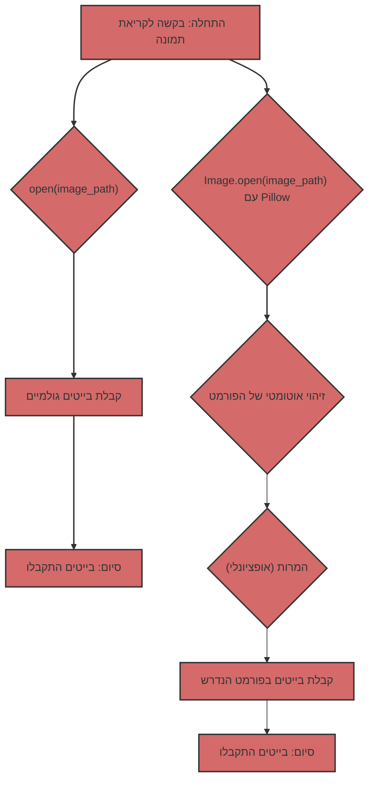

## קריאת תמונות: בייטים גולמיים מול Pillow

כשמדובר בעבודה עם תמונות ב-Python, עומדות לרשותך שתי גישות עיקריות:

1.  **קריאת בייטים גולמיים:** שימוש בפונקציה `open()` לקריאת תוכן קובץ התמונה כרצף של בייטים.
2.  **שימוש ב-Pillow:** שימוש בספריית Pillow לפתיחה ועיבוד תמונות.

נתבונן בכל גישה בפירוט ונברר מהם ההבדלים ביניהן ומתי עדיף להשתמש בכל גישה.

### 1. קריאת בייטים גולמיים באמצעות `open()`

#### מה זה?

כאשר אתה פותח קובץ תמונה במצב בינארי (`"rb"`) באמצעות `open()`, אתה מקבל גישה לתוכן הקובץ כרצף של בייטים. משמעות הדבר היא שאתה מקבל נתונים "גולמיים", ללא כל פרשנות או עיבוד.

#### איך זה נראה בקוד?

```python
from pathlib import Path

def read_image_bytes_direct(image_path: Path) -> bytes | None:
    """
    קורא תמונה כבייטים ישירות באמצעות open().

    Args:
        image_path: נתיב לקובץ התמונה.

    Returns:
        bytes: בייטים של התמונה.
        None: אם אירעה שגיאה.
    """
    try:
        with open(image_path, "rb") as image_file:
            image_data = image_file.read()
            return image_data
    except Exception as e:
        print(f"Error reading file: {e}") # השאר באנגלית לפי ההנחיה
        return None


if __name__ == '__main__':
    image_path = Path("test.jpg")  # יש להחליף בנתיב לתמונה שלך

    if not image_path.is_file():
        print(f"File {image_path} does not exist") # השאר באנגלית לפי ההנחיה
    else:
       image_bytes_direct = read_image_bytes_direct(image_path)

       if image_bytes_direct:
           print(f"Image read directly, size: {len(image_bytes_direct)} bytes") # השאר באנגלית לפי ההנחיה, למעט הוספת פסיק
           # ניתן להשתמש ב-image_bytes_direct, לדוגמה, לשליחה ברשת
       else:
           print("Failed to read image.") # השאר באנגלית לפי ההנחיה
```

#### מתי זה שימושי?

*   **העברת נתונים ברשת:** כאשר אתה צריך פשוט להעביר נתוני תמונה ברשת, מבלי לדאוג לפורמט.
*   **שמירה על דיסק:** כאשר אתה צריך לשמור את תוכן הקובץ על הדיסק ללא שינויים.
*   **גישה ברמה נמוכה:** כאשר אתה זקוק לגישה ברמה נמוכה לנתוני הקובץ, ואתה עצמך יודע כיצד לפרש אותם.

#### מגבלות

*   **אין עיבוד פורמט:** אתה מקבל רק בייטים, ללא כל מידע על פורמט התמונה (JPEG, PNG, GIF וכו').
*   **אין ולידציה:** אין בדיקה האם הקובץ אכן מהווה תמונה.
*   **אין מטא-נתונים:** אין גישה למטא-נתונים של התמונה (גודל, מרחב צבעים וכו').
*   **אין המרות נוחות:** לא ניתן לשנות גודל, פורמט או לבצע המרות אחרות ללא עיבוד נוסף.

### 2. שימוש ב-Pillow לקריאת תמונות

#### מה זה?

Pillow היא ספרייה עוצמתית לעבודה עם תמונות. היא מאפשרת לפתוח תמונות בפורמטים שונים, לקבל מטא-נתונים, לשנות גודל, להמיר פורמטים ועוד הרבה יותר.

#### איך זה נראה בקוד?

```python
from pathlib import Path
from PIL import Image
from io import BytesIO

def read_image_pillow(image_path: Path) -> bytes | None:
    """
    קורא תמונה באמצעות Pillow ומחזיר אותה כבייטים של JPEG.

    Args:
        image_path: נתיב לקובץ התמונה.

    Returns:
         bytes: בייטים של התמונה בפורמט JPEG.
         None: אם אירעה שגיאה.
    """
    try:
        img = Image.open(image_path)
        img_byte_arr = BytesIO()
        img.save(img_byte_arr, format="JPEG")
        return img_byte_arr.getvalue()
    except Exception as e:
        print(f"Error reading image with Pillow: {e}") # השאר באנגלית לפי ההנחיה
        return None

if __name__ == '__main__':
    image_path = Path("test.jpg") # יש להחליף בנתיב לתמונה שלך

    if not image_path.is_file():
        print(f"File {image_path} does not exist") # השאר באנגלית לפי ההנחיה
    else:
        image_bytes_pillow = read_image_pillow(image_path)
        if image_bytes_pillow:
           print(f"Image read with Pillow, size: {len(image_bytes_pillow)} bytes") # השאר באנגלית לפי ההנחיה, למעט הוספת פסיק
           # ניתן להשתמש ב-image_bytes_pillow, לדוגמה, לשליחה למודל Gemini.
        else:
           print("Failed to read image with Pillow.") # השאר באנגלית לפי ההנחיה
```

#### מתי זה שימושי?

*   **עבודה עם תמונות:** כאשר אתה צריך לעבוד עם תמונות, ולא רק עם בייטים.
*   **זיהוי אוטומטי של הפורמט:** Pillow מזהה אוטומטית את פורמט התמונה.
*   **המרת פורמטים:** ניתן בקלות להמיר תמונות בין פורמטים שונים (JPEG, PNG, GIF וכו').
*   **שינוי גודל:** ניתן לשנות את גודל התמונה לפני העיבוד.
*   **מטא-נתונים:** ניתן לקבל גישה למטא-נתונים של התמונה (גודל, פרופיל צבעים וכו').
*   **טיפול בשגיאות:** Pillow מטפלת בשגיאות בעת פתיחת קבצים פגומים.

#### יתרונות

*   **גמישות:** Pillow מספקת מגוון רחב של אפשרויות לעבודה עם תמונות.
*   **אמינות:** Pillow בודקת האם הקובץ מהווה תמונה תקינה.
*   **נוחות:** Pillow מפשטת את תהליך עיבוד התמונות.

### השוואה בטבלה

| מאפיין             | `open(image_path, "rb")`                                    | Pillow                                                      |
| :------------------------- | :---------------------------------------------------------- | :---------------------------------------------------------- |
| **מה עושה**            | קורא את הקובץ כרצף של בייטים                     | פותח ומעבד את התמונה                         |
| **פורמט**                | אינו מזהה פורמט                                        | מזהה אוטומטית פורמט                              |
| **מטא-נתונים**            | אין גישה למטא-נתונים                                     | מספק גישה למטא-נתונים                             |
| **עיבוד**              | אין יכולות עיבוד                                 | שינוי גודל, המרת פורמטים, וכו'.              |
| **ולידציה**             | אין ולידציה                                                | בודק האם הקובץ מהווה תמונה תקינה          |
| **מתי להשתמש**    | העברת בייטים פשוטה, גישה ברמה נמוכה              | עבודה עם תמונות, המרות, טיפול בשגיאות |
| **דוגמה**                | העברת בייטים ברשת, שמירה על דיסק                  | הכנת תמונות עבור Gemini, פיתוח ווב           |

### בהקשר של Gemini

מודלי Gemini מצפים לנתוני תמונה בפורמט מוגדר (בדרך כלל JPEG או PNG). שימוש ב-Pillow מבטיח שאתה מספק תמונות בפורמט נכון, ולא רק בייטים "גולמיים". יתרה מכך, Pillow מאפשרת לשנות את גודל התמונה, אם הדבר נדרש.

### דיאגרמת השוואה



אם אתה צריך פשוט לקרוא קובץ כבייטים, ללא כל עיבוד, `open(image_path, "rb")` יתאים. עם זאת, לעיבוד תמונות, במיוחד לצורך אינטראקציה עם ממשקי API שמצפים לתמונות בפורמט מוגדר, שימוש ב-Pillow הוא פתרון אמין וגמיש יותר.