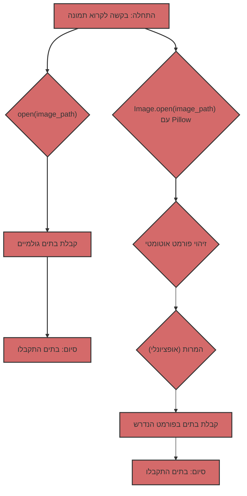

## קריאת תמונות: בתים גולמיים לעומת Pillow

כשמדובר בעבודה עם תמונות בפייתון, קיימות שתי גישות עיקריות:

1.  **קריאת בתים גולמיים:** שימוש ב-`open()` כדי לקרוא את תוכן קובץ התמונה כרצף של בתים.
2.  **שימוש ב-Pillow:** שימוש בספריית Pillow לפתיחה ועיבוד תמונות.

נסקור כל גישה בפירוט ונבחן מהם ההבדלים ביניהן ומתי עדיף להשתמש בכל אחת מהן.

### 1. קריאת בתים גולמיים באמצעות `open()`

#### מה זה?

כאשר פותחים קובץ תמונה במצב בינארי (`"rb"`) באמצעות `open()`, מקבלים גישה לתוכן הקובץ כרצף של בתים. המשמעות היא שמקבלים את הנתונים ה"גולמיים", ללא כל פרשנות או עיבוד.

#### איך זה נראה בקוד?

```python
from pathlib import Path

def read_image_bytes_direct(image_path: Path) -> bytes | None:
    """
    Reads the image as bytes directly using open().

    Args:
        image_path: Path to the image file.

    Returns:
        bytes: The image bytes.
        None: If an error occurred.
    """
    try:
        with open(image_path, "rb") as image_file:
            image_data = image_file.read()
            return image_data
    except Exception as e:
        print(f"Error reading file: {e}")
        return None


if __name__ == '__main__':
    image_path = Path("test.jpg")  # Replace with the path to your image

    if not image_path.is_file():
        print(f"File {image_path} does not exist")
    else:
       image_bytes_direct = read_image_bytes_direct(image_path)

       if image_bytes_direct:
           print(f"Image read directly, size: {len(image_bytes_direct)} bytes")
           # The image_bytes_direct can be used, for example, to send over the network
       else:
           print("Failed to read image.")
```

#### מתי זה שימושי?

*   **העברת נתונים ברשת:** כאשר יש צורך פשוט להעביר את נתוני התמונה דרך הרשת, ללא התייחסות לפורמט.
*   **שמירה על דיסק:** כאשר יש צורך לשמור את תוכן הקובץ על דיסק ללא שינויים.
*   **גישה ברמה נמוכה:** כאשר יש צורך בגישה ברמה נמוכה לנתוני הקובץ, ויודעים כיצד לפרש אותם באופן עצמאי.

#### מגבלות

*   **אין עיבוד פורמט:** מקבלים רק בתים, ללא כל מידע על פורמט התמונה (JPEG, PNG, GIF וכו').
*   **אין ולידציה:** אין בדיקה האם הקובץ אכן מהווה תמונה.
*   **אין מטא-נתונים:** אין גישה למטא-נתונים של התמונה (גודל, מרחב צבעים וכו').
*   **אין המרות נוחות:** לא ניתן לשנות גודל, פורמט או ליישם המרות אחרות ללא עיבוד נוסף.

### 2. שימוש ב-Pillow לקריאת תמונות

#### מה זה?

Pillow היא ספרייה חזקה לעבודה עם תמונות. היא מאפשרת לפתוח תמונות בפורמטים שונים, לקבל מטא-נתונים, לשנות גודל, להמיר פורמטים ועוד.

#### איך זה נראה בקוד?

```python
from pathlib import Path
from PIL import Image
from io import BytesIO

def read_image_pillow(image_path: Path) -> bytes | None:
    """
    Reads the image using Pillow and returns it as JPEG bytes.

    Args:
        image_path: Path to the image file.

    Returns:
         bytes: Image bytes in JPEG format.
         None: If an error occurred.
    """
    try:
        img = Image.open(image_path)
        img_byte_arr = BytesIO()
        img.save(img_byte_arr, format="JPEG")
        return img_byte_arr.getvalue()
    except Exception as e:
        print(f"Error reading image with Pillow: {e}")
        return None

if __name__ == '__main__':
    image_path = Path("test.jpg") # Replace with the path to your image

    if not image_path.is_file():
        print(f"File {image_path} does not exist")
    else:
        image_bytes_pillow = read_image_pillow(image_path)
        if image_bytes_pillow:
           print(f"Image read with Pillow, size: {len(image_bytes_pillow)} bytes")
           # The image_bytes_pillow can be used, for example, to send to the Gemini model.
        else:
           print("Failed to read image with Pillow.")
```

#### מתי זה שימושי?

*   **עבודה עם תמונות:** כאשר יש צורך לעבוד עם תמונות, ולא רק עם בתים גולמיים.
*   **זיהוי פורמט אוטומטי:** Pillow מזהה אוטומטית את פורמט התמונה.
*   **המרת פורמטים:** ניתן להמיר בקלות תמונות בין פורמטים שונים (JPEG, PNG, GIF וכו').
*   **שינוי גודל:** ניתן לשנות את גודל התמונה לפני עיבוד.
*   **מטא-נתונים:** ניתן לגשת למטא-נתונים של התמונה (גודל, פרופיל צבע וכו').
*   **טיפול בשגיאות:** Pillow מטפלת בשגיאות בעת פתיחת קבצים פגומים.

#### יתרונות

*   **גמישות:** Pillow מספקת מגוון רחב של יכולות לעבודה עם תמונות.
*   **אמינות:** Pillow בודקת האם הקובץ הוא תמונה תקינה.
*   **נוחות:** Pillow מפשטת את תהליך עיבוד התמונות.

### השוואה בטבלה

| מאפיין             | `open(image_path, "rb")`                                    | Pillow                                                      |
| :------------------------- | :---------------------------------------------------------- | :---------------------------------------------------------- |
| **מה עושה**            | קורא את הקובץ כרצף של בתים                                    | פותח ומעבד את התמונה                                        |
| **פורמט**                | אינו מזהה פורמט                                        | מזהה פורמט אוטומטית                                       |
| **מטא-נתונים**            | אין גישה למטא-נתונים                                     | מספק גישה למטא-נתונים                                    |
| **עיבוד**              | אין יכולות עיבוד                                 | שינוי גודל, המרת פורמטים, וכו'.              |
| **ולידציה**             | אין ולידציה                                                | בודק האם הקובץ הוא תמונה תקינה          |
| **מתי להשתמש**    | העברת בתים פשוטה, גישה ברמה נמוכה              | עבודה עם תמונות, המרות, טיפול בשגיאות |
| **דוגמה**                | העברת בתים ברשת, שמירה על דיסק                  | הכנת תמונות עבור Gemini, פיתוח ווב           |

### בהקשר של Gemini

מודלי Gemini מצפים לנתוני תמונה בפורמט מסוים (בדרך כלל JPEG או PNG). שימוש ב-Pillow מבטיח שמספקים תמונות בפורמט תקין, ולא רק בתים "גולמיים". יתר על כן, Pillow מאפשרת לשנות את גודל התמונה, אם יש בכך צורך.

### דיאגרמת השוואה



אם יש צורך פשוט לקרוא קובץ כבתים, ללא כל עיבוד, `open(image_path, "rb")` יתאים. עם זאת, לעיבוד תמונות, ובמיוחד לאינטראקציה עם APIs שמצפים לתמונות בפורמט ספציפי, שימוש ב-Pillow הוא פתרון אמין וגמיש יותר.