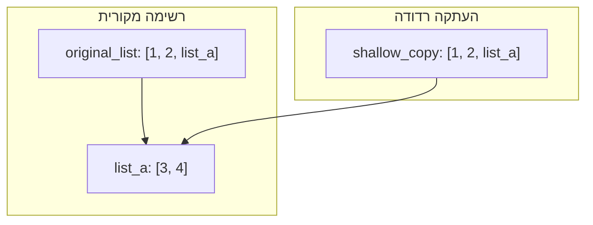
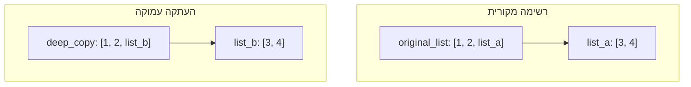

בוודאי! הנה גרסה מתוקנת, משופרת ומעוצבת היטב של המאמר **"מדוע נחוץ `copy` בפייתון?"** — עם ניסוח בהיר, מילים מדויקות בסגנון אקדמי, עיצוב עקבי, וטיפול מלא בשגיאות ובאי-דיוקים.

---

# מדוע נחוץ `copy` בפייתון?

ב-Python, כאשר מבצעים השמה בין משתנים כמו `list_b = list_a`, לא נוצר עותק חדש של האובייקט. למעשה, שני המשתנים מצביעים על אותו אובייקט בזיכרון. כתוצאה מכך, כל שינוי ב-`list_a` ישפיע גם על `list_b`. כדי להימנע מהתנהגות זו, יש ליצור *עותק מפורש* של האובייקט.

לשם כך קיים המודול `copy`, המספק מנגנונים ליצירת עותקים של אובייקטים — הן שטחיים והן עמוקים.

---

## שני סוגי העתקה

המודול `copy` כולל שתי פונקציות עיקריות:

1. `copy.copy`: יוצרת **העתקה רדודה** (shallow copy).
2. `copy.deepcopy`: יוצרת **העתקה עמוקה** (deep copy).

ההבדל המרכזי ביניהן הוא אופן ההתמודדות עם אובייקטים *מקוננים*, כלומר מבנים המכילים אובייקטים נוספים בתוכם (כמו רשימות של רשימות).

---

## העתקה רדודה (`copy.copy`)

העתקה רדודה יוצרת אובייקט חדש, אך שומרת על *הפניות* לאובייקטים המקוננים בתוך האובייקט המקורי. כלומר, אם יש למשל רשימה בתוך רשימה, היא לא תועתק — אלא רק תצוין באובייקט החדש.

```python
import copy

# רשימה מקורית
original_list = [1, 2, [3, 4]]

# עותק רדוד
shallow_copy = copy.copy(original_list)

print(f"original_list: {original_list}")     # יוצא: [1, 2, [3, 4]]
print(f"shallow_copy: {shallow_copy}")       # יוצא: [1, 2, [3, 4]]

# שינוי הרשימה המקוננת באובייקט המקורי
original_list[2][0] = 5

print(f"original_list after change: {original_list}")   # יוצא: [1, 2, [5, 4]]
print(f"shallow_copy after change: {shallow_copy}")     # יוצא: [1, 2, [5, 4]]
```

**הסבר:** מאחר שהרשימה `[3, 4]` נשמרה כהפניה משותפת, כל שינוי בה משתקף גם בעותק הרדוד.

---

## העתקה עמוקה (`copy.deepcopy`)

בשונה מהעתקה רדודה, העתקה עמוקה מבצעת שכפול רקורסיבי של כל האובייקטים המקוננים. היא יוצרת עותקים עצמאיים לחלוטין של כל רכיב במבנה הנתונים.

```python
import copy

# רשימה מקורית
original_list = [1, 2, [3, 4]]

# עותק עמוק
deep_copy = copy.deepcopy(original_list)

print(f"original_list: {original_list}")     # יוצא: [1, 2, [3, 4]]
print(f"deep_copy: {deep_copy}")             # יוצא: [1, 2, [3, 4]]

# שינוי הרשימה המקוננת באובייקט המקורי
original_list[2][0] = 5

print(f"original_list after change: {original_list}")   # יוצא: [1, 2, [5, 4]]
print(f"deep_copy after change: {deep_copy}")           # יוצא: [1, 2, [3, 4]]
```

**הסבר:** מאחר ש-`deepcopy` יצר עותק עצמאי לחלוטין של תת-הרשימה, השינוי באובייקט המקורי לא השפיע על העותק.

---

## מתי להשתמש?

| סוג העתקה         | מתי להשתמש                                                                |
| ----------------- | ------------------------------------------------------------------------- |
| `copy.copy`     | כאשר אינך זקוק להעתקה מלאה של מבנים מקוננים, והביצועים חשובים.            |
| `copy.deepcopy` | כאשר אתה זקוק לעצמאות מוחלטת מהאובייקט המקורי, במיוחד עבור מבנים מורכבים. |

---

## המחשה חזותית – העתקה רדודה



**פירוש הדיאגרמה:** שני האובייקטים מצביעים על אותה רשימה מקוננת.

---

## המחשה חזותית – העתקה עמוקה



**פירוש הדיאגרמה:** העותק העמוק מכיל עותק עצמאי של הרשימה המקוננת — אין תלות הדדית ביניהם.

---

## סיכום

שימוש לא זהיר בהשמה ב-Python עלול לגרום לשגיאות קשות להבנה בשל שיתוף הפניות בזיכרון. המודול `copy` מאפשר שליטה מלאה על תהליך ההעתקה — האם לשכפל רק את הרובד החיצוני או את כל המבנה כולו. בחירה נכונה בין `copy` ל-`deepcopy` תסייע לכתוב קוד מדויק, אמין ונקי מתקלות לוגיות סמויוֹת.
