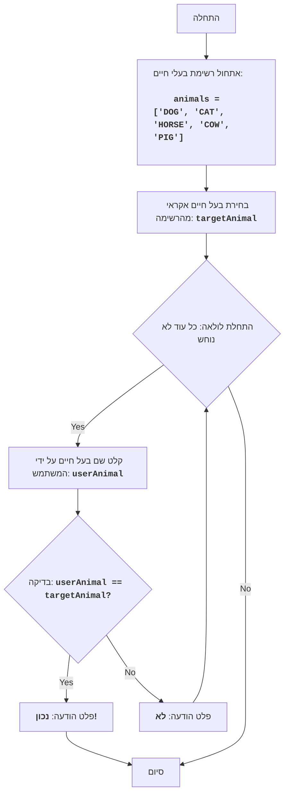

ANIMAL:
=================
דרגת קושי: 4
-----------------
המשחק "ANIMAL" הוא משחק ניחוש בעל חיים, בו המחשב בוחר בעל חיים אקראי מרשימה, והשחקן מנסה לנחש אותו באמצעות הזנת השערותיו. המשחק נמשך עד שהשחקן מנחש את בעל החיים.

חוקי המשחק:
1. המחשב בוחר בעל חיים אקראי מרשימה מוגדרת מראש.
2. השחקן מזין את השערותיו לגבי בעל החיים שנבחר.
3. לאחר כל ניסיון, המחשב מודיע האם השחקן ניחש את בעל החיים או לא.
4. המשחק נמשך כל עוד השחקן לא ניחש את בעל החיים שנבחר.
-----------------
אלגוריתם:
1. הגדרת רשימת בעלי החיים.
2. בחירת בעל חיים אקראי מהרשימה.
3. התחלת לולאת "כל עוד בעל החיים לא נוחש":
    3.1 בקשת קלט מהשחקן עבור שם בעל החיים.
    3.2 אם השם שהוזן זהה לבעל החיים שנבחר, עבור לשלב 4.
    3.3 אחרת, הצגת ההודעה "לא".
4. הצגת ההודעה "נכון!".
5. סיום המשחק.
-----------------
דיאגרמת זרימה:

מקרא:
    Start - התחלת התוכנית.
    InitializeAnimals - אתחול רשימת בעלי החיים.
    ChooseRandomAnimal - בחירת בעל חיים אקראי מהרשימה ושמירתו במשתנה targetAnimal.
    LoopStart - התחלת הלולאה, הנמשכת כל עוד בעל החיים לא נוחש.
    InputAnimal - בקשת קלט שם בעל חיים מהמשתמש ושמירתו במשתנה userAnimal.
    CheckAnimal - בדיקה האם שם בעל החיים שהוזן userAnimal זהה לבעל החיים שנבחר targetAnimal.
    OutputWin - פלט הודעה על ניצחון, אם שמות בעלי החיים זהים.
    End - סיום התוכנית.
    OutputWrong - פלט הודעה "לא", אם שם בעל החיים שהוזן אינו זהה לבעל החיים שנבחר.
```
import random

# רשימת בעלי חיים למשחק
animals = ['DOG', 'CAT', 'HORSE', 'COW', 'PIG']

# בוחרים בעל חיים אקראי מהרשימה
targetAnimal = random.choice(animals)

# מתחילים לולאה, כל עוד בעל החיים לא נוחש
while True:
    # מבקשים מהמשתמש להזין את שם בעל החיים
    userAnimal = input("נחש את בעל החיים (DOG, CAT, HORSE, COW, PIG): ").upper()

    # בודקים האם המשתמש ניחש את בעל החיים
    if userAnimal == targetAnimal:
        print("נכון!") # מודיעים על התשובה הנכונה
        break # מסיימים את הלולאה אם בעל החיים נוחש
    else:
        print("לא") # מודיעים על התשובה השגויה

"""
הסבר הקוד:

1.  **ייבוא המודול `random`**:
    -   `import random`: מייבא את המודול `random`, המשמש לבחירה אקראית של בעל חיים.

2.  **רשימת בעלי חיים**:
    -   `animals = ['DOG', 'CAT', 'HORSE', 'COW', 'PIG']`: יוצר רשימת מחרוזות המכילות את שמות בעלי החיים.

3.  **בחירת בעל חיים אקראי**:
    -   `targetAnimal = random.choice(animals)`: בוחר בעל חיים אקראי מהרשימה `animals` ושומר אותו במשתנה `targetAnimal`.

4.  **לולאת המשחק הראשית `while True:`**:
    -   לולאה אינסופית, הנמשכת כל עוד השחקן לא ניחש את בעל החיים.
    -   **קלט נתונים**:
        -   `userAnimal = input("נחש את בעל החיים (DOG, CAT, HORSE, COW, PIG): ").upper()`: מבקש מהמשתמש להזין את שם בעל החיים וממיר אותו לאותיות גדולות לצורך השוואה ללא תלות ברישיות.
    -   **תנאי הניצחון**:
        -   `if userAnimal == targetAnimal:`: בודק האם שם בעל החיים שהוזן על ידי המשתמש זהה לבעל החיים שנבחר.
        -   `print("נכון!")`: מוציא פלט הודעה על ניצחון, אם בעל החיים נוחש.
        -   `break`: מסיים את הלולאה (ואת המשחק), אם בעל החיים נוחש.
    -   **הודעה על תשובה שגויה**:
        -   `else:`: מבוצע אם שם בעל החיים שהוזן אינו זהה לבעל החיים שנבחר.
        -   `print("לא")`: מוציא פלט הודעה "לא", אם התשובה שגויה.
"""