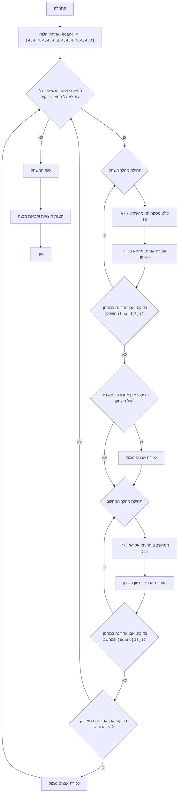

"""
AWARI:
=================
מורכבות: 6
-----------------
המשחק "אוארי" הוא משחק לוח המדמה את המשחק המסורתי מנקלה, בו שני שחקנים בתורות מזיזים "אבנים" (במקרה זה, מספרים) מתאים על הלוח, בניסיון ללכוד כמה שיותר אבנים לתוך "מחסנים" משלהם. זוהי גרסה פשוטה של המשחק, בה השחקן משחק נגד המחשב.

חוקי המשחק:
1.  לוח המשחק מורכב מ-14 תאים, ממוספרים מ-0 עד 13. תאים 6 ו-13 הם ה"מחסנים" של השחקנים.
2.  בתחילת המשחק, בכל אחד מ-12 התאים (0-5 ו-7-12) יש 4 אבנים.
3.  השחקן (אדם) מתחיל את המשחק.
4.  בוחר תא עם אבנים משלו (0-5).
5.  כל האבנים מהתא הנבחר מועברות אחת-אחת לכל תא עוקב בכיוון השעון, כולל ה"מחסן" שלו.
6.  אם האבן האחרונה הגיעה למחסן השחקן, השחקן זכאי למהלך נוסף.
7.  אם האבן האחרונה הגיעה לתא ריק בצד השחקן, ומול תא זה יש אבנים, אז השחקן לוקח את האבנים מתא זה ומהתא שממול לתוך המחסן שלו.
8.  המחשב מבצע מהלך באופן דומה.
9.  המשחק מסתיים כאשר כל התאים עם אבנים מתרוקנים.
10. מנצח השחקן שיש לו יותר אבנים במחסן.
-----------------
אלגוריתם:
1.  לאתחל את הלוח (מערך) של 14 תאים עם 4 אבנים בכל אחד, למעט תאים 6 ו-13, שהם שווים ל-0.
2.  להתחיל לולאה "כל עוד המשחק לא הסתיים"
3.  מהלך השחקן:
    3.1 בקש קלט של מספר תא מהשחקן (מ-0 עד 5).
    3.2 העבר את האבנים מהתא הנבחר בכיוון השעון.
    3.3 בדוק אם האבן האחרונה הגיעה למחסן השחקן (תא 6). אם כן, תן לשחקן מהלך נוסף.
    3.4 בדוק אם האבן האחרונה הגיעה לתא ריק בצד השחקן. אם כן, לכוד את האבנים מתא זה ומהתא שממול.
4.  מהלך המחשב (דומה למהלך השחקן, אך בחירת התא אקראית מ-7 עד 12).
5.  אם כל התאים עם אבנים ריקים, סיים את המשחק.
6.  הצג את התוצאה (מספר האבנים במחסנים של השחקן והמחשב).
7.  קבע את המנצח (למי שיש יותר אבנים במחסן).
-----------------
תרשים זרימה:

מקרא:
   Start - תחילת התוכנית.
    InitializeBoard - אתחול לוח המשחק עם 14 תאים. 6 הראשונים (0-5) ו-6 האחרונים (7-12) מייצגים תאים עם אבנים, 6 ו-13 – מחסני השחקנים.
    GameLoopStart - תחילת לולאת המשחק, שנמשכת כל עוד המשחק לא הסתיים.
    PlayerTurnStart - תחילת מהלך השחקן.
    PlayerInputCell - בקשת מספר התא מהשחקן, ממנו הוא רוצה להזיז אבנים.
    PlayerMoveStones - העברת אבנים מהתא הנבחר בכיוון השעון.
    PlayerCheckExtraTurn - בדיקה אם האבן האחרונה הגיעה למחסן השחקן. אם כן, השחקן מקבל מהלך נוסף.
    PlayerCheckCapture - בדיקה אם האבן האחרונה הגיעה לתא ריק בצד השחקן.
    PlayerCaptureStones - לכידת אבנים מהתא שממול, אם האבן האחרונה הגיעה לתא ריק בצד השחקן.
    ComputerTurnStart - תחילת מהלך המחשב.
    ComputerSelectCell - בחירת תא אקראי על ידי המחשב עבור המהלך.
    ComputerMoveStones - העברת אבנים על ידי המחשב בכיוון השעון.
    ComputerCheckExtraTurn - בדיקה אם האבן האחרונה הגיעה למחסן המחשב. אם כן, המחשב מקבל מהלך נוסף.
    ComputerCheckCapture - בדיקה אם האבן האחרונה הגיעה לתא ריק בצד המחשב.
    ComputerCaptureStones - לכידת אבנים מהתא שממול, אם האבן האחרונה הגיעה לתא ריק בצד המחשב.
    EndGame - סוף המשחק.
    OutputResult - הצגת התוצאות וקביעת המנצח.
    End - סוף התוכנית.
"""
import random

# אתחול הלוח.
# תאים 0-5 - תאי השחקן, 6 - מחסן השחקן
# תאים 7-12 - תאי המחשב, 13 - מחסן המחשב
board = [4, 4, 4, 4, 4, 4, 0, 4, 4, 4, 4, 4, 4, 0]

def display_board():
    """מציג את המצב הנוכחי של לוח המשחק."""
    print("----------------------------------------------------")
    print(f"  {board[12]:2}  {board[11]:2}  {board[10]:2}  {board[9]:2}  {board[8]:2}  {board[7]:2}   ")
    print("----------------------------------------------------")
    print(f"{board[13]:2}                                 {board[6]:2}")
    print("----------------------------------------------------")
    print(f"  {board[0]:2}  {board[1]:2}  {board[2]:2}  {board[3]:2}  {board[4]:2}  {board[5]:2}  ")
    print("----------------------------------------------------")

def player_turn():
    """מטפל במהלך השחקן."""
    while True:
        try:
            cell = int(input("בחר תא (0-5): "))
            if 0 <= cell <= 5 and board[cell] > 0:
                break
            else:
                print("בחירה לא חוקית. בחר תא עם אבנים מ-0 עד 5.")
        except ValueError:
            print("קלט לא חוקי. נא הכנס מספר.")

    stones = board[cell]
    board[cell] = 0
    current_cell = cell

    while stones > 0:
        current_cell = (current_cell + 1) % 14
        board[current_cell] += 1
        stones -= 1

    # בדיקה עבור מהלך נוסף אם האבן האחרונה הגיעה למחסן השחקן
    if current_cell == 6:
        print("השחקן מקבל מהלך נוסף.")
        display_board()
        player_turn()
        return

    # לכידת אבנים
    if 0 <= current_cell <= 5 and board[current_cell] == 1:
        opposite_cell = 12 - current_cell
        if board[opposite_cell] > 0:
             board[6] += board[opposite_cell] + 1
             board[opposite_cell]=0
             board[current_cell] = 0
             print(f"השחקן לוכד אבנים מהתאים {current_cell} ו- {opposite_cell}")

def computer_turn():
    """מטפל במהלך המחשב."""
    possible_moves = [i for i in range(7, 13) if board[i] > 0]
    if not possible_moves:
        return  # אם אין מהלכים זמינים למחשב, צא

    cell = random.choice(possible_moves)
    print(f"המחשב בוחר תא {cell}")
    stones = board[cell]
    board[cell] = 0
    current_cell = cell

    while stones > 0:
         current_cell = (current_cell + 1) % 14
         board[current_cell] += 1
         stones -= 1

    # בדיקה עבור מהלך נוסף אם האבן האחרונה הגיעה למחסן המחשב
    if current_cell == 13:
        print("המחשב מקבל מהלך נוסף.")
        display_board()
        computer_turn()
        return

    # לכידת אבנים
    if 7 <= current_cell <= 12 and board[current_cell] == 1:
          opposite_cell = 12 - current_cell
          if board[opposite_cell] > 0:
             board[13] += board[opposite_cell] + 1
             board[opposite_cell]=0
             board[current_cell] = 0
             print(f"המחשב לוכד אבנים מהתאים {current_cell} ו- {opposite_cell}")

def is_game_over():
    """בודק האם המשחק הסתיים."""
    player_side_empty = all(board[i] == 0 for i in range(0, 6))
    computer_side_empty = all(board[i] == 0 for i in range(7, 13))
    return player_side_empty or computer_side_empty

def calculate_winner():
    """קובע את המנצח ומציג את התוצאות."""
    player_score = board[6]
    computer_score = board[13]

    print(f"שחקן: {player_score} נקודות")
    print(f"מחשב: {computer_score} נקודות")

    if player_score > computer_score:
        print("ניצחת!")
    elif computer_score > player_score:
        print("המחשב ניצח!")
    else:
        print("תיקו!")

# לולאת המשחק הראשית
while True:
    display_board()
    player_turn()
    if is_game_over():
        break
    display_board()
    computer_turn()
    if is_game_over():
       break

# לאחר סיום המשחק
display_board()
calculate_winner()

"""
הסבר הקוד:
1. **אתחול הלוח (`board`)**:
   - `board = [4, 4, 4, 4, 4, 4, 0, 4, 4, 4, 4, 4, 4, 0]`: נוצרת רשימה המייצגת את לוח המשחק.
     6 האלמנטים הראשונים (0-5) - תאי השחקן, 7-12 - תאי המחשב, 6 - מחסן השחקן, 13 - מחסן המחשב.
     בתחילת המשחק בכל תא יש 4 אבנים, במחסנים - 0.

2. **הפונקציה `display_board()`**:
   - מציגה את המצב הנוכחי של לוח המשחק על המסך.

3. **הפונקציה `player_turn()`**:
   - מטפלת במהלך השחקן:
     - מבקשת קלט של מספר תא (0-5).
     - בודקת את תקינות הקלט (מספר מ-0 עד 5 והתא אינו ריק).
     - לוקחת את האבנים מהתא הנבחר.
     - מפזרת את האבנים אחת-אחת בכל תא עוקב בכיוון השעון.
     - בודקת אם האבן האחרונה הגיעה למחסן השחקן (תא 6). אם כן, השחקן מבצע מהלך נוסף.
     - בודקת אם האבן האחרונה הגיעה לתא ריק בצד השחקן, אם כן, לוכדת את האבנים שממול.
4. **הפונקציה `computer_turn()`**:
   - מטפלת במהלך המחשב:
     - בוחרת תא אקראי (7-12), שאינו ריק.
     - מפזרת את האבנים אחת-אחת בכל תא עוקב בכיוון השעון.
     - בודקת אם האבן האחרונה הגיעה למחסן המחשב (תא 13). אם כן, המחשב מבצע מהלך נוסף.
     - בודקת אם האבן האחרונה הגיעה לתא ריק בצד המחשב, אם כן, לוכדת את האבנים שממול.

5. **הפונקציה `is_game_over()`**:
   - בודקת האם המשחק הסתיים. המשחק מסתיים כאשר כל התאים בצד השחקן או בצד המחשב ריקים.
6. **הפונקציה `calculate_winner()`**:
   - מציגה את מספר הנקודות של כל שחקן.
   - קובעת את המנצח.

7. **לולאת המשחק הראשית (`while True`)**:
   - מציגה את הלוח.
   - נותנת תור לשחקן.
   - בודקת האם המשחק הסתיים. אם כן, יוצאת מהלולאה.
   - נותנת תור למחשב.
   - בודקת האם המשחק הסתיים. אם כן, יוצאת מהלולאה.

8. **הצגת תוצאות**:
   - לאחר סיום המשחק, מציגה את הלוח ואת התוצאות.
"""