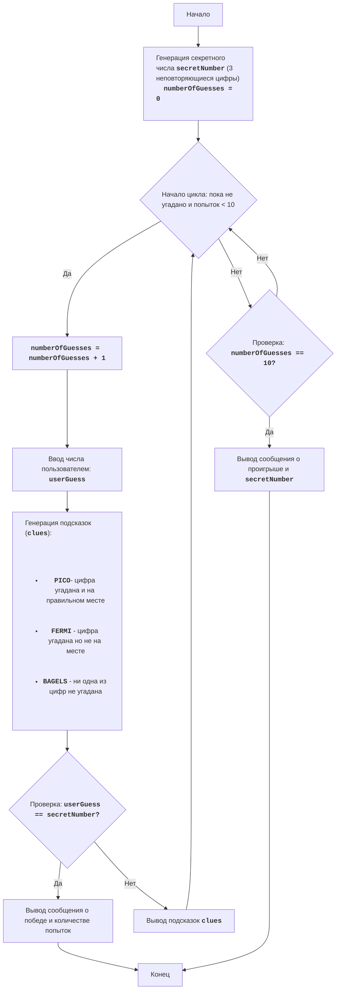

BAGLES:
=================
מורכבות: 6
-----------------
המשחק 'בייגלס' הוא משחק היגיון-חידה שבו השחקן מנסה לנחש מספר תלת-ספרתי המורכב מספרות שונות. לאחר כל ניסיון, השחקן מקבל רמזים: "PICO" פירושו שאחת מהספרות נוחשה ונמצאת במיקום הנכון, "FERMI" פירושו שאחת מהספרות נוחשה, אך לא במיקום הנכון, ו-"BAGELS" פירושו שאף אחת מהספרות לא נוחשה.

חוקי המשחק:
1. המחשב מייצר מספר תלת-ספרתי אקראי המורכב מספרות שונות.
2. השחקן מזין את ניחושו כמספר תלת-ספרתי.
3. המחשב מספק רמזים:
    - "PICO" - ספרה אחת נוחשה ונמצאת במיקום הנכון.
    - "FERMI" - ספרה אחת נוחשה אך לא במיקום הנכון.
    - "BAGELS" - אף אחת מהספרות לא נוחשה.
4. הרמזים ניתנים לפי סדר הספרות במספר המטרה, לדוגמה אם המספר המטרה הוא `123` והשחקן הזין `142`, הרמזים יהיו `PICO FERMI`.
5. המשחק נמשך עד שהשחקן מנחש את המספר.
6. אם לאחר 10 ניסיונות השחקן לא מנחש את המספר, המשחק מסתיים ומספר המטרה מוצג.
-----------------
אלגוריתם:
1. לייצר מספר תלת-ספרתי אקראי המורכב מספרות שונות (לדוגמה, 123).
2. להגדיר את מונה הניסיונות ל-0.
3. לולאה: כל עוד המספר לא נוחש או שמספר הניסיונות קטן מ-10:
    3.1. להגדיל את מונה הניסיונות ב-1.
    3.2. לבקש מהשחקן מספר תלת-ספרתי.
    3.3. להשוות את המספר שהוזן למספר המטרה וליצור את הרמזים "PICO", "FERMI" ו-"BAGELS".
    3.4. אם המספר נוחש, להציג הודעת ניצחון ומספר הניסיונות.
    3.5. אם המספר לא נוחש, להציג את הרמזים שנוצרו.
4. אם לאחר 10 ניסיונות המספר לא נוחש, להציג את מספר המטרה והודעת הפסד.
5. סוף המשחק.
-----------------
תרשים זרימה:

מקרא:
    Start - התחלת המשחק.
    GenerateSecretNumber - יצירת מספר המטרה secretNumber עם 3 ספרות שונות ואתחול מונה הניסיונות numberOfGuesses ל-0.
    LoopStart - התחלת הלולאה, הנמשכת כל עוד המספר לא נוחש ומספר הניסיונות קטן מ-10.
    IncreaseGuesses - הגדלת מונה מספר הניסיונות ב-1.
    InputGuess - בקשת קלט מספר מהמשתמש ושמירתו במשתנה userGuess.
    GenerateClues - יצירת רמזים על בסיס השוואת userGuess ו-secretNumber.
    CheckWin - בדיקה האם המספר שהוזן userGuess שווה למספר המטרה secretNumber.
    OutputWin - הצגת הודעת ניצחון ומספר הניסיונות.
    End - סיום המשחק.
    OutputClues - הצגת הרמזים שנוצרו.
    CheckLose - בדיקה האם מספר הניסיונות הגיע ל-10.
    OutputLose - הצגת הודעת הפסד ומספר המטרה secretNumber.