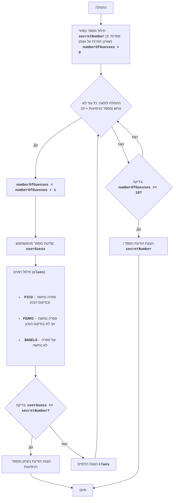

BAGLES:
=================
רמת קושי: 6
-----------------
המשחק "בייגלס" הוא משחק היגיון וחידה, בו השחקן מנסה לנחש מספר תלת-ספרתי המורכב מספרות שאינן חוזרות על עצמן. לאחר כל ניסיון, השחקן מקבל רמזים: "PICO" מציין שאחת הספרות נוחשה ונמצאת במיקום הנכון, "FERMI" מציין שאחת הספרות נוחשה אך לא במיקום הנכון, ו-"BAGELS" מציין שאף ספרה לא נוחשה.

כללי המשחק:
1. המחשב מחולל מספר תלת-ספרתי אקראי המורכב מספרות שאינן חוזרות על עצמן.
2. השחקן מזין את הניחוש שלו בצורת מספר תלת-ספרתי.
3. המחשב מספק רמזים:
    - "PICO" - ספרה אחת נוחשה ונמצאת במיקום הנכון.
    - "FERMI" - ספרה אחת נוחשה אך לא במיקום הנכון.
    - "BAGELS" - אף ספרה לא נוחשה.
4. הרמזים ניתנים לפי סדר מיקום הספרות במספר הנסתר. לדוגמה, אם המספר הנסתר הוא `123` והשחקן הזין `142`, הרמזים יהיו `PICO FERMI`.
5. המשחק נמשך עד שהשחקן ינחש את המספר.
6. אם לאחר 10 ניסיונות השחקן לא מנחש את המספר, המשחק מסתיים והמספר הנסתר מוצג.
-----------------
אלגוריתם:
1. לחולל מספר תלת-ספרתי אקראי, המורכב מספרות שאינן חוזרות על עצמן (לדוגמה, 123).
2. להגדיר את מספר הניסיונות שווה ל-0.
3. לולאה "כל עוד המספר לא נוחש או מספר הניסיונות קטן מ-10":
    3.1. להגדיל את מספר הניסיונות ב-1.
    3.2. לבקש מהשחקן מספר תלת-ספרתי.
    3.3. להשוות את המספר שהוזן למספר הנסתר ולחולל את הרמזים "PICO", "FERMI" ו-"BAGELS".
    3.4. אם המספר נוחש, להציג הודעת ניצחון ואת מספר הניסיונות.
    3.5. אם המספר לא נוחש, להציג את הרמזים שנוצרו.
4. אם לאחר 10 ניסיונות המספר לא נוחש, להציג את המספר הנסתר והודעת הפסד.
5. סוף המשחק.
-----------------
תרשים זרימה:

מקרא:
    Start - התחלת המשחק.
    GenerateSecretNumber - חילוּל המספר הנסתר secretNumber המורכב מ-3 ספרות שאינן חוזרות על עצמן ואתחול מונה הניסיונות numberOfGuesses ל-0.
    LoopStart - התחלת הלולאה, שנמשכת כל עוד המספר לא נוחש ומספר הניסיונות קטן מ-10.
    IncreaseGuesses - הגדלת מונה מספר הניסיונות ב-1.
    InputGuess - בקשה מהמשתמש להזין מספר ושמירתו במשתנה userGuess.
    GenerateClues - חילוּל רמזים על בסיס השוואת userGuess ו-secretNumber.
    CheckWin - בדיקה האם המספר userGuess שהוזן שווה למספר הנסתר secretNumber.
    OutputWin - הצגת הודעת ניצחון ומספר הניסיונות.
    End - סוף המשחק.
    OutputClues - הצגת הרמזים שנוצרו.
    CheckLose - בדיקה האם מספר הניסיונות הגיע ל-10.
    OutputLose - הצגת הודעת הפסד והמספר הנסתר secretNumber.