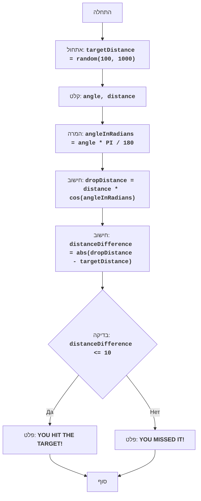

BOMBER:
=================
רמת קושי: 5
-----------------
המשחק "בומבר" הוא משחק פאזל שבו השחקן מנסה להטיל פצצה על מטרה, הממוקמת במרחק שנוצר באופן אקראי. השחקן מזין את זווית ההטלה ואת המרחק, והמחשב מחשב את מסלול הפצצה. מטרת המשחק היא לפגוע במטרה בדיוק מרבי ככל האפשר.

כללי המשחק:
1. המחשב מייצר מרחק אקראי למטרה בטווח של 100 עד 1000.
2. השחקן מזין את זווית הטלת הפצצה ואת מרחק ההטלה.
3. המחשב מחשב את המרחק אליו תנחת הפצצה.
4. אם מרחק נחיתת הפצצה נמצא בטווח של 10 יחידות מהמרחק למטרה, השחקן מנצח.
5. אם מרחק נחיתת הפצצה אינו בטווח, השחקן מפסיד.
-----------------
אלגוריתם:
1. לייצר מרחק אקראי למטרה בטווח של 100 עד 1000 ולהקצות למשתנה `targetDistance`.
2. לבקש מהשחקן את זווית הטלת הפצצה במעלות (`angle`) ואת מרחק ההטלה (`distance`).
3. להמיר את הזווית ממעלות לרדיאנים: `angleInRadians = angle * 3.14159 / 180`.
4. לחשב את מרחק נחיתת הפצצה לפי הנוסחה: `dropDistance = distance * cos(angleInRadians)`.
5. לחשב את ההפרש המוחלט בין מרחק נחיתת הפצצה לבין המרחק למטרה: `distanceDifference = abs(dropDistance - targetDistance)`.
6. אם ההפרש בין המרחקים קטן או שווה ל-10, להציג הודעה על ניצחון.
7. אחרת, להציג הודעה על הפסד.
8. סוף.
-----------------
תרשים זרימה:

מקרא:
    Start - התחלת התוכנית.
    InitializeTargetDistance - אתחול: נוצר מרחק אקראי למטרה (targetDistance) מ-100 עד 1000.
    InputAngleDistance - בקשת זווית הטלה (angle) ומרחק הטלה (distance) מהמשתמש.
    ConvertAngle - המרת הזווית ממעלות לרדיאנים (angleInRadians).
    CalculateDropDistance - חישוב מרחק נחיתת הפצצה (dropDistance) על בסיס הנתונים שהוזנו.
    CalculateDistanceDifference - חישוב ההפרש המוחלט בין מרחק נחיתת הפצצה (dropDistance) לבין המרחק למטרה (targetDistance).
    CheckDistanceDifference - בדיקה האם ההפרש בין המרחקים נמצא בטווח של 10 יחידות (distanceDifference <= 10).
    OutputWin - הצגת הודעה על ניצחון, אם ההפרש בטווח של 10 יחידות.
    End - סוף התוכנית.
    OutputLose - הצגת הודעה על הפסד, אם ההפרש גדול מ-10 יחידות.