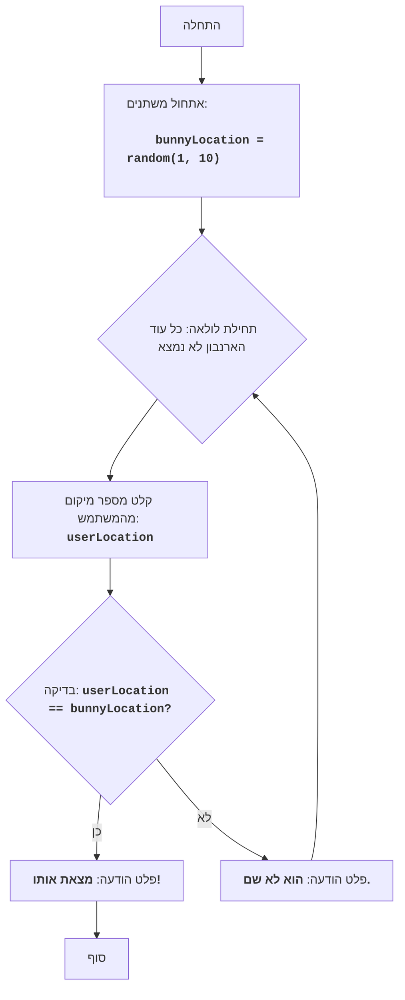

BUNNY:
=================
קושי: 4
-----------------
המשחק "BUNNY" הוא משחק טקסט שבו השחקן מנסה למצוא ארנבון החבוי באחד מעשרה מיקומים.
השחקן בוחר מספר מיקום, והמשחק מודיע האם הארנבון נמצא במיקום זה. המשחק נמשך עד שהארנבון נמצא.

כללי המשחק:
1. הארנבון מתחבא באופן אקראי באחד מעשרה מיקומים (ממוספרים מ-1 עד 10).
2. השחקן בוחר את מספר המיקום שבו לדעתו נמצא הארנבון.
3. המשחק מודיע האם הארנבון נמצא במיקום הנבחר.
4. המשחק מסתיים כאשר הארנבון נמצא.
-----------------
אלגוריתם:
1. יצירת מספר אקראי בטווח מ-1 עד 10, שייצג את המיקום שבו חבוי הארנבון.
2. התחלת לולאה "כל עוד הארנבון לא נמצא":
   2.1 בקשה מהשחקן להזין מספר מיקום מ-1 עד 10.
   2.2 אם מספר המיקום שווה למיקום שבו חבוי הארנבון, הצגת ההודעה "מצאת אותו!".
      2.2.1 סיום המשחק.
   2.3 אחרת, אם מספר המיקום אינו שווה למיקום שבו חבוי הארנבון, הצגת ההודעה "הוא לא שם.".
      2.3.1 המשך המשחק (חזרה לתחילת הלולאה).
-----------------
דיאגרמת זרימה:

מקרא:
    Start - התחלת התוכנית.
    InitializeVariables - אתחול משתנה: `bunnyLocation` (מיקום הארנבון) נוצר באופן אקראי מ-1 עד 10.
    LoopStart - תחילת הלולאה, שנמשכת כל עוד הארנבון לא נמצא.
    InputLocation - בקשה מהמשתמש להזין מספר מיקום ושמירתו במשתנה `userLocation`.
    CheckLocation - בדיקה האם המיקום שהוזן `userLocation` שווה למיקום הארנבון `bunnyLocation`.
    OutputWin - פלט הודעת ניצחון "מצאת אותו!", אם המיקומים תואמים.
    End - סוף התוכנית.
    OutputLose - פלט ההודעה "הוא לא שם.", אם המיקומים אינם תואמים.
"""
import random

# מייצר מספר אקראי בין 1 ל-10 עבור מיקום הארנבון
bunnyLocation = random.randint(1, 10)

# הלולאה הראשית של המשחק
while True:
    # מבקש מהמשתמש את מספר המיקום
    try:
        userLocation = int(input("היכן הארנבון (1-10)? "))
    except ValueError:
        print("אנא הכנס מספר שלם בין 1 ל-10.")
        continue

    # בודק אם המשתמש ניחש את מיקום הארנבון
    if userLocation == bunnyLocation:
        print("מצאת אותו!")  # מוציא הודעה אם הארנבון נמצא
        break  # מסיים את הלולאה אם הארנבון נמצא
    else:
        print("הוא לא שם.")  # מוציא הודעה אם הארנבון לא נמצא

"""
הסבר על הקוד:
1.  **ייבוא מודול `random`**:
    -  `import random`: מייבא את מודול `random`, המשמש ליצירת מספר אקראי המייצג את המיקום שבו חבוי הארנבון.
2.  **אתחול מיקום הארנבון**:
    -   `bunnyLocation = random.randint(1, 10)`: מייצר מספר שלם אקראי בטווח מ-1 עד 10 ושומר אותו במשתנה `bunnyLocation`. מספר זה מייצג את המיקום שבו חבוי הארנבון.
3.  **הלולאה הראשית `while True:`**:
    -   לולאה זו תתבצע כל עוד הארנבון לא נמצא (עד שתתבצע הפקודה `break`).
    -   **קלט מספר המיקום**:
        -   `try...except ValueError`: בלוק try-except מטפל בשגיאות קלט אפשריות. אם המשתמש יזין קלט שאינו מספר שלם, תוצג הודעת שגיאה.
        -   `userLocation = int(input("היכן הארנבון (1-10)? "))`: מבקש מהמשתמש את מספר המיקום שלדעתו הארנבון חבוי בו, וממיר את הקלט למספר שלם.
    -   **בדיקת המיקום**:
        -   `if userLocation == bunnyLocation`: בודק האם מספר המיקום שהוזן תואם את מיקום הארנבון.
        -   `print("מצאת אותו!")`: אם המיקומים תואמים, מוציא הודעה שהארנבון נמצא.
        -   `break`: מסיים את לולאת המשחק.
        -   `else:`: אם המיקומים אינם תואמים.
        -  `print("הוא לא שם.")`: מוציא הודעה שהארנבון לא נמצא במיקום הנבחר.
"""