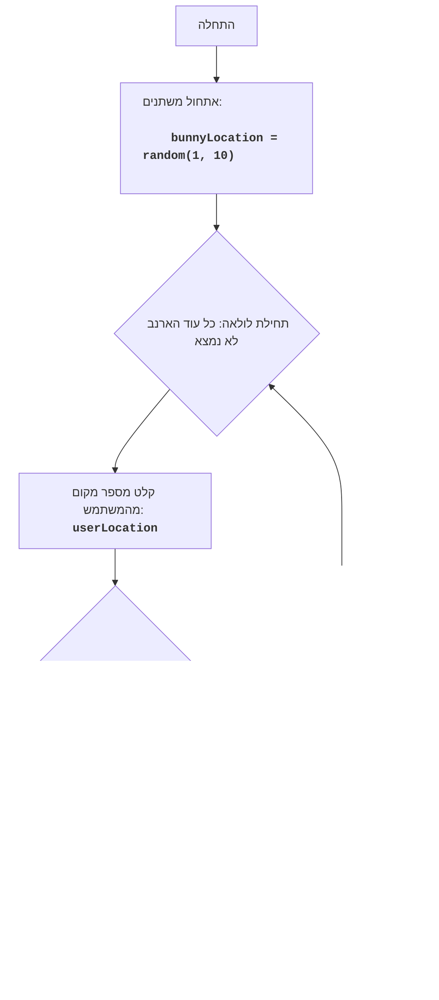

BUNNY:
=================
מורכבות: 4
-----------------
המשחק "BUNNY" מהווה משחק טקסטואלי שבו השחקן מנסה למצוא ארנב המוחבא באחד מעשרה מקומות.
השחקן בוחר מספר מקום, והמשחק מודיע האם הארנב נמצא במקום זה. המשחק נמשך עד אשר הארנב יימצא.

חוקי המשחק:
1. ארנב מוחבא באופן אקראי באחד מעשרה מקומות (ממוספרים מ-1 עד 10).
2. השחקן בוחר מספר מקום, היכן, לדעתו, נמצא הארנב.
3. המשחק מודיע האם הארנב נמצא במקום שנבחר.
4. המשחק מסתיים כאשר הארנב נמצא.
-----------------
אלגוריתם:
1. ליצור מספר אקראי בטווח של 1 עד 10, אשר ייצג את המקום שבו מוחבא הארנב.
2. להתחיל לולאה "כל עוד הארנב לא נמצא":
   2.1 לבקש מהשחקן קלט של מספר מקום מ-1 עד 10.
   2.2 אם מספר המקום שווה למקום שבו מוחבא הארנב, להציג הודעה "You found him!".
      2.2.1 לסיים את המשחק.
   2.3 אחרת, אם מספר המקום אינו שווה למקום שבו מוחבא הארנב, להציג הודעה "He's not there.".
      2.3.1 להמשיך את המשחק (לחזור לתחילת הלולאה).
-----------------
תרשים זרימה:

מקרא:
    Start - תחילת התוכנית.
    InitializeVariables - אתחול משתנה: bunnyLocation (מקום הארנב) נוצר באופן אקראי מ-1 עד 10.
    LoopStart - תחילת הלולאה, שנמשכת כל עוד הארנב לא נמצא.
    InputLocation - בקשת קלט מהמשתמש של מספר מקום ושמירתו במשתנה userLocation.
    CheckLocation - בדיקה האם המקום שהוזן userLocation שווה למקום הארנב bunnyLocation.
    OutputWin - הצגת הודעת ניצחון "You found him!", אם המקומות תואמים.
    End - סיום התוכנית.
    OutputLose - הצגת הודעה "He's not there.", אם המקומות אינם תואמים.
"""
import random

# יוצר מספר אקראי מ-1 עד 10 עבור מקום הארנב
bunnyLocation = random.randint(1, 10)

# לולאת המשחק הראשית
while True:
    # מבקש מהמשתמש את מספר המקום
    try:
        userLocation = int(input("היכן הארנב (1-10)? "))
    except ValueError:
        print("אנא הזן מספר שלם מ-1 עד 10.")
        continue

    # בודק האם המשתמש ניחש את מקום הארנב
    if userLocation == bunnyLocation:
        print("You found him!")  # מציג הודעה אם הארנב נמצא
        break  # מסיים את הלולאה אם הארנב נמצא
    else:
        print("He's not there.")  # מציג הודעה אם הארנב לא נמצא

"""
הסבר על הקוד:
1.  **ייבוא מודול `random`**:
    -  `import random`: מייבא את המודול `random`, המשמש ליצירת מספר אקראי המייצג את המקום שבו מוחבא הארנב.
2.  **אתחול מיקום הארנב**:
    -   `bunnyLocation = random.randint(1, 10)`: יוצר מספר שלם אקראי בטווח של 1 עד 10 ושומר אותו במשתנה `bunnyLocation`. מספר זה מייצג את המקום שבו מוחבא הארנב.
3.  **לולאת המשחק הראשית `while True:`**:
    -   לולאה זו תתבצע עד אשר הארנב יימצא (עד שהפקודה `break` תתבצע).
    -   **קלט מספר מקום**:
        -   `try...except ValueError`: בלוק try-except מטפל בשגיאות קלט אפשריות. אם המשתמש יזין מספר שאינו שלם, תוצג הודעת שגיאה.
        -   `userLocation = int(input("היכן הארנב (1-10)? "))`: מבקש מהמשתמש את מספר המקום היכן, לדעתו, מוחבא הארנב, וממיר את הקלט למספר שלם.
    -   **בדיקת המיקום**:
        -   `if userLocation == bunnyLocation`: בודק האם מספר המקום שהוזן תואם את מיקום הארנב.
        -   `print("You found him!")`: אם המקומות תואמים, מציג הודעה על כך שהארנב נמצא.
        -   `break`: מסיים את לולאת המשחק.
        -   `else:`: אם המקומות אינם תואמים.
        -  `print("He's not there.")`: מציג הודעה על כך שהארנב לא נמצא במקום שנבחר.
"""