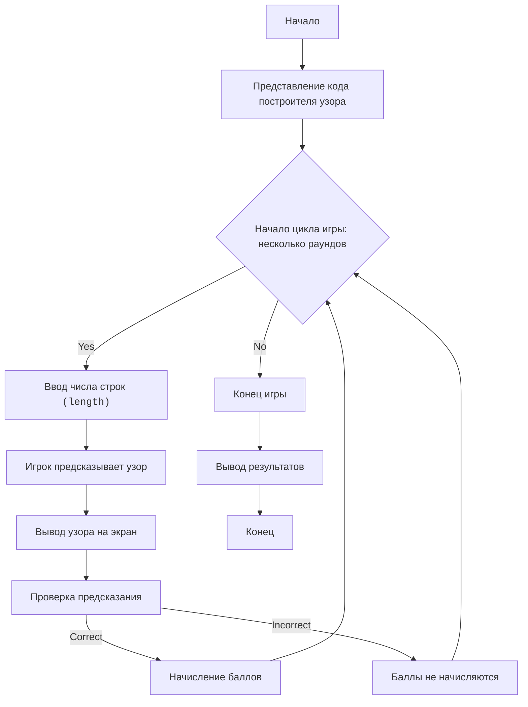

**הנחיה מערכתית למודל שפה: תרגום מסמכים מרוסית**

עליך לתרגם מסמך מרוסית לשפות שונות בהתאם להקשר התוכן:

1.  **טקסט שאינו קוד** – כל טקסט מחוץ לחלקי קוד יש לתרגם לעברית אקדמית, ברורה ורהוטה. יש לשמור על רמת ניסוח גבוהה, מתאימה למסמכים טכניים או אקדמיים.
2.  **קוד תוכנה** – אין לשנות את הקוד עצמו בשום אופן. אין להוסיף, למחוק או לערוך שורות קוד.
3.  **הערות בתוך הקוד** (כולל תגובות עם `#`, מסמכי docstring, והערות בתוך שורות קוד) – יש לתרגם רק את ההערות וה-docstrings לעברית אקדמית. עם זאת, במקרה שהוראות ניתנות באנגלית בקוד – יש להשאיר אותן באנגלית תקנית, ולהחליף את ההערות הרוסיות באנגלית טכנית ברורה.
4.  **אין לתרגם מילים או שמות קוד, משתנים, שמות קבצים או פונקציות**.
5.  **יש לשמר את המבנה המקורי של המסמך**, כולל רווחים, מבנה קבצים, פסקאות, ותיחום של קטעי קוד.
6.  **יש להקפיד על עקביות בתרגום מונחים טכניים** – מונח ברוסית שמופיע כמה פעמים צריך להיות מתורגם באותה הצורה בכל המקומות, בהתאם להקשר.

---

הנה תיאור משחק המבוסס על קוד מתוך תמונה, אשר מציג תבנית של כוכבים, עם דגש על הבנת פעולת לולאות ואלגוריתם בניית התבנית:

"""
STAR PATTERN:
=================
רמת קושי: 6
-----------------
המשחק "תבנית כוכבים" הוא משחק לימודי שבו השחקן מנסה להבין כיצד פועל קוד Python היוצר תבנית של כוכבים. השחקן, ללא גישה ישירה להרצת הקוד, מנתח את ההיגיון שבו ומנסה לחזות איזו תבנית תתקבל עבור ערכי קלט שונים. מטרת המשחק היא ללמוד כיצד לולאות מקוננות ופקודות פלט יוצרות צורות מורכבות.

חוקי המשחק:
1. לשחקן מסופק קוד Python המציג תבנית של כוכבים.
2. השחקן מתבקש להזין מספר שורות (length).
3. השחקן נדרש לחזות איזו תבנית כוכבים תוצג על המסך.
4. השחקן מקבל נקודות עבור חיזויים נכונים.
5. המשחק מורכב ממספר סבבים, בכל פעם עם מספר שורות חדש.
-----------------
אלגוריתם:
1. **הצגת הקוד:** לשחקן מוצג קוד Python היוצר את תבנית הכוכבים.
2. **קלט `length`:** השחקן מתבקש להזין את הערך של `length` (מספר השורות).
3. **חיזוי:** השחקן, באמצעות ניתוח הקוד, נדרש לחזות איזו תבנית תוצג עבור ה-`length` שהוזן. לשם כך, יש להבין כיצד פועלות הלולאות המקוננות.
    - הלולאה החיצונית הראשונה (החלק העליון של התבנית) רצה מ-`0` עד `length - 1`.
    - הלולאה הפנימית הראשונה מציגה כוכבים משמאל. מספר הכוכבים גדל מ-0 עד `length-1`.
    - הלולאה הפנימית השנייה מציגה רווחים במרכז. מספר הרווחים קטן מ-`2*(length-1)` עד `0`.
    - הלולאה הפנימית השלישית מציגה כוכבים מימין, מספר הכוכבים מ-0 עד `length-1`.
    - הלולאה החיצונית השנייה (החלק התחתון של התבנית) רצה מ-`0` עד `length - 1`.
    - הלולאה הפנימית הראשונה מציגה כוכבים משמאל. מספר הכוכבים קטן מ-`length` עד `1`.
    - הלולאה הפנימית השנייה מציגה רווחים במרכז. מספר הרווחים גדל מ-`0` עד `2*(length-1)`.
    - הלולאה הפנימית השלישית מציגה כוכבים מימין, מספר הכוכבים קטן מ-`length` עד `1`.
4. **בדיקת החיזוי:** לאחר החיזוי, מוצגת לשחקן התבנית האמיתית.
5. **הערכה:** השחקן מקבל נקודות עבור חיזוי נכון.
6. **חזרה:** שלבים 2-5 חוזרים על עצמם מספר פעמים עם ערכים שונים של `length`.
7. **סיום:** המשחק מסתיים, והניקוד הכולל מוצג.
-----------------
תרשים זרימה:

מקרא:
    Start - תחילת המשחק.
    PresentCode - הצגת קוד התוכנית לשחקן.
    GameLoopStart - תחילת מחזור המשחק, נמשך עד תום הסבבים.
    PlayerInputLength - בקשת מספר השורות מהשחקן עבור התבנית.
    PlayerPredict - השחקן חוזה כיצד תיראה התבנית.
    DisplayResult - הצגת התבנית האמיתית על המסך.
    CheckPrediction - בדיקת חיזוי השחקן.
    AwardPoints - צבירת נקודות עבור תשובה נכונה.
    NoPoints - נקודות אינן נצברות עבור תשובה שגויה.
    EndGame - סוף המשחק.
    OutputScore - הצגת הניקוד הכולל.
    End - סוף התוכנית.
"""

import random

# פונקציה לשרטוט התבנית
def draw_star_pattern(length):
    # upper section
    for i in range(length):
        for j in range(i):
            print('*', end='')
        for k in range(2*(length-i)):
            print(' ', end='')
        for l in range(i):
            print('*', end='')
        print() # for new line
    
    #lower section
    for i in range(length):
      for j in range((length-i)-1):
          print('*',end='')
      for k in range(2*i):
          print(' ',end='')
      for l in range((length-i)-1):
          print('*',end='')
      print() #for new line
    
def play_star_pattern_game():
    """משחק ניחוש תבנית כוכבים."""
    print("ברוכים הבאים למשחק 'תבנית כוכבים'!")
    
    score = 0
    num_rounds = 3

    for round_num in range(num_rounds):
        print(f"\nסבב {round_num + 1}/{num_rounds}:")
        length = random.randint(3, 6)  # בוחרים מספר אקראי של שורות
        print(f"נסה לחזות את התבנית, אם מספר השורות הוא: {length}")
    
        print("הנה הקוד עבור התבנית:")
        print("""
# upper section
for i in range(length):
    for j in range(i):
        print('*', end='')
    for k in range(2*(length-i)):
        print(' ', end='')
    for l in range(i):
        print('*', end='')
    print() # for new line
    
#lower section
for i in range(length):
  for j in range((length-i)-1):
      print('*',end='')
  for k in range(2*i):
      print(' ',end='')
  for l in range((length-i)-1):
      print('*',end='')
  print() #for new line
""")
        input("לחץ Enter כדי לראות את התבנית")
        draw_star_pattern(length)
    
        correct_prediction = input("האם האלגוריתם מובן? (כ/ל): ")
        if correct_prediction.lower() == 'כ':
           score += 1
           print("מעולה, נקודה נצברה!")
        else:
           print("נסה בסבב הבא.")
    print(f"המשחק הסתיים, הניקוד שלך: {score}/{num_rounds}")
    

if __name__ == "__main__":
    play_star_pattern_game()

"""
**הסבר הקוד**

1. **פונקציה `draw_star_pattern(length)`**:
    * מקבלת כקלט מספר שלם `length`, המגדיר את גודל התבנית.
    * **קטע עליון:**
        * לולאה חיצונית (`for i in range(length)`): עוברת על כל שורה בחלק העליון של התבנית.
        * לולאות פנימיות (`for j`, `for k`, `for l`):
            * `for j`: מציגה `i` כוכבים.
            * `for k`: מציגה רווחים. מספר הרווחים מחושב לפי הנוסחה: `2 * (length - i)`.
            * `for l`: מציגה `i` כוכבים.
        * `print()`: מעבר לשורה חדשה.
    * **קטע תחתון:**
        * לולאה חיצונית (`for i in range(length)`): עוברת על כל שורה בחלק התחתון של התבנית.
        * לולאות פנימיות (`for j`, `for k`, `for l`):
            * `for j`: מציגה `length-i-1` כוכבים.
            * `for k`: מציגה רווחים. מספר הרווחים מחושב לפי הנוסחה: `2 * i`.
            * `for l`: מציגה `length-i-1` כוכבים.
        * `print()`: מעבר לשורה חדשה.

2. **פונקציה `play_star_pattern_game()`**:
    * מציגה ברכה.
    * מאתחלת את מונה הניקוד `score` ל-`0`.
    * מגדירה את מספר הסבבים `num_rounds` כ-`3`.
    * בלולאת `for` עבור הסבבים:
        * מציגה את מספר הסבב ואת המספר האקראי `length` שנוצר.
        * מציגה תיאור של הקוד, כרמז לשחקן.
        * מציעה ללחוץ enter ומציגה את התבנית באמצעות הפונקציה `draw_star_pattern`.
        * שואלת את השחקן אם הבין כיצד הקוד עובד.
        * אם התשובה היא 'כ', צוברת נקודה ומודיעה על כך.
        * בסוף המשחק מציגה את התוצאה.

3. **`if __name__ == "__main__":`**:
    * מריצה את המשחק `play_star_pattern_game`.

**כיצד להשתמש במשחק:**

1. **הציגו את הקוד:** הראו לשחקן את הקוד המצורף (הוא כלול בתיאור המשחק).
2. **צרו `length`:** בחרו באקראי מספר שורות `length` (3 עד 6 להתחלה).
3. **חיזוי:** בקשו מהשחקן לתאר איזו תבנית הוא מצפה לראות.
4. **הצגת התבנית:** הציגו את התבנית שנוצרה.
5. **הערכה:** העריכו עד כמה השחקן הבין נכון את היגיון התוכנית וחזה את התבנית.

דוגמה זו מדגימה כיצד ניתן להפוך קוד היוצר תבנית למשחק לימודי, שבו השחקן לומד לנתח קוד ולחזות תוצאות.
"""