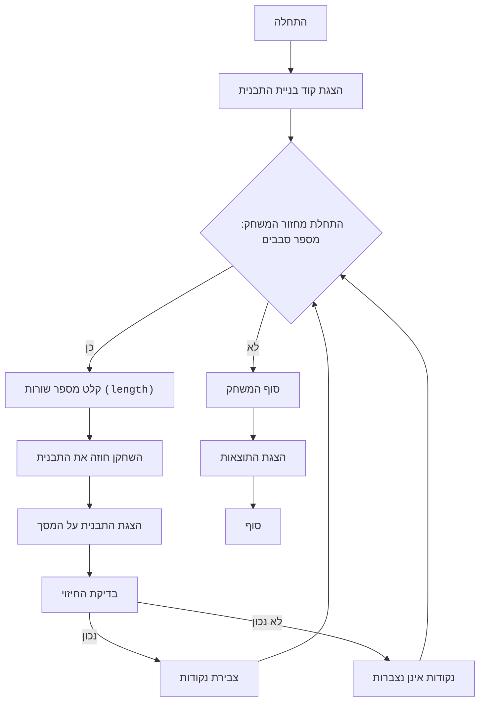

**הנחיה מערכתית למודל שפה: תרגום מסמכים מרוסית**

עליך לתרגם מסמך מרוסית לשפות שונות בהתאם להקשר התוכן:

1.  **טקסט שאינו קוד** – כל טקסט מחוץ לחלקי קוד יש לתרגם לעברית אקדמית, ברורה ורהוטה. יש לשמור על רמת ניסוח גבוהה, מתאימה למסמכים טכניים או אקדמיים.
2.  **קוד תוכנה** – אין לשנות את הקוד עצמו בשום אופן. אין להוסיף, למחוק או לערוך שורות קוד.
3.  **הערות בתוך הקוד** (כולל תגובות עם `#`, מסמכי docstring, והערות בתוך שורות קוד) – יש לתרגם רק את ההערות וה-docstrings לעברית אקדמית. עם זאת, במקרה שהוראות ניתנות באנגלית בקוד – יש להשאיר אותן באנגלית תקנית, ולהחליף את ההערות הרוסיות באנגלית טכנית ברורה.
4.  **אין לתרגם מילים או שמות קוד, משתנים, שמות קבצים או פונקציות**.
5.  **יש לשמר את המבנה המקורי של המסמך**, כולל רווחים, מבנה קבצים, פסקאות, ותיחום של קטעי קוד.
6.  **יש להקפיד על עקביות בתרגום מונחים טכניים** – מונח ברוסית שמופיע כמה פעמים צריך להיות מתורגם באותה הצורה בכל המקומות, בהתאם להקשר.

---

הנה תיאור המשחק, המבוסס על הקוד מהתמונה, המציג תבנית כוכבים, עם דגש על הבנת פעולת הלולאות והאלגוריתם לבניית התבנית:

"""
STAR PATTERN:
=================
מורכבות: 6
-----------------
המשחק "תבנית כוכבים" הוא משחק לימודי שבו השחקן מנסה להבין כיצד פועל קוד Python היוצר תבנית כוכבים. השחקן, ללא גישה ישירה להרצת הקוד, מנתח את הלוגיקה שלו ומנסה לחזות איזו תבנית תתקבל עבור ערכי קלט שונים. מטרת המשחק היא ללמוד כיצד לולאות מקוננות ופקודות פלט מעצבות צורות מורכבות.

חוקי המשחק:
1. לשחקן מסופק קוד Python המדפיס תבנית כוכבים.
2. השחקן מתבקש להזין מספר שורות (length).
3. השחקן חייב לחזות איזו תבנית כוכבים תודפס על המסך.
4. השחקן מקבל נקודות עבור חיזויים נכונים.
5. המשחק מורכב ממספר סבבים, בכל פעם עם מספר שורות חדש.
-----------------
אלגוריתם:
1. **הצגת הקוד:** לשחקן מסופק קוד Python היוצר תבנית כוכבים.
2. **קלט `length`:** השחקן מתבקש להזין ערך עבור `length` (מספר שורות).
3. **חיזוי:** השחקן, מנתח את הקוד, חייב לחזות איזו תבנית תודפס עבור הערך המוזן של `length`. לשם כך יש להבין כיצד פועלות הלולאות המקוננות.
    - הלולאה החיצונית הראשונה (החלק העליון של התבנית) רצה מ-`0` עד `length - 1`.
    - הלולאה הפנימית הראשונה מדפיסה כוכביות משמאל. מספר הכוכביות גדל מ-0 עד `length-1`.
    - הלולאה הפנימית השנייה מדפיסה רווחים במרכז. מספר הרווחים פוחת מ-`2*(length-1)` עד `0`.
    - הלולאה הפנימית השלישית מדפיסה כוכביות מימין, מספר הכוכביות מ-0 עד `length-1`.
    - הלולאה החיצונית השנייה (החלק התחתון של התבנית) רצה מ-`0` עד `length - 1`.
    - הלולאה הפנימית הראשונה מדפיסה כוכביות משמאל. מספר הכוכביות פוחת מ-`length` עד `1`.
    - הלולאה הפנימית השנייה מדפיסה רווחים במרכז. מספר הרווחים עולה מ-`0` עד `2*(length-1)`.
    - הלולאה הפנימית השלישית מדפיסה כוכביות מימין, מספר הכוכביות פוחת מ-`length` עד `1`.
4. **בדיקת החיזוי:** לאחר החיזוי, לשחקן מוצגת התבנית האמיתית.
5. **הערכה:** השחקן מקבל נקודות עבור חיזוי נכון.
6. **חזרה:** שלבים 2-5 חוזרים על עצמם מספר פעמים עם ערכים שונים של `length`.
7. **סיום:** המשחק מסתיים, ומוצג סך כל הנקודות.
-----------------
תרשים זרימה:

מקרא:
    Start - התחלת המשחק.
    PresentCode - הצגת קוד התוכנית לשחקן.
    GameLoopStart - התחלת מחזור המשחק, נמשך עד לסיום הסבבים.
    PlayerInputLength - בקשת מספר שורות מהשחקן עבור התבנית.
    PlayerPredict - השחקן חוזה איזו תבנית תתקבל.
    DisplayResult - הצגת התבנית האמיתית על המסך.
    CheckPrediction - בדיקת חיזוי השחקן.
    AwardPoints - צבירת נקודות עבור תשובה נכונה.
    NoPoints - נקודות אינן נצברות עבור תשובה לא נכונה.
    EndGame - סוף המשחק.
    OutputScore - הצגת סך כל הנקודות.
    End - סוף התוכנית.
"""

import random

# פונקציה לשרטוט התבנית
def draw_star_pattern(length):
    # upper section
    for i in range(length):
        for j in range(i):
            print('*', end='')
        for k in range(2*(length-i)):
            print(' ', end='')
        for l in range(i):
            print('*', end='')
        print() # למעבר שורה
    
    #lower section
    for i in range(length):
      for j in range((length-i)-1):
          print('*',end='')
      for k in range(2*i):
          print(' ',end='')
      for l in range((length-i)-1):
          print('*',end='')
      print() # למעבר שורה
    
def play_star_pattern_game():
    """משחק ניחוש תבנית הכוכבים."""
    print("ברוכים הבאים למשחק 'תבנית כוכבים'!")
    
    score = 0
    num_rounds = 3

    for round_num in range(num_rounds):
        print(f"\nסבב {round_num + 1}/{num_rounds}:")
        length = random.randint(3, 6)  # בוחרים מספר אקראי של שורות
        print(f"נסה לחזות את התבנית כאשר מספר השורות הוא: {length}")
    
        print("הנה הקוד עבור התבנית:")
        print("""
# upper section
for i in range(length):
    for j in range(i):
        print('*', end='')
    for k in range(2*(length-i)):
        print(' ', end='')
    for l in range(i):
        print('*', end='')
    print() # for new line
    
#lower section
for i in range(length):
  for j in range((length-i)-1):
      print('*',end='')
  for k in range(2*i):
      print(' ',end='')
  for l in range((length-i)-1):
      print('*',end='')
  print() #for new line
""")
        input("לחץ Enter כדי לראות את התבנית")
        draw_star_pattern(length)
    
        correct_prediction = input("האם האלגוריתם ברור? (כ/ל): ")
        if correct_prediction.lower() == 'כ':
           score += 1
           print("מעולה, נקודה נצברה!")
        else:
           print("נסה שוב בסבב הבא.")
    print(f"המשחק הסתיים, הניקוד שלך: {score}/{num_rounds}")
    

if __name__ == "__main__":
    play_star_pattern_game()

"""
**הסבר על הקוד**

1.  **הפונקציה `draw_star_pattern(length)`**:
    *   מקבלת כקלט מספר שלם `length`, הקובע את גודל התבנית.
    *   **מקטע עליון:**
        *   לולאה חיצונית (`for i in range(length)`): עוברת (מבצעת איטרציה) על כל שורה בחלק העליון של התבנית.
        *   לולאות פנימיות (`for j`, `for k`, `for l`):
            *   `for j`: מדפיסה `i` כוכביות.
            *   `for k`: מדפיסה רווחים. כמות הרווחים מחושבת לפי הנוסחה: `2 * (length - i)`.
            *   `for l`: מדפיסה `i` כוכביות.
        *   `print()`: מעבר לשורה חדשה.
    *   **מקטע תחתון:**
         *   לולאה חיצונית (`for i in range(length)`): עוברת (מבצעת איטרציה) על כל שורה בחלק התחתון של התבנית.
        *   לולאות פנימיות (`for j`, `for k`, `for l`):
            *   `for j`: מדפיסה `length-i-1` כוכביות.
            *   `for k`: מדפיסה רווחים. כמות הרווחים מחושבת לפי הנוסחה: `2 * i`.
            *   `for l`: מדפיסה `length-i-1` כוכביות.
        *   `print()`: מעבר לשורה חדשה.

2.  **הפונקציה `play_star_pattern_game()`**:
    *   מדפיסה ברכה.
    *   מאפסת את מונה הניקוד (`score`) לאפס.
    *   קובעת את מספר הסבבים (`num_rounds`) ל-3.
    *   בלולאת `for` על הסבבים:
        *   מדפיסה את מספר הסבב ואת המספר האקראי שנוצר עבור `length`.
        *   מדפיסה את תיאור הקוד, כרמז לשחקן.
        *   מציעה ללחוץ על Enter ומדפיסה את התבנית באמצעות הפונקציה `draw_star_pattern`.
        *   שואלת את השחקן האם הוא הבין כיצד הקוד פועל.
        *   אם התשובה היא 'כן', היא צוברת נקודה ומודיעה על כך.
        *   בסוף המשחק מדפיסה את התוצאה.

3.  **`if __name__ == "__main__":`**:
    *   מפעילה את המשחק `play_star_pattern_game`.

**כיצד להשתמש במשחק:**

1.  **הצג את הקוד:** הצג לשחקן את הקוד המצורף (הוא כלול בתיאור המשחק).
2.  **צור ערך `length`:** בחר באופן אקראי מספר שורות (`length`) (מ-3 עד 6 להתחלה).
3.  **חיזוי:** בקש מהשחקן לתאר איזו תבנית הוא מצפה לראות.
4.  **הצגת התבנית:** הצג את התבנית שנוצרה.
5.  **הערכה:** הערך עד כמה נכון השחקן הבין את לוגיקת התוכנית וחיזה את התבנית.

דוגמה זו מראה כיצד ניתן להפוך קוד היוצר תבנית למשחק לימודי שבו השחקן לומד לנתח קוד ולחזות תוצאות.
"""