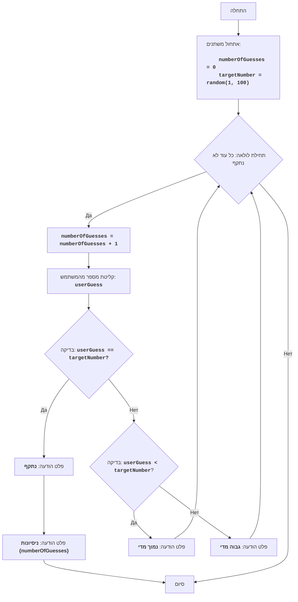

BUZZWD:
=================
רמת מורכבות: 4
-----------------
המשחק "BUZZWD" הוא משחק מספרים פשוט, שבו המחשב מייצר מספר אקראי, והשחקן צריך לנחש אותו על ידי קליטת מספרים בזה אחר זה. לאחר כל קליטה, התוכנית מדווחת האם המספר שהוזן הוא "גבוה מדי", "נמוך מדי", או שהוא נתקף. המשחק מסתיים כאשר השחקן מנחש נכונה את המספר.

כללי המשחק:
1. המחשב בוחר מספר שלם אקראי בין 1 ל-100.
2. השחקן מזין את השערותיו בנוגע למספר שיש לנחש.
3. לאחר כל ניסיון, המחשב מדווח האם המספר שהוזן היה נמוך מדי, גבוה מדי, או שהוא נתקף.
4. המשחק ממשיך עד שהשחקן מנחש את המספר שיש לנחש בצורה נכונה.
-----------------
אלגוריתם:
1. אתחול מונה הניסיונות ל-0.
2. ייצור מספר אקראי בטווח שבין 1 ל-100.
3. התחלת לולאה "כל עוד המספר לא נתקף":
    3.1 הגדלת מונה הניסיונות ב-1.
    3.2 בקשת קליטת מספר מהשחקן.
    3.3 אם המספר שנקלט שווה למספר שיש לנחש, פלט ההודעה "נתקף" ומעבר לשלב 4.
    3.4 אם המספר שנקלט קטן מהמספר שיש לנחש, פלט ההודעה "נמוך מדי".
    3.5 אם המספר שנקלט גדול מהמספר שיש לנחש, פלט ההודעה "גבוה מדי".
4. פלט ההודעה "ניסיונות {numberOfGuesses}".
5. סיום המשחק.
-----------------
תרשים זרימה:

מקרא:
    Start - התחלת התוכנית.
    InitializeVariables - אתחול משתנים: numberOfGuesses (מספר הניסיונות) מאופס ל-0, ו-targetNumber (המספר שיש לנחש) נוצר באופן אקראי בטווח שבין 1 ל-100.
    LoopStart - תחילת הלולאה, הנמשכת כל עוד המספר לא נתקף.
    IncreaseGuesses - הגדלת מונה מספר הניסיונות ב-1.
    InputGuess - בקשת קליטת מספר מהמשתמש ושמירתו במשתנה userGuess.
    CheckGuess - בדיקה האם המספר שנקלט userGuess שווה למספר שיש לנחש targetNumber.
    OutputWin - פלט ההודעה "נתקף", אם המספרים שווים.
    OutputAttempts - פלט ההודעה "ניסיונות {numberOfGuesses}", עם ציון מספר הניסיונות.
    End - סיום התוכנית.
    CheckLow - בדיקה האם המספר שנקלט userGuess קטן מהמספר שיש לנחש targetNumber.
    OutputLow - פלט ההודעה "נמוך מדי", אם המספר שנקלט קטן מהמספר שיש לנחש.
    OutputHigh - פלט ההודעה "גבוה מדי", אם המספר שנקלט גדול מהמספר שיש לנחש.