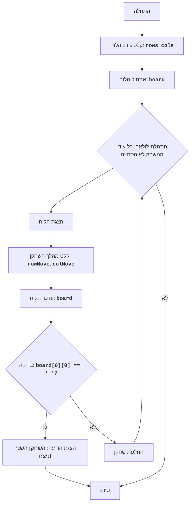

CHOMP:
=================
רמת מורכבות: 5
-----------------
המשחק "CHOMP" הוא משחק לשני שחקנים, המשתמש בלוח מלבני המייצג לוח שוקולד. אחת הפינות (בדרך כלל התחתונה השמאלית) מייצגת "משבצת" מורעלת. שחקנים בתורם שוברים חלקים מהלוח, ומבצעים מהלכים. מטרת המשחק היא לגרום ליריב לאכול את המשבצת המורעלת. שחקן שנאלץ לאכול את המשבצת המורעלת מפסיד.
כללי המשחק:
1. לוח המשחק הוא לוח שוקולד מלבני.
2. אחת הפינות (התחתונה השמאלית) נחשבת למורעלת.
3. שחקנים בתורם שוברים חלק מלוח השוקולד.
4. שחקן בוחר שורה ועמודה (שובר חתיכת שוקולד).
5. כל המשבצות מימין ומעל המיקום הנבחר מוסרות.
6. המטרה היא לגרום ליריב לאכול את המשבצת המורעלת.
7. שחקן שאוכל את המשבצת המורעלת מפסיד.
-----------------
אלגוריתם:
1. תחילת המשחק.
2. בקשת גודל לוח השוקולד (מספר שורות ועמודות) מהמשתמש.
3. אתחול לוח המשחק המייצג את לוח השוקולד.
4. התחלת לולאת המשחק, כל עוד המשחק לא הסתיים:
    4.1. הצגת מצב הלוח הנוכחי על המסך.
    4.2. בקשת קואורדינטות החלק שיישבר מהשחקן הנוכחי.
    4.3. עדכון מצב הלוח על ידי שבירת החלק שנבחר.
    4.4. בדיקה האם השחקן הנוכחי אכל את המשבצת המורעלת.
    4.5. אם אכל, הכרזה על ניצחון השחקן הנגדי וסיום המשחק.
    4.6. העברת התור לשחקן הבא.
5. סיום המשחק.
-----------------
תרשים זרימה:

מקרא:
    Start - תחילת המשחק.
    InputBoardSize - בקשת גודל הלוח (מספר שורות ועמודות).
    InitializeBoard - אתחול לוח המשחק.
    LoopStart - תחילת לולאת המשחק, שנמשכת כל עוד המשחק לא הסתיים.
    DisplayBoard - הצגת מצב הלוח הנוכחי על המסך.
    InputMove - בקשת קואורדינטות החלק שיישבר מהשחקן הנוכחי.
    UpdateBoard - עדכון מצב הלוח לאחר מהלך השחקן.
    CheckWin - בדיקה האם השחקן הנוכחי אכל את המשבצת המורעלת.
    OutputWinner - הצגת הודעה על ניצחון השחקן השני.
    End - סיום המשחק.
    SwitchPlayer - העברת התור לשחקן הבא.