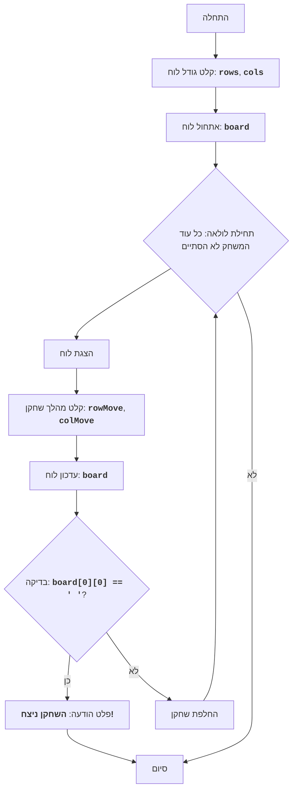

CHOMP:
=================
דרגת קושי: 5
-----------------
משחק "CHOMP" הוא משחק לשני שחקנים המשתמש בלוח מלבני, המייצג טבלת שוקולד. 
אחת הפינות (בדרך כלל התחתונה השמאלית) מייצגת "ריבוע" מורעל. השחקנים בתורם שוברים חתיכות מהטבלה, ומבצעים מהלכים. מטרת המשחק היא לגרום ליריב לאכול את הריבוע המורעל.
שחקן שמאלץ לאכול את הריבוע המורעל - מפסיד.
חוקי המשחק:
1. שדה המשחק הוא טבלת שוקולד מלבנית.
2. אחת הפינות (התחתונה השמאלית) נחשבת למורעלת.
3. השחקנים בתורם נוגסים חלק מטבלת השוקולד.
4. השחקן בוחר שורה ועמודה (נוגס חתיכת שוקולד).
5. כל הריבועים מימין ומעל המיקום שנבחר מוסרים.
6. המטרה - לגרום ליריב לאכול את הריבוע המורעל.
7. שחקן שאוכל את הריבוע המורעל - מפסיד.
-----------------
אלגוריתם:
1. תחילת המשחק.
2. בקש מהמשתמש את גודל טבלת השוקולד (מספר שורות ועמודות).
3. אתחל את לוח המשחק המייצג את טבלת השוקולד.
4. התחל בלולאת המשחק, כל עוד המשחק לא הסתיים:
    4.1. הצג את מצב הלוח הנוכחי על המסך.
    4.2. בקש מהשחקן הנוכחי את קואורדינטות חתיכת השוקולד הנגוסה.
    4.3. עדכן את מצב הלוח על ידי נגיסת החתיכה שנבחרה.
    4.4. בדוק אם השחקן הנוכחי אכל את הריבוע המורעל.
    4.5. אם אכל, הכרז על ניצחון השחקן היריב וסיים את המשחק.
    4.6. העבר את התור לשחקן הבא.
5. סיום המשחק.
-----------------
תרשים זרימה:

מקרא:
    Start - תחילת המשחק.
    InputBoardSize - בקשת גודל הלוח (מספר שורות ועמודות).
    InitializeBoard - אתחול לוח המשחק.
    LoopStart - תחילת לולאת המשחק, הנמשכת כל עוד המשחק לא הסתיים.
    DisplayBoard - הצגת מצב הלוח הנוכחי על המסך.
    InputMove - בקשת קואורדינטות חתיכת השוקולד הנגוסה מהשחקן הנוכחי.
    UpdateBoard - עדכון מצב הלוח לאחר מהלך השחקן.
    CheckWin - בדיקה האם השחקן הנוכחי אכל את הריבוע המורעל.
    OutputWinner - פלט הודעה על ניצחון השחקן האחר.
    End - סיום המשחק.
    SwitchPlayer - החלפת התור לשחקן הבא.