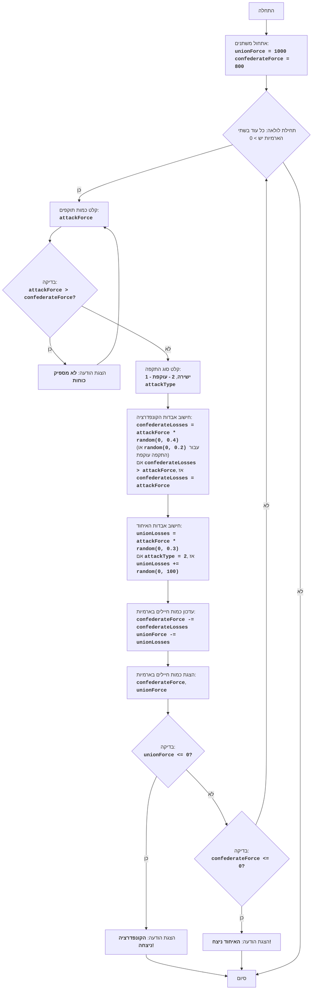

CIVILW:
=================
דרגת מורכבות: 7
-----------------
המשחק "מלחמת האזרחים" הוא סימולציה של קרב בין שתי ארמיות: הקונפדרציה והאיחוד. השחקן שולט בארמיית הקונפדרציה ומקבל החלטות לגבי גודל כוחותיו וסוג ההתקפה (התקפה ישירה או תמרון עוקף). מטרת המשחק היא להביס את ארמיית האיחוד, תוך מזעור אבדות הקונפדרציה. המשחק לוקח בחשבון גורמים אקראיים המשפיעים על תוצאת הקרב, מה שהופך כל קרב לייחודי.

כללי המשחק:
1.  השחקן שולט בארמיית הקונפדרציה וחייב להביס את ארמיית האיחוד.
2.  השחקן מזין את כמות החיילים המיועדים להתקפה.
3.  השחקן בוחר את סוג ההתקפה: ישירה (1) או עוקפת (2).
4.  בהתאם לבחירת השחקן ולגורמים אקראיים, מחושבות האבדות לשני הצדדים.
5.  לאחר כל קרב, המשחק מציג את מספר החיילים הנוכחי בשתי הארמיות.
6.  המשחק מסתיים בניצחון של אחד מהצדדים כאשר מספר חיילי האויב שווה לאפס או פחות מכך.
-----------------
אלגוריתם:
1. קבע את כמות החיילים ההתחלתית של ארמיית האיחוד (UnionForce) כ-1000 ואת כמות החיילים של ארמיית הקונפדרציה (ConfederateForce) כ-800.
2. התחל לולאה "כל עוד בשתי הארמיות יש כמות חיילים גדולה מ-0":
    2.1. בקש מהשחקן להזין את כמות החיילים אותם הוא רוצה לשלוח להתקפה (AttackForce).
        2.1.1. אם AttackForce גדול מכמות הכוחות הזמינים של הקונפדרציה (ConfederateForce), הצג הודעה "לא מספיק כוחות" וחזור לתחילת שלב 2.1
    2.2. בקש מהשחקן לבחור את סוג ההתקפה: ישירה (1) או עוקפת (2) (AttackType).
    2.3. חשב את אבדות הקונפדרציה (ConfederateLosses) באופן אקראי, על ידי הכפלת AttackForce במספר אקראי בין 0 ל-0.4 (עבור התקפה ישירה) או במספר אקראי בין 0 ל-0.2 (עבור תמרון עוקף).
        2.3.1. אם ConfederateLosses גדול מ-AttackForce, הגדר את ConfederateLosses להיות שווה ל-AttackForce.
    2.4. חשב את אבדות האיחוד (UnionLosses) באופן אקראי, על ידי הכפלת AttackForce במספר אקראי בין 0 ל-0.3.
        2.4.1. אם AttackType שווה ל-2, הוסף ל-UnionLosses מספר אקראי בין 0 ל-100.
    2.5. עדכן את כמות החיילים בארמיות:
        ConfederateForce = ConfederateForce - ConfederateLosses
        UnionForce = UnionForce - UnionLosses
    2.6. הצג את כמות החיילים הנוכחית בשתי הארמיות.
    2.7. בדוק את תנאי הניצחון:
        2.7.1. אם UnionForce קטן או שווה ל-0, הצג הודעה "הקונפדרציה ניצחה!" וסיים את המשחק.
        2.7.2. אם ConfederateForce קטן או שווה ל-0, הצג הודעה "האיחוד ניצח!" וסיים את המשחק.
3. סיום המשחק.
-----------------
דיאגרמת זרימה:

    
מפתח סמלים (לג'נדה):
    Start - התחלת התוכנית.
    InitializeForces - אתחול כמות החיילים ההתחלתית של ארמיית האיחוד (unionForce = 1000) וארמיית הקונפדרציה (confederateForce = 800).
    LoopStart - תחילת לולאה הנמשכת כל עוד בשתי הארמיות יש כמות חיילים גדולה מ-0.
    InputAttackForce - בקשת קלט מהשחקן לגבי כמות החיילים להתקפה (attackForce).
    CheckForce - בדיקה אם לקונפדרציה מספיק כוחות להתקפה (attackForce > confederateForce).
    OutputInsufficient - הצגת ההודעה "לא מספיק כוחות" אם כמות התוקפים גדולה מכמות הכוחות הזמינים.
    InputAttackType - בקשת קלט מהשחקן לבחירת סוג התקפה: ישירה (1) או עוקפת (2).
    CalculateConfederateLosses - חישוב אבדות הקונפדרציה (confederateLosses) על בסיס attackForce וסוג ההתקפה, תוך התחשבות בגורם אקראי. אם האבדות עולות על attackForce, האבדות נקבעות להיות שוות ל-attackForce.
    CalculateUnionLosses - חישוב אבדות האיחוד (unionLosses) על בסיס attackForce וסוג ההתקפה, תוך התחשבות בגורם אקראי. בתמרון עוקף, אבדות האיחוד גדלות בנוסף במספר אקראי.
    UpdateForces - עדכון כמות החיילים בשתי הארמיות לאחר הקרב.
    OutputForces - הצגת כמות החיילים הנוכחית של ארמיות הקונפדרציה והאיחוד.
    CheckUnionWin - בדיקה אם הקונפדרציה ניצחה (כמות החיילים של ארמיית האיחוד <= 0).
    OutputConfederateWin - הצגת הודעה על ניצחון הקונפדרציה.
    CheckConfederateWin - בדיקה אם האיחוד ניצח (כמות החיילים של ארמיית הקונפדרציה <= 0).
    OutputUnionWin - הצגת הודעה על ניצחון האיחוד.
    End - סיום התוכנית.