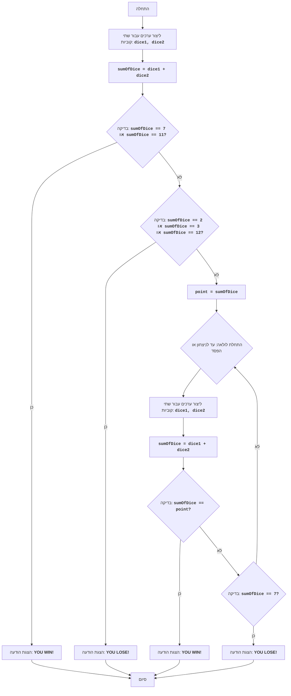

CRAPS:
=================
דרגת קושי: 7
-----------------
המשחק "קראפס" הוא משחק מזל בקוביות, בו השחקן מהמר על תוצאת הטלת שתי קוביות משחק. בסיבוב הראשון, השחקן מנצח אם סכום הנקודות על הקוביות שווה ל-7 או 11, ומפסיד אם הסכום שווה ל-2, 3 או 12. אם סכום הנקודות שווה ל-4, 5, 6, 8, 9 או 10, אז מספר זה הופך ל"מספר המטרה" של השחקן, והוא ממשיך להטיל את הקוביות עד שמספר זה ייצא שוב (במקרה זה, השחקן מנצח) או עד שייצא 7 (במקרה זה, השחקן מפסיד).

כללי המשחק:
1. בתחילת המשחק, השחקן מטיל שתי קוביות.
2. אם סכום הנקודות על הקוביות שווה ל-7 או 11, השחקן מנצח.
3. אם סכום הנקודות שווה ל-2, 3 או 12, השחקן מפסיד.
4. אם סכום הנקודות שווה ל-4, 5, 6, 8, 9 או 10, מספר זה הופך ל"מספר המטרה" (point).
5. לאחר קביעת "מספר המטרה", השחקן ממשיך להטיל קוביות עד אשר:
   -  ייצא "מספר המטרה", ואז השחקן מנצח.
   -  ייצא 7, ואז השחקן מפסיד.
-----------------
אלגוריתם:
1. ליצור ערכים אקראיים עבור שתי קוביות (מ-1 עד 6).
2. לחשב את סכום הערכים שיצאו.
3. אם הסכום שווה ל-7 או 11, להציג הודעת ניצחון ולעבור לשלב 7.
4. אם הסכום שווה ל-2, 3 או 12, להציג הודעת הפסד ולעבור לשלב 7.
5. לשמור את הסכום כ"מספר המטרה" (point).
6.  להתחיל לולאה:
    6.1 ליצור ערכים אקראיים עבור שתי קוביות.
    6.2 לחשב את סכום הערכים שיצאו.
    6.3 אם הסכום שווה ל"מספר המטרה", להציג הודעת ניצחון ולעבור לשלב 7.
    6.4 אם הסכום שווה ל-7, להציג הודעת הפסד ולעבור לשלב 7.
    6.5 אחרת, לחזור על הלולאה משלב 6.
7. סיום המשחק.
-----------------
תרשים זרימה:

מקרא:
    Start - התחלת המשחק.
    RollDice1 - יצירת ערכים אקראיים עבור שתי קוביות משחק (dice1, dice2) בהטלה הראשונה.
    CalculateSum1 - חישוב סכום ערכי הקוביות dice1 ו-dice2 ושמירת התוצאה במשתנה sumOfDice.
    CheckWin1 - בדיקה האם הסכום sumOfDice שווה ל-7 או 11. אם כן, השחקן ניצח.
    OutputWin1 - הצגת הודעה "YOU WIN!" וסיום המשחק.
    CheckLose1 - בדיקה האם הסכום sumOfDice שווה ל-2, 3 או 12. אם כן, השחקן הפסיד.
    OutputLose1 - הצגת הודעה "YOU LOSE!" וסיום המשחק.
    SetPoint - אם השחקן לא ניצח ולא הפסיד בהטלה הראשונה, אז הסכום sumOfDice נשמר במשתנה point, אשר הופך ל"מספר המטרה".
    LoopStart - התחלת הלולאה, אשר ממשיכה עד שהשחקן מנצח או מפסיד.
    RollDice2 - יצירת ערכים אקראיים עבור שתי קוביות משחק (dice1, dice2) בהטלות הבאות.
    CalculateSum2 - חישוב סכום ערכי הקוביות dice1 ו-dice2 ושמירת התוצאה במשתנה sumOfDice.
    CheckWin2 - בדיקה האם הסכום sumOfDice שווה ל"מספר המטרה" point. אם כן, השחקן ניצח.
    CheckLose2 - בדיקה האם הסכום sumOfDice שווה ל-7. אם כן, השחקן הפסיד.
    End - סיום המשחק.