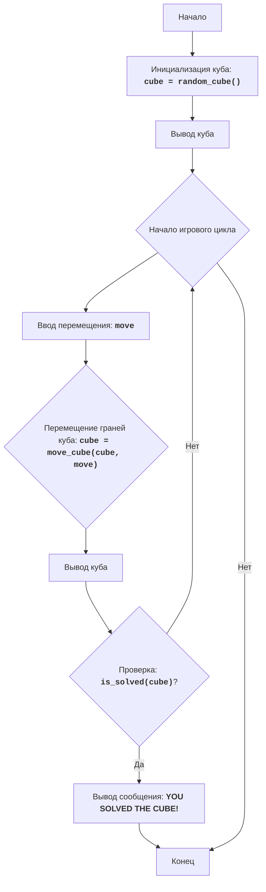

CUBE
=================

רמת קושי: 5
-----------------
המשחק "קובייה" הוא משחק פאזל שבו השחקן נדרש להרכיב קובייה על ידי הזזת פאותיה. הקובייה מיוצגת כמטריצה בגודל 3x3, כאשר כל תא מייצג פאה של הקובייה. השחקן יכול להזיז את פאות הקובייה למעלה, למטה, שמאלה וימינה. מטרת המשחק היא להרכיב את הקובייה על ידי סידור הפאות בסדר הנכון.
כללי המשחק:
1. הקובייה מיוצגת כמטריצה בגודל 3x3.
2. השחקן יכול להזיז את פאות הקובייה על ידי הזנת פקודות: U (למעלה), D (למטה), L (שמאלה), R (ימינה).
3. מטרת המשחק היא להרכיב את הקובייה על ידי סידור הפאות בסדר הנכון.
4. מצב ההתחלה של הקובייה נוצר באופן אקראי.
5. המשחק מסתיים כאשר הקובייה הורכבה, כלומר כאשר כל הפאות מסודרות בסדר הנכון.
-----------------
אלגוריתם:
1. אתחל את הקובייה עם ערכים אקראיים מ-1 עד 9 בצורה של מטריצה 3x3.
2. הצג את הקובייה על המסך.
3. התחל לולאת משחק:
    3.1. בקש מהשחקן להזין פקודה להזזת פאת הקובייה (U, D, L, R).
    3.2. בצע את הזזת הפאה בהתאם לפקודה:
       - אם הפקודה היא "U", הזז את כל השורות למעלה.
       - אם הפקודה היא "D", הזז את כל השורות למטה.
       - אם הפקודה היא "L", הזז את כל העמודות שמאלה.
       - אם הפקודה היא "R", הזז את כל העמודות ימינה.
    3.3. הצג את הקובייה על המסך.
    3.4. בדוק האם הקובייה הורכבה.
    3.5. אם הקובייה הורכבה, הצג הודעת ניצחון וסיים את המשחק.
    3.6. אם הקובייה לא הורכבה, חזור לשלב 3.1.
-----------------
תרשים זרימה:

מקרא:
    Start - התחלת התוכנית.
    InitializeCube - אתחול הקובייה, יצירת מטריצה 3x3 עם ערכים אקראיים מ-1 עד 9.
    DisplayCube - הצגת המצב הנוכחי של הקובייה על המסך.
    GameLoopStart - התחלת לולאת המשחק, אשר נמשכת עד שהקובייה הורכבה.
    InputMove - בקשת קלט מהמשתמש עבור פקודה להזזת פאות הקובייה (U, D, L, R).
    MoveCube - הזזת פאות הקובייה בהתאם לפקודה שהוזנה.
    DisplayCubeAgain - הצגת הקובייה לאחר ביצוע ההזזה.
    CheckSolved - בדיקה האם הקובייה הורכבה.
    OutputWin - הצגת הודעת ניצחון, אם הקובייה הורכבה.
    End - סיום התוכנית.