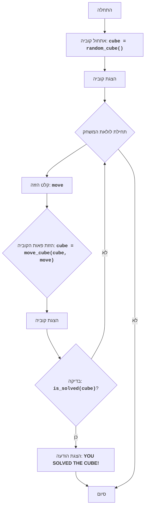

CUBE
=================

מורכבות: 5
-----------------
המשחק "קוביה" הוא משחק פאזל בו השחקן צריך להרכיב קוביה על ידי הזזת פאותיה. הקוביה מיוצגת כמטריצה 3x3, כאשר כל תא מייצג פאה של הקוביה. השחקן יכול להזיז את פאות הקוביה למעלה, למטה, שמאלה וימינה. מטרת המשחק היא להרכיב את הקוביה על ידי סידור הפאות בסדר הנכון.
כללי המשחק:
1. הקוביה מיוצגת כמטריצה 3x3.
2. השחקן יכול להזיז את פאות הקוביה על ידי הזנת פקודות: U (למעלה), D (למטה), L (שמאלה), R (ימינה).
3. מטרת המשחק היא להרכיב את הקוביה על ידי סידור הפאות בסדר הנכון.
4. המצב ההתחלתי של הקוביה נוצר באופן אקראי.
5. המשחק מסתיים כאשר הקוביה מורכבת, כלומר כאשר כל הפאות מסודרות בסדר הנכון.
-----------------
אלגוריתם:
1. לאתחל את הקוביה עם ערכים אקראיים מ-1 עד 9 בצורת מטריצה 3x3.
2. להציג את הקוביה על המסך.
3. להתחיל את לולאת המשחק:
    3.1. לבקש מהשחקן להזין פקודה להזזת פאת הקוביה (U, D, L, R).
    3.2. לבצע את הזזת הפאה בהתאם לפקודה:
       - אם הפקודה "U", להזיח את כל השורות למעלה.
       - אם הפקודה "D", להזיח את כל השורות למטה.
       - אם הפקודה "L", להזיח את כל העמודות שמאלה.
       - אם הפקודה "R", להזיח את כל העמודות ימינה.
    3.3. להציג את הקוביה על המסך.
    3.4. לבדוק האם הקוביה הורכבה.
    3.5. אם הקוביה הורכבה, להציג הודעת ניצחון ולסיים את המשחק.
    3.6. אם הקוביה לא הורכבה, לחזור לשלב 3.1.
-----------------
תרשים זרימה:

מקרא:
    התחלה - התחלת התוכנית.
    אתחול קוביה - אתחול הקוביה, יצירת מטריצה 3x3 עם ערכים אקראיים מ-1 עד 9.
    הצגת קוביה - הצגת המצב הנוכחי של הקוביה על המסך.
    תחילת לולאת המשחק - התחלת לולאת המשחק, הנמשכת כל עוד הקוביה לא הורכבה.
    קלט הזזה - בקשת קלט מהמשתמש עבור פקודה להזזת פאות הקוביה (U, D, L, R).
    הזזת פאות הקוביה - הזזת פאות הקוביה בהתאם לפקודה שהוזנה.
    הצגת קוביה - הצגת הקוביה לאחר ההזזה שבוצעה.
    בדיקה - בדיקה האם הקוביה הורכבה.
    הצגת הודעה - הצגת הודעת ניצחון, אם הקוביה הורכבה.
    סיום - סיום התוכנית.