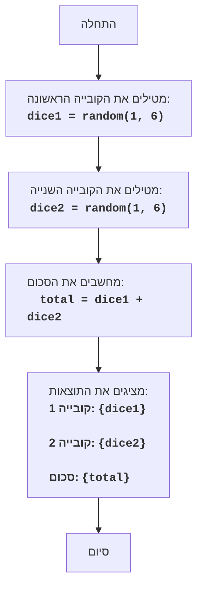

DICE:
=================
דרגת קושי: 2
-----------------
המשחק "קובייה" הוא משחק פשוט, שבו השחקן מטיל שתי קוביות משחק, והמחשב מציג את סכום הערכים שהתקבלו.

כללי המשחק:
1.  המחשב מדמה הטלה של שתי קוביות משחק בעלות שש פאות.
2.  המחשב מציג על המסך את הערכים של כל קובייה ואת סכומם.
-----------------
אלגוריתם:
1.  יצירת מספר אקראי בין 1 ל-6 עבור הקובייה הראשונה.
2.  יצירת מספר אקראי בין 1 ל-6 עבור הקובייה השנייה.
3.  חישוב סכום הערכים של שתי הקוביות.
4.  הצגת הערך של הקובייה הראשונה, הערך של הקובייה השנייה, וסכומם על המסך.
-----------------
תרשים זרימה:

מקרא:
    Start - התחלת התוכנית.
    RollDice1 -  נוצר מספר אקראי בין 1 ל-6, המייצג את תוצאת ההטלה של הקובייה הראשונה, והוא נשמר במשתנה dice1.
    RollDice2 - נוצר מספר אקראי בין 1 ל-6, המייצג את תוצאת ההטלה של הקובייה השנייה, והוא נשמר במשתנה dice2.
    CalculateSum -  מחושב סכום הערכים של dice1 ו-dice2, התוצאה נשמרת במשתנה total.
    OutputResults - הערכים של dice1, dice2 וסכומם total מוצגים על המסך.
    End - סיום התוכנית.