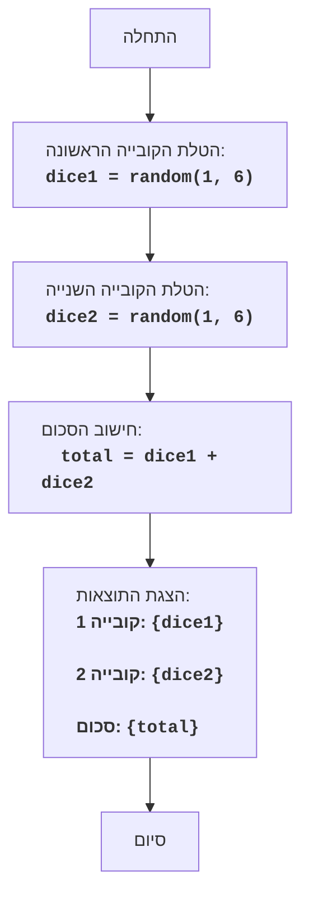

DICE:
=================
מורכבות: 2
-----------------
משחק "קוביות" הוא משחק פשוט שבו השחקן מטיל שתי קוביות משחק, והמחשב מציג את סכום הערכים שהתקבלו.

כללי המשחק:
1.  המחשב מדמה הטלה של שתי קוביות משחק בעלות שש פאות.
2.  המחשב מציג על המסך את הערכים של כל קובייה ואת סכומם.
-----------------
אלגוריתם:
1.  ליצור מספר אקראי בטווח שבין 1 ל-6 עבור הקובייה הראשונה.
2.  ליצור מספר אקראי בטווח שבין 1 ל-6 עבור הקובייה השנייה.
3.  לחשב את סכום הערכים של שתי הקוביות.
4.  להציג על המסך את הערך של הקובייה הראשונה, את הערך של הקובייה השנייה ואת סכומם.
-----------------
תרשים זרימה:

Legenda:
    Start - תחילת התוכנית.
    RollDice1 - נוצר מספר אקראי בטווח שבין 1 ל-6, המייצג את תוצאת הטלת הקובייה הראשונה, ונשמר במשתנה dice1.
    RollDice2 - נוצר מספר אקראי בטווח שבין 1 ל-6, המייצג את תוצאת הטלת הקובייה השנייה, ונשמר במשתנה dice2.
    CalculateSum - מחושב סכום הערכים של dice1 ו-dice2, והתוצאה נשמרת במשתנה total.
    OutputResults - מוצגים על המסך הערכים של dice1, dice2 וסכומם total.
    End - סוף התוכנית.