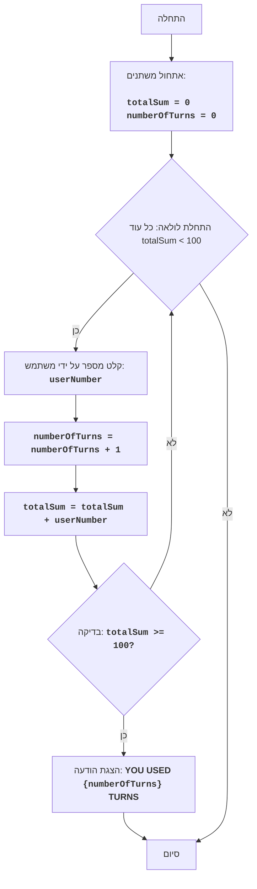

FIPFOP:
=================
מורכבות: 5
-----------------
המשחק FIPFOP הוא משחק-חידה שבו השחקן נדרש להזין מספרים, בזה אחר זה.
מטרת המשחק היא להגיע למצב שבו סכום כל המספרים שהוזנו על ידי המשתמש מסתכם ב-100.
המשחק מסתיים כאשר סכום כל המספרים שהוזנו מגיע ל-100.

כללי המשחק:
1. השחקן מזין מספרים שלמים, אחד בכל פעם.
2. כל מספר שהוזן מתווסף לסכום הכולל.
3. המשחק מסתיים כאשר הסכום הכולל מגיע ל-100.
4. לאחר סיום המשחק, מוצג המספר הכולל של המספרים שהוזנו (מהלכים).
-----------------
אלגוריתם:
1. אפס את הסכום ל-0.
2. אפס את מונה המהלכים ל-0.
3. התחל לולאת "כל עוד הסכום קטן מ-100":
    3.1 בקש מהשחקן להזין מספר.
    3.2 הגדל את מונה המהלכים ב-1.
    3.3 הוסף את המספר שהוזן לסכום הכולל.
4. הצג הודעה "YOU USED {מספר מהלכים} TURNS" (השתמשת ב-{מספר מהלכים} מהלכים).
5. סיום המשחק.
-----------------
תרשים זרימה:


**מקרא:**
    Start - התחלת התוכנית.
    InitializeVariables - אתחול משתנים: totalSum (סכום המספרים שהוזנו) מאופס ל-0, ו-numberOfTurns (מספר המהלכים) מאופס ל-0.
    LoopStart - התחלת לולאה שנמשכת כל עוד totalSum קטן מ-100.
    InputNumber - בקשת מספר מהמשתמש ושמירתו במשתנה userNumber.
    IncreaseTurns - הגדלת מונה המהלכים ב-1.
    AddNumber - הוספת המספר שהוזן userNumber לסכום הכולל totalSum.
    CheckSum - בדיקה האם הסכום הכולל totalSum גדול או שווה ל-100.
    OutputTurns - הצגת הודעה על מספר המהלכים שהמשתמש ביצע.
    End - סיום התוכנית.
"""


# אתחול הסכום ומונה המהלכים
totalSum = 0 # סכום המספרים שהוזנו
numberOfTurns = 0 # מספר המהלכים

# לולאת המשחק הראשית
while totalSum < 100:
    # בקשת קלט מספר מהמשתמש
    try:
        userNumber = int(input("הכנס מספר: "))
    except ValueError:
         print("אנא הכנס מספר שלם.")
         continue

    # הגדלת מונה המהלכים
    numberOfTurns += 1
    # הוספת המספר שהוזן לסכום הכולל
    totalSum += userNumber

# הצגת הודעה על מספר המהלכים
print(f"השתמשת ב-{numberOfTurns} מהלכים")


"""
הסבר הקוד:
1. **אתחול משתנים:**
   - `totalSum = 0`: מאתחל את המשתנה `totalSum` לאחסון סכום המספרים שהוזנו, מתחיל מ-0.
   - `numberOfTurns = 0`: מאתחל את המשתנה `numberOfTurns` לספירת מספר המהלכים, גם הוא מתחיל מ-0.
2. **הלולאה הראשית `while totalSum < 100`:**
   - הלולאה נמשכת כל עוד סכום המספרים שהוזנו (`totalSum`) קטן מ-100.
3. **קלט נתונים מהמשתמש:**
    - `try...except ValueError`: בלוק try-except מטפל בשגיאות קלט אפשריות. אם המשתמש יזין קלט שאינו מספר שלם, תוצג הודעת שגיאה.
   - `userNumber = int(input("הכנס מספר: "))`: מבקש מהמשתמש להזין מספר וממיר אותו למספר שלם, שומר את התוצאה במשתנה `userNumber`.
4. **הגדלת מונה המהלכים:**
   - `numberOfTurns += 1`: מגדיל את מונה המהלכים ב-1 בכל איטרציה של הלולאה.
5.  **הוספת המספר לסכום:**
   -  `totalSum += userNumber`: מוסיף את המספר שהוזן (`userNumber`) לסכום הכולל (`totalSum`).
6.  **הצגת תוצאה:**
    - `print(f"השתמשת ב-{numberOfTurns} מהלכים")`: מציג על המסך הודעה המציינת כמה מהלכים בוצעו כאשר סכום המספרים הגיע ל-100 או יותר.
"""
```