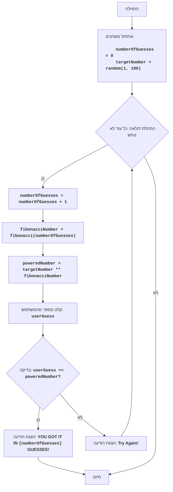

FIPOWR:
=================
קושי: 6
-----------------
המשחק "פיבונאצ'י בחזקה" הוא משחק מתמטי שבו המחשב בוחר מספר אקראי בטווח שבין 1 ל-100, והשחקן מזין מספר.
המחשב מעלה את המספר האקראי בחזקת מספר פיבונאצ'י התואם למספר הניסיון, ומשווה את התוצאה למספר שהזין המשתמש.
המשחק נמשך עד שהמספרים שווים.
כללי המשחק:
1. המחשב בוחר מספר שלם אקראי בטווח שבין 1 ל-100.
2. השחקן מזין את המספר שלו.
3. המחשב מחשב את מספר פיבונאצ'י התואם למספר הניסיון, ומעלה את המספר האקראי בחזקה זו.
4. משווה את התוצאה המתקבלת למספר שהזין השחקן.
5. המשחק נמשך עד שהמספרים שווים.
-----------------
אלגוריתם:
1. לאתחל את מונה הניסיונות ל-0.
2. ליצור מספר אקראי בטווח שבין 1 ל-100.
3. להתחיל לולאה "כל עוד מספר השחקן אינו שווה למספר שהועלה בחזקת פיבונאצ'י":
    3.1 להגדיל את מונה הניסיונות ב-1.
    3.2 לחשב את מספר פיבונאצ'י התואם למספר הניסיון.
    3.3 להעלות את המספר האקראי בחזקת מספר פיבונאצ'י.
    3.4 לבקש מהשחקן להזין מספר.
    3.5 אם מספר השחקן שווה למספר המחושב, לעבור לשלב 4.
    3.6 אם מספר השחקן אינו שווה למספר המחושב, להציג הודעה על המצב הנוכחי.
4. להציג את ההודעה "YOU GOT IT IN {מספר ניסיונות} GUESSES!"
5. סוף המשחק.
-----------------
בלוק-תרשים:

**מקרא:**
    Start - תחילת התוכנית.
    InitializeVariables - אתחול משתנים: numberOfGuesses (מספר הניסיונות) מאותחל ל-0, ו-targetNumber (המספר שנבחר) נוצר באופן אקראי בטווח שבין 1 ל-100.
    LoopStart - תחילת הלולאה, שנמשכת כל עוד המספר לא נוחש.
    IncreaseGuesses - הגדלת מונה מספר הניסיונות ב-1.
    CalculateFibonacci - חישוב מספר פיבונאצ'י התואם לניסיון הנוכחי.
    CalculatePower - העלאת המספר שנבחר בחזקת מספר פיבונאצ'י.
    InputGuess - בקשה מהמשתמש להזין מספר ושמירתו במשתנה userGuess.
    CheckGuess - בדיקה האם המספר שהוזן, userGuess, שווה למספר המחושב, poweredNumber.
    OutputWin - הצגת הודעת ניצחון אם המספרים שווים, בציון מספר הניסיונות.
    End - סיום התוכנית.
    OutputTryAgain - הצגת ההודעה "Try Again!", אם המספר שהוזן אינו שווה למספר המחושב.
"""

import random

# פונקציה לחישוב מספר פיבונאצ'י
def fibonacci(n):
    if n <= 0:
        return 0
    elif n == 1:
        return 1
    else:
        a, b = 0, 1
        for _ in range(2, n + 1):
            a, b = b, a + b
        return b

# אתחול מונה ניסיונות
numberOfGuesses = 0
# יצירת מספר אקראי מ-1 עד 100
targetNumber = random.randint(1, 100)

# לולאת המשחק הראשית
while True:
    # הגדלת מונה הניסיונות
    numberOfGuesses += 1
    # חישוב מספר פיבונאצ'י עבור הניסיון הנוכחי
    fibonacciNumber = fibonacci(numberOfGuesses)
    # העלאת המספר הנבחר בחזקת מספר פיבונאצ'י
    poweredNumber = targetNumber ** fibonacciNumber

    # בקשת קלט מספר מהמשתמש
    try:
        userGuess = int(input(f"ניסיון {numberOfGuesses}: אנא הזן מספר: "))
    except ValueError:
         print("אנא הזן מספר שלם.")
         continue

    # בדיקה האם המספר נוחש
    if userGuess == poweredNumber:
        print(f"ברכות! ניחשת את המספר ב- {numberOfGuesses} ניסיונות!")
        break  # סיום הלולאה אם המספר נוחש
    else:
         print("אנא נסה שוב!") # הודעה שיש לנסות שוב


"""
הסבר הקוד:
1.  **ייבוא מודול `random`**:
   -  `import random`: מייבא את מודול `random`, המשמש ליצירת מספר אקראי.
2.  **פונקציה `fibonacci(n)`**:
    -   מגדירה את הפונקציה `fibonacci(n)`, המחשבת את מספר פיבונאצ'י ה-n-י.
    -   משתמשת בגישה איטרטיבית לחישוב מספרי פיבונאצ'י.
3.  **אתחול משתנים**:
    -   `numberOfGuesses = 0`: מאתחל את המשתנה `numberOfGuesses` לספירת ניסיונות השחקן.
    -   `targetNumber = random.randint(1, 100)`: מייצר מספר שלם אקראי בטווח שבין 1 ל-100 ושומר אותו ב-`targetNumber`.
4. **לולאת המשחק הראשית `while True:`**:
    - לולאה אינסופית הנמשכת עד שהשחקן מנחש את המספר (תבוצע הפקודה `break`).
    - `numberOfGuesses += 1`: מגדילה את מונה הניסיונות ב-1 בכל סיבוב חדש של הלולאה.
    - `fibonacciNumber = fibonacci(numberOfGuesses)`: קוראת לפונקציה `fibonacci` לקבלת מספר פיבונאצ'י התואם לניסיון הנוכחי.
    - `poweredNumber = targetNumber ** fibonacciNumber`: מחשבת את המספר הנבחר בחזקת מספר פיבונאצ'י.
    - **קלט נתונים**:
       - `try...except ValueError`: בלוק try-except מטפל בשגיאות קלט אפשריות. אם המשתמש יזין מספר שאינו שלם, תוצג הודעת שגיאה.
       - `userGuess = int(input(f"ניסיון {numberOfGuesses}: אנא הזן מספר: "))`: מבקשת מהמשתמש מספר (עם הודעה המציינת את מספר הניסיון) וממירה אותו למספר שלם, ושומרת את התוצאה ב-`userGuess`.
    - **תנאי ניצחון**:
      -  `if userGuess == poweredNumber:`: בדיקה האם המספר שהוזן שווה לערך המחושב.
      -  `print(f"ברכות! ניחשת את המספר ב- {numberOfGuesses} ניסיונות!")`: מציגה הודעת ניצחון ואת מספר הניסיונות.
      - `break`: מסיימת את הלולאה (ואת המשחק), אם המספר נוחש.
    -  **הדרכה/הודעה**:
       - `else:`: אם המספר לא נוחש, מוצגת ההודעה "אנא נסה שוב!".

"""
```