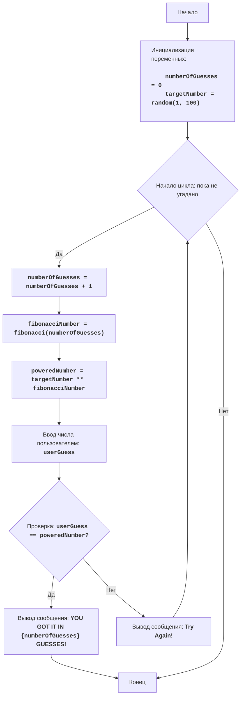

FIPOWR:
=================
רמת קושי: 6
-----------------
המשחק "פיבונאצ'י בחזקה" הוא משחק מתמטי שבו המחשב בוחר מספר אקראי בטווח שבין 1 ל-100, והשחקן מזין מספר.
המחשב מעלה את המספר האקראי שנבחר בחזקת מספר פיבונאצ'י התואם למספר הניסיון, ומשווה אותו למספר שהזין המשתמש.
המשחק ממשיך עד שמספרים שווים.
כללי המשחק:
1. המחשב בוחר מספר שלם אקראי בין 1 ל-100.
2. השחקן מזין את מספרו.
3. המחשב מחשב את מספר פיבונאצ'י התואם למספר הניסיון הנוכחי ומעלה את המספר האקראי בחזקה זו.
4. משווה את התוצאה המתקבלת למספר השחקן.
5. המשחק נמשך עד שהמספרים שווים.
-----------------
אלגוריתם:
1. הגדר את מונה הניסיונות לאפס (0).
2. צור מספר אקראי בטווח שבין 1 ל-100.
3. התחל לולאה "כל עוד מספר השחקן אינו שווה למספר שהועלה בחזקת פיבונאצ'י":
    3.1 הגדל את מונה הניסיונות ב-1.
    3.2 חשב את מספר פיבונאצ'י התואם למספר הניסיון הנוכחי.
    3.3 העלה את המספר האקראי בחזקת מספר פיבונאצ'י.
    3.4 בקש מהשחקן להזין מספר.
    3.5 אם מספר השחקן שווה למספר המחושב, עבור לשלב 4.
    3.6 אם מספר השחקן אינו שווה למספר המחושב, הצג הודעה על המצב הנוכחי.
4. הצג הודעה "YOU GOT IT IN {מספר_ניסיונות} GUESSES!"
5. סוף המשחק.
-----------------
בלוק-תרשים:

**מקרא:**
    Start - תחילת התוכנית.
    InitializeVariables - אתחול משתנים: numberOfGuesses (מספר הניסיונות) מוגדר לאפס (0), ו-targetNumber (המספר הסודי) מוגרל באופן אקראי בין 1 ל-100.
    LoopStart - תחילת הלולאה, הנמשכת עד שהמספר מנוחש.
    IncreaseGuesses - הגדלת מונה מספר הניסיונות ב-1.
    CalculateFibonacci - חישוב מספר פיבונאצ'י התואם לניסיון הנוכחי.
    CalculatePower - העלאת המספר הסודי בחזקת מספר פיבונאצ'י.
    InputGuess - בקשת קלט מהמשתמש ושמירתו במשתנה userGuess.
    CheckGuess - בדיקה האם המספר שהוזן (userGuess) שווה למספר המחושב (poweredNumber).
    OutputWin - הצגת הודעת ניצחון, אם המספרים שווים, בצירוף מספר הניסיונות.
    End - סוף התוכנית.
    OutputTryAgain - הצגת ההודעה "Try Again!", אם המספר שהוזן אינו שווה למספר המחושב.
"""

```python
import random

# פונקציה לחישוב מספר פיבונאצ'י
def fibonacci(n):
    if n <= 0:
        return 0
    elif n == 1:
        return 1
    else:
        a, b = 0, 1
        for _ in range(2, n + 1):
            a, b = b, a + b
        return b

# אתחול מונה הניסיונות
numberOfGuesses = 0
# יצירת מספר אקראי בין 1 ל-100
targetNumber = random.randint(1, 100)

# לולאת המשחק הראשית
while True:
    # הגדלת מספר הניסיונות
    numberOfGuesses += 1
    # חישוב מספר פיבונאצ'י עבור הניסיון הנוכחי
    fibonacciNumber = fibonacci(numberOfGuesses)
    # העלאת המספר הסודי בחזקת מספר פיבונאצ'י
    poweredNumber = targetNumber ** fibonacciNumber

    # בקשת קלט מספר מהמשתמש
    try:
        userGuess = int(input(f"ניסיון {numberOfGuesses}: אנא הזן מספר: "))
    except ValueError:
         print("אנא הזן מספר שלם.")
         continue

    # בדיקה האם המספר נוחש
    if userGuess == poweredNumber:
        print(f"ברכותי! ניחשת את המספר ב- {numberOfGuesses} ניסיונות!")
        break  # סיום הלולאה אם המספר נוחש
    else:
         print("נסה שוב!") # הודעה על ניסיון נוסף

```
"""
הסבר הקוד:
1.  **ייבוא מודול `random`**:
   -  `import random`: מייבא את מודול `random`, המשמש ליצירת מספרים אקראיים.
2.  **פונקציה `fibonacci(n)`**:
    -   מגדירה את הפונקציה `fibonacci(n)`, המחשבת את המספר ה-n בסדרת פיבונאצ'י.
    -   משתמשת בגישה איטרטיבית לחישוב מספרי פיבונאצ'י.
3.  **אתחול משתנים**:
    -   `numberOfGuesses = 0`: מאתחל את המשתנה `numberOfGuesses` לספירת ניסיונות השחקן.
    -   `targetNumber = random.randint(1, 100)`: יוצר מספר שלם אקראי בטווח שבין 1 ל-100 ושומר אותו ב-`targetNumber`.
4. **לולאה ראשית `while True:`**:
    - לולאה אינסופית שנמשכת עד שהשחקן מנחש את המספר (באמצעות פקודת `break`).
    - `numberOfGuesses += 1`: מגדיל את מונה הניסיונות ב-1 בכל איטרציה חדשה של הלולאה.
    - `fibonacciNumber = fibonacci(numberOfGuesses)`: קורא לפונקציה `fibonacci` לקבלת מספר פיבונאצ'י התואם לניסיון הנוכחי.
    - `poweredNumber = targetNumber ** fibonacciNumber`: מחשב את המספר הסודי בחזקת מספר פיבונאצ'י.
    - **קלט נתונים**:
       - `try...except ValueError`: בלוק try-except המטפל בשגיאות קלט אפשריות. אם המשתמש מזין ערך שאינו מספר שלם, תוצג הודעת שגיאה.
       - `userGuess = int(input(f"ניסיון {numberOfGuesses}: אנא הזן מספר: "))`: מבקש מהמשתמש להזין מספר וממיר אותו למספר שלם, שומר את התוצאה ב-`userGuess`.
    - **תנאי ניצחון**:
      -  `if userGuess == poweredNumber:`: בודק האם המספר שהוזן שווה לערך המחושב.
      -  `print(f"ברכותי! ניחשת את המספר ב- {numberOfGuesses} ניסיונות!")`: מציג הודעת ניצחון ומספר הניסיונות.
      - `break`: מסיים את הלולאה (והמשחק), אם המספר נוחש.
    -  **הדרכה**:
       - `else:`: אם המספר אינו נוחש, מוצגת ההודעה "נסה שוב!".

"""
```