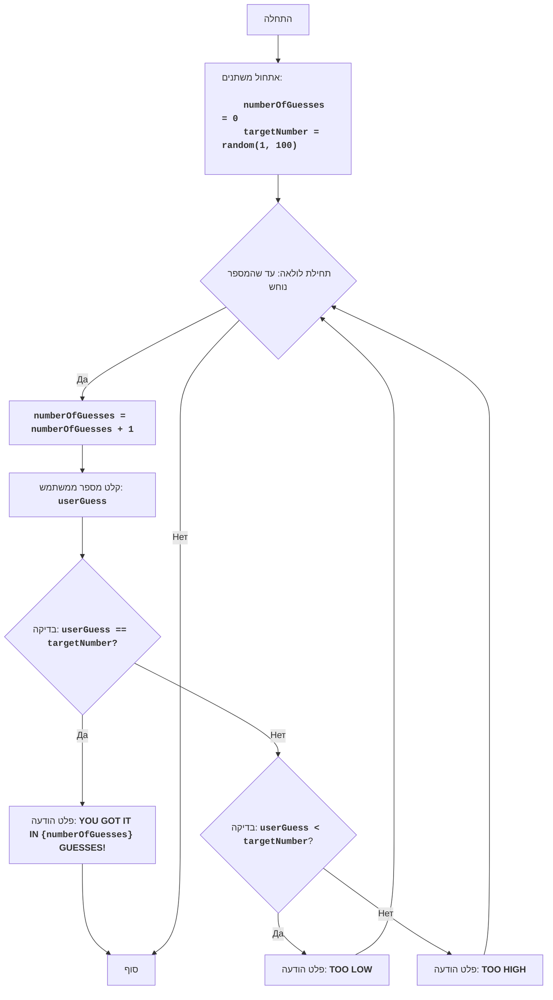

GUESS:
=================
רמת קושי: 3
-----------------
המשחק "נחש את המספר" הוא משחק קלאסי שבו המחשב בוחר מספר אקראי בטווח שבין 1 ל-100, והשחקן נדרש לנחש מספר זה. לאחר כל ניסיון, השחקן מקבל רמזים "נמוך מדי" או "גבוה מדי". המשחק נמשך עד שהשחקן מנחש בהצלחה את המספר.
-----------------
כללי המשחק:
1. המחשב בוחר מספר שלם אקראי בין 1 ל-100.
2. השחקן מזין את הניחושים שלו עבור המספר שנגאל.
3. לאחר כל ניסיון, המחשב מציין האם המספר שהוזן היה נמוך מדי, גבוה מדי, או נוחש בהצלחה.
4. המשחק נמשך עד שהשחקן מנחש את המספר שנגאל.
-----------------
אלגוריתם:
1. הגדר את מספר הניסיונות ל-0.
2. צור מספר אקראי בטווח שבין 1 ל-100.
3. התחל לולאת "כל עוד המספר לא נוחש":
    3.1 הגדל את מספר הניסיונות ב-1.
    3.2 בקש מהשחקן להזין מספר.
    3.3 אם המספר שהוזן שווה למספר שנגאל, עבור לשלב 4.
    3.4 אם המספר שהוזן קטן מהמספר שנגאל, פלוט את ההודעה "TOO LOW".
    3.5 אם המספר שהוזן גדול מהמספר שנגאל, פלוט את ההודעה "TOO HIGH".
4. פלוט את ההודעה "YOU GOT IT IN {numberOfGuesses} GUESSES!"
5. סוף המשחק.
-----------------
תרשים זרימה:

מקרא:
Start - התחלת התוכנית.
InitializeVariables - אתחול משתנים: numberOfGuesses (מספר הניסיונות) מוגדר ל-0, ו-targetNumber (המספר שנגאל) נוצר באקראי בטווח של 1 עד 100.
LoopStart - תחילת הלולאה שנמשכת כל עוד המספר לא נוחש.
IncreaseGuesses - הגדלת מונה מספר הניסיונות ב-1.
InputGuess - בקשת קלט מספר מהמשתמש ושמירתו במשתנה userGuess.
CheckGuess - בדיקה האם המספר שהוזן userGuess שווה למספר שנגאל targetNumber.
OutputWin - פלט הודעת ניצחון אם המספרים שווים, עם ציון מספר הניסיונות.
End - סוף התוכנית.
CheckLow - בדיקה האם המספר שהוזן userGuess קטן מהמספר שנגאל targetNumber.
OutputLow - פלט ההודעה "TOO LOW" אם המספר שהוזן קטן מהמספר שנגאל.
OutputHigh - פלט ההודעה "TOO HIGH" אם המספר שהוזן גדול מהמספר שנגאל.