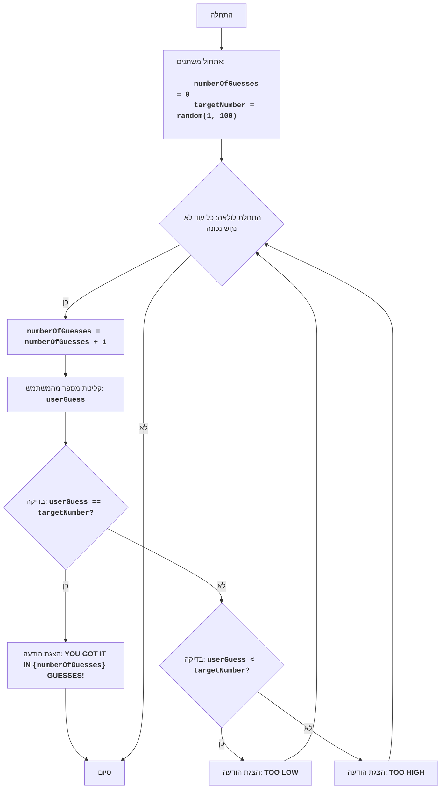

GUESS:
=================
רמת קושי: 3
-----------------
המשחק "נחש את המספר" הוא משחק קלאסי שבו המחשב בוחר מספר אקראי בטווח שבין 1 ל-100, והשחקן צריך לנחש את המספר הזה, כשהוא מקבל רמזים "נמוך מדי" או "גבוה מדי" לאחר כל ניסיון. המשחק נמשך עד שהשחקן מנחש את המספר.

חוקי המשחק:
1. המחשב בוחר מספר שלם אקראי בין 1 ל-100.
2. השחקן מזין את ניחושיו לגבי המספר שנבחר.
3. לאחר כל ניסיון, המחשב מציין האם המספר שהוזן היה נמוך מדי, גבוה מדי, או שנחַש נכונה.
4. המשחק נמשך עד שהשחקן מנחש את המספר שנבחר.
-----------------
אלגוריתם:
1. הגדר את מונה הניסיונות ל-0.
2. צור מספר אקראי בטווח שבין 1 ל-100.
3. התחל לולאה "כל עוד המספר לא נחש נכונה":
    3.1 הגדל את מונה הניסיונות ב-1.
    3.2 בקש מהשחקן להזין מספר.
    3.3 אם המספר שהוזן שווה למספר שנבחר, עבור לשלב 4.
    3.4 אם המספר שהוזן קטן מהמספר שנבחר, הצג את ההודעה "TOO LOW".
    3.5 אם המספר שהוזן גדול מהמספר שנבחר, הצג את ההודעה "TOO HIGH".
4. הצג את ההודעה "YOU GOT IT IN {מספר ניסיונות} GUESSES!".
5. סיום המשחק.
-----------------
תרשים זרימה:

מקרא:
    Start - התחלת התוכנית.
    InitializeVariables - אתחול משתנים: numberOfGuesses (מספר ניסיונות) מוגדר ל-0, ו-targetNumber (המספר שנבחר) נוצר באופן אקראי בין 1 ל-100.
    LoopStart - התחלת לולאה, שנמשכת כל עוד המספר לא נחש נכונה.
    IncreaseGuesses - הגדלת מונה מספר הניסיונות ב-1.
    InputGuess - בקשה מהמשתמש להזין מספר ושמירתו במשתנה userGuess.
    CheckGuess - בדיקה האם המספר שהוזן userGuess שווה למספר שנבחר targetNumber.
    OutputWin - הצגת הודעת ניצחון, אם המספרים שווים, עם ציון מספר הניסיונות.
    End - סיום התוכנית.
    CheckLow - בדיקה האם המספר שהוזן userGuess קטן מהמספר שנבחר targetNumber.
    OutputLow - הצגת ההודעה "TOO LOW", אם המספר שהוזן קטן מהמספר שנבחר.
    OutputHigh - הצגת ההודעה "TOO HIGH", אם המספר שהוזן גדול מהמספר שנבחר.