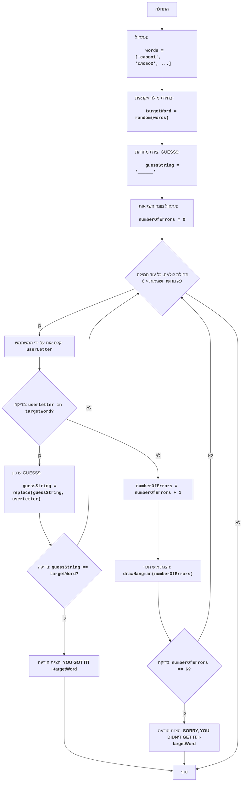

HANG
=================
מורכבות: 7
-----------------
המשחק "איש תלוי" הוא משחק מילים שבו שחקן אחד (או המחשב) בוחר מילה, ושחקן אחר מנסה לנחש אותה לפי אותיות.
עבור כל אות שגויה, השחקן מקבל עונש, בדרך כלל בצורת חלק מציור איש תלוי. אם הציור הושלם, השחקן מפסיד.

כללי המשחק:
1. המחשב בוחר מילה אקראית מתוך רשימה שהוגדרה מראש.
2. השחקן רואה את המילה מיוצגת על ידי קווים תחתונים (אחד עבור כל אות).
3. השחקן מנסה לנחש את המילה על ידי הזנת אותיות.
4. אם האות שהוזנה קיימת במילה, היא מוצגת במקומותיה המתאימים.
5. אם האות שהוזנה אינה קיימת במילה, השחקן מקבל עונש.
6. המשחק נמשך עד אשר השחקן ינחש את המילה או ימצה את מגבלת העונשים.
-----------------
אלגוריתם:
1.  לאתחל מערך מילים שהמחשב יכול לבחור.
2.  לבחור מילה אקראית מתוך המערך.
3.  ליצור מחרוזת `GUESS$` , המכילה קווים תחתונים, באורך המילה הנבחרת.
4.  לאתחל את מספר השגיאות, שווה ל-0.
5.  להתחיל לולאה "כל עוד המילה לא נוחשה ומספר השגיאות קטן מ-6":
  5.1 לבקש קלט של אות מהשחקן.
  5.2 אם האות שהוזנה קיימת במילה הנבחרת:
    5.2.1 לעדכן את המחרוזת `GUESS$` , בהצגת האות בכל עמדותיה במילה.
    5.2.2 אם כל האותיות נוחשו, לעבור לשלב 6.
  5.3 אחרת:
    5.3.1 להגדיל את מספר השגיאות ב-1.
    5.3.2 להציג את תמונת איש התלוי, המתאימה למספר השגיאות הנוכחי.
  5.4 אם מספר השגיאות שווה ל-6, לעבור לשלב 7.
6. להציג הודעה "YOU GOT IT!", ולאחר מכן את המילה שנבחרה, ולעבור לשלב 8.
7. להציג הודעה "SORRY, YOU DIDN'T GET IT.", ולאחר מכן את המילה שנבחרה, ולעבור לשלב 8.
8. סיום המשחק.
-----------------
תרשים זרימה:

-----
**מקרא**:

  - Start - התחלת המשחק.
  - InitializeWords - אתחול רשימת המילים לבחירה.
  - ChooseWord - בחירת מילה אקראית מהרשימה.
  - CreateGuessString - יצירת המחרוזת `guessString` מקווים תחתונים, המתאימה לאורך המילה הנבחרת.
  - InitializeErrors - אתחול מונה השגיאות `numberOfErrors` ל-0.
  - LoopStart - תחילת הלולאה, הנמשכת כל עוד המילה לא נוחשה ומספר השגיאות קטן מ-6.
  - InputLetter - בקשת קלט אות מהמשתמש ושמירתה ב-`userLetter`.
  - CheckLetter - בדיקה האם האות שהוזנה `userLetter` קיימת במילה הנבחרת `targetWord`.
  - UpdateGuessString - עדכון המחרוזת `guessString`, בהצגת האות שהוזנה במקומותיה.
  - CheckWin - בדיקה האם המילה נוחשה (כלומר, `guessString` שווה ל-`targetWord`).
  - OutputWin - הצגת הודעת הניצחון "YOU GOT IT!" והמילה הנבחרת.
  - End - סיום המשחק.
  - IncreaseErrors - הגדלת מונה השגיאות `numberOfErrors` ב-1.
  - DrawHangman - הצגת מצב איש התלוי הנוכחי בהתאם למספר השגיאות.
  - CheckLose - בדיקה האם מספר השגיאות `numberOfErrors` הגיע לערך 6.
  - OutputLose - הצגת הודעת ההפסד "SORRY, YOU DIDN'T GET IT." והמילה הנבחרת.
"""