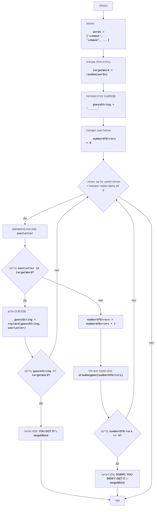

HANG
=================
מורכבות: 7
-----------------
המשחק "איש תלוי" הוא משחק ניחוש מילים שבו שחקן אחד (או המחשב) בוחר מילה, ושחקן אחר מנסה לנחש אותה על ידי ניחוש אותיות.
על כל אות שגויה שהשחקן מנחש, הוא מקבל עונש, בדרך כלל בצורת חלק מציור של איש תלוי. אם הציור הושלם, השחקן מפסיד.

כללי המשחק:
1. המחשב בוחר מילה אקראית מרשימה מוגדרת מראש.
2. השחקן רואה את המילה מיוצגת על ידי קווים תחתונים (אחד לכל אות).
3. השחקן מנסה לנחש את המילה על ידי קלט של אותיות.
4. אם האות שהוזנה נמצאת במילה, היא מוצגת במקומותיה המתאימים.
5. אם האות שהוזנה אינה נמצאת במילה, השחקן מקבל עונש.
6. המשחק ממשיך עד שהשחקן מנחש את המילה או מגיע למגבלת העונשים.
-----------------
אלגוריתם:
1. אתחל מערך מילים שהמחשב יכול לבחור.
2. בחר מילה אקראית מהמערך.
3. צור מחרוזת `GUESS$` המורכבת מקווים תחתונים, באורך המילה שנבחרה.
4. אתחל את מספר השגיאות ל-0.
5. התחל לולאה "כל עוד המילה לא נוחשה ומספר השגיאות קטן מ-6":
  5.1 בקש קלט אות מהשחקן.
  5.2 אם האות שהוזנה נמצאת במילה שנבחרה:
    5.2.1 עדכן את המחרוזת `GUESS$` על ידי הצגת האות בכל מיקומיה במילה.
    5.2.2 אם כל האותיות נוחשו, עבור לשלב 6.
  5.3 אחרת (האות אינה נמצאת במילה):
    5.3.1 הגדל את מספר השגיאות ב-1.
    5.3.2 הצג את תמונת האיש התלוי המתאימה למספר השגיאות הנוכחי.
  5.4 אם מספר השגיאות שווה ל-6, עבור לשלב 7.
6. הצג את ההודעה "YOU GOT IT!", לאחר מכן את המילה שנבחרה, ועבור לשלב 8.
7. הצג את ההודעה "SORRY, YOU DIDN'T GET IT.", לאחר מכן את המילה שנבחרה, ועבור לשלב 8.
8. סוף המשחק.
-----------------
תרשים זרימה:

-----
**מקרא**:

  - Start - התחלת המשחק.
  - InitializeWords - אתחול רשימת המילים לבחירה.
  - ChooseWord - בחירת מילה אקראית מהרשימה.
  - CreateGuessString - יצירת המחרוזת `guessString` המורכבת מקווים תחתונים, התואמת לאורך המילה שנבחרה.
  - InitializeErrors - אתחול מונה השגיאות `numberOfErrors` ל-0.
  - LoopStart - תחילת לולאה, הנמשכת כל עוד המילה לא נוחשה ומספר השגיאות קטן מ-6.
  - InputLetter - בקשת קלט אות מהמשתמש ושמירתה במשתנה `userLetter`.
  - CheckLetter - בדיקה האם האות שהוזנה `userLetter` נמצאת במילה שנבחרה `targetWord`.
  - UpdateGuessString - עדכון המחרוזת `guessString`, על ידי הצגת האות שהוזנה במקומותיה המתאימים.
  - CheckWin - בדיקה האם המילה נוחשה (כלומר, האם `guessString` שווה ל-`targetWord`).
  - OutputWin - פלט הודעה על ניצחון "YOU GOT IT!" והצגת המילה שנבחרה.
  - End - סוף המשחק.
  - IncreaseErrors - הגדלת מונה השגיאות `numberOfErrors` ב-1.
  - DrawHangman - הצגת מצב האיש התלוי הנוכחי בהתאם למספר השגיאות.
  - CheckLose - בדיקה האם מספר השגיאות `numberOfErrors` הגיע לערך 6.
  - OutputLose - פלט הודעה על הפסד "SORRY, YOU DIDN'T GET IT." והצגת המילה שנבחרה.
"""