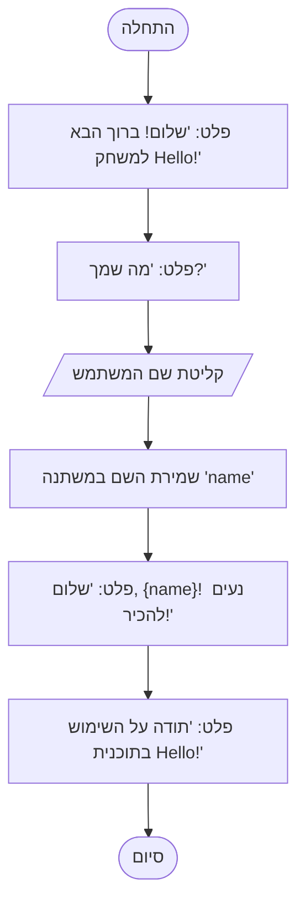

```python
# משחק Hello
# תוכנית זו מציגה ברכה למשתמש.
# זוהי אחת התוכניות הפשוטות ביותר המדגימה פקודות בסיסיות ב-Python.

# פלט של ברכה למסך
print("Привет! Добро пожаловать в игру Hello!")  # שימוש בפונקציה print לפלט טקסט

# בקשת שם המשתמש
name = input("Как тебя зовут? ")  # שימוש בפונקציה input לקבלת נתונים מהמשתמש

# פלט של ברכה מותאמת אישית
print(f"Привет, {name}! Приятно познакомиться!")  # שימוש ב-f-string להחלפת שם בטקסט

# הודעה נוספת
print("Спасибо за использование программы Hello!")
```

---

### **הסברים על הקוד:**
1.  **`print()`** – פונקציה לפלט טקסט למסך. במקרה זה, משמשת לברכת המשתמש.
2.  **`input()`** – פונקציה לקבלת נתונים מהמשתמש. במקרה זה, מבקשת את השם.
3.  **f-strings** – משמשים להחלפת משתנים במחרוזת. לדוגמה, `{name}` מחליף את הערך של המשתנה `name`.
4.  **המשתנה `name`** – מאחסן את השם שהוזן על ידי המשתמש.

---

### **כיצד התוכנית פועלת:**
1.  התוכנית מציגה ברכה.
2.  מבקשת מהמשתמש את שמו.
3.  מציגה ברכה מותאמת אישית, תוך שימוש בשם שהוזן.
4.  מסיימת את פעולתה עם הודעה נוספת.

---

### **דוגמה להרצת התוכנית:**
```
Привет! Добро пожаловать в игру Hello!
Как тебя зовут? Иван
Привет, Иван! Приятно познакомиться!
Спасибо за использование программы Hello!
```
### **דיאגרמת זרימה**


מקרא
1.  **`Start`** – התחלת התוכנית.
2.  **`DisplayWelcome`** – פלט ברכה למשתמש.
3.  **`AskName`** – פלט בקשת שם המשתמש.
4.  **`GetUserName`** – קליטת השם מהמשתמש.
5.  **`StoreName`** – שמירת השם במשתנה `name`.
6.  **`DisplayGreeting`** – פלט ברכה מותאמת אישית באמצעות המשתנה `name`.
7.  **`DisplayThanks`** – פלט הודעה על סיום התוכנית.
8.  **`End`** – סיום התוכנית.

הרץ קוד ב-[google colab](https://colab.research.google.com/github/hypo69/101_python_computer_games_ru/blob/master/GAMES/HELLO/101bcg_ru_hello.ipynb)

### בעידן ה-AI, גם הקוד צריך להתאים את עצמו לזמן. הנה גרסה מודרנית של Hello, World!

בפוסט הקודם התחלתי להציג פתרונות פשוטים למתחילים ללמוד Python. כמו בכל ספרי לימוד תכנות, התחלתי עם הדוגמה הקלאסית "Hello, World!". בה שמתי דגש עיקרי לא על הקוד, אלא על ההערות (comments). אל תתעצל לכתוב הערות. אל תסמוך על הזיכרון שלך. ככל שהקוד ילך ויהפוך מורכב יותר, בהכרח תשכח מה כתבת בשבוע שעבר או לפני חודש. הקוד שלך ייקרא על ידי אחרים, וקוד מתועד היטב נקרא כמו רומן הרפתקאות. קוד מתועד רע, עם שמות משתנים ופונקציות לא ברורים, עם לוגיקה מסובכת – מיד מתחשק לזרוק אותו לפח.

בעידן ה-AI, גם הקוד צריך להתאים את עצמו לזמן. הנה גרסה מודרנית של Hello, World! – דוגמה אינטראקטיבית המאפשרת תקשורת עם מודל הבינה המלאכותית Gemini של Google. דוגמה זו מראה כיצד ניתן להשתמש ב-Python כדי לשוחח עם AI ולקבל תשובות לשאלות.