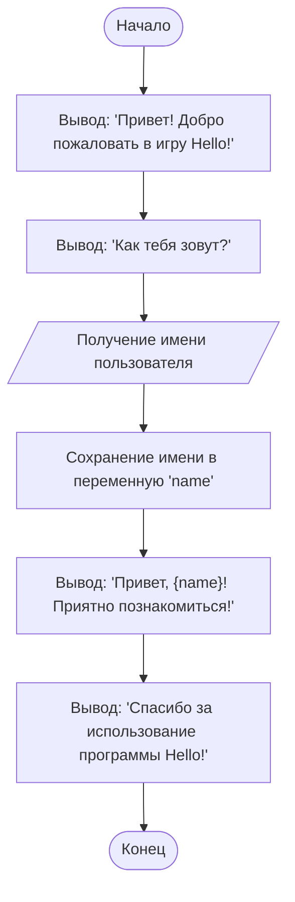

```python
# משחק Hello
# תוכנית זו מציגה ברכה למשתמש.
# זו אחת התוכניות הפשוטות ביותר, המדגימה פקודות Python בסיסיות.

# הדפסת הברכה למסך
print("Привет! Добро пожаловать в игру Hello!")  # משתמשים בפונקציה print להדפסת טקסט

# בקשת שם המשתמש
name = input("Как тебя зовут? ")  # משתמשים בפונקציה input לקבלת נתונים מהמשתמש

# הדפסת ברכה מותאמת אישית
print(f"Привет, {name}! Приятно познакомиться!")  # משתמשים ב-f-string לשילוב השם בטקסט

# הודעה נוספת
print("Спасибо за использование программы Hello!")
```

---

### **הסברים לקוד:**
1. **`print()`** – פונקציה להדפסת טקסט למסך. במקרה זה, משמשת לברכת המשתמש.
2. **`input()`** – פונקציה לקבלת נתונים מהמשתמש. במקרה זה, מתבקש השם.
3. **f-strings** – משמשות לשילוב משתנים בתוך מחרוזת. לדוגמה, `{name}` משלב את ערך המשתנה `name`.
4. **המשתנה `name`** – מאחסן את השם שהוזן על ידי המשתמש.

---

### **אופן פעולת התוכנית:**
1. התוכנית מציגה ברכה.
2. מבקשת מהמשתמש את שמו.
3. מציגה ברכה מותאמת אישית תוך שימוש בשם שהוזן.
4. מסיימת את פעולתה בהודעה נוספת.

---

### **דוגמה לביצוע התוכנית:**
```
Привет! Добро пожаловать в игру Hello!
Как тебя зовут? Иван
Привет, Иван! Приятно познакомиться!
Спасибо за использование программы Hello!
```
### **תרשים זרימה**


**מקרא**
1. **`Start`** – תחילת התוכנית.
2. **`DisplayWelcome`** – הצגת הברכה למשתמש.
3. **`AskName`** – הצגת בקשת שם המשתמש.
4. **`GetUserName`** – קבלת השם מהמשתמש.
5. **`StoreName`** – שמירת השם במשתנה `name`.
6. **`DisplayGreeting`** – הצגת ברכה מותאמת אישית תוך שימוש במשתנה `name`.
7. **`DisplayThanks`** – הצגת הודעת סיום התוכנית.
8. **`End`** – סוף התוכנית.

להרצת הקוד ב-[google colab](https://colab.research.google.com/github/hypo69/101_python_computer_games_ru/blob/master/GAMES/HELLO/101bcg_ru_hello.ipynb)

### בעידן ה-AI, גם קוד צריך להיות תואם לרוח הזמן. ראו את הגרסה המודרנית של Hello, World!

בפוסט הקודם התחלתי להציג פתרונות פשוטים למתחילים בלימודי Python. כמו בכל ספרי לימוד תכנות, התחלתי עם הדוגמה הקלאסית "Hello, World!". בה שמתי את הדגש העיקרי לא על הקוד, אלא על ההערות. אל תתעצלו לכתוב הערות. אל תסמכו על הזיכרון שלכם. עם העלייה במורכבות הקוד, בטוח תשכחו מה כתבתם בשבוע או בחודש שעבר. הקוד שלכם ייקרא על ידי אחרים, וקוד מתועד היטב נקרא כמו רומן הרפתקאות. קוד מתועד בצורה גרועה, עם שמות משתנים ופונקציות לא ברורים, עם לוגיקה מסובכת – מיד בא לזרוק אותו לפח.

בעידן ה-AI, גם קוד צריך להיות תואם לרוח הזמן. ראו את הגרסה המודרנית של Hello, World! – דוגמה אינטראקטיבית המאפשרת אינטראקציה עם מודל הבינה המלאכותית Gemini מבית Google. דוגמה זו מראה כיצד ניתן להשתמש ב-Python כדי לתקשר עם AI ולקבל תשובות לשאלותיכם.