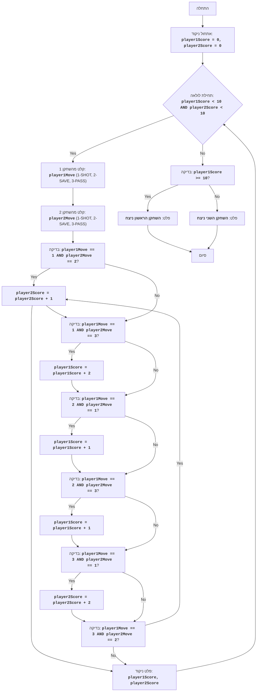

"""
HOCKEY:
=================
רמת קושי: 5
-----------------
המשחק "הוקי" מהווה סימולציה פשוטה של משחק הוקי בין שני שחקנים. המשחק מורכב ממספר סיבובים, כאשר בכל סיבוב שחקנים בוחרים בתורם אחת משלוש פעולות: זריקה (SHOT), הגנה (SAVE) או מסירה (PASS). הפעולות של כל שחקן מושוות, ובהתאם לשילוב הפעולות מוענקות נקודות.
המשחק נמשך עד שאחד השחקנים צובר 10 נקודות.

חוקי המשחק:
1. משחקים שני שחקנים, כאשר כל אחד מהם מזין את המהלך שלו בכל סיבוב.
2. המהלכים מוזנים בצורת קודים מספריים: 1 - זריקה, 2 - הגנה, 3 - מסירה.
3. בכל סיבוב מושוות הפעולות של השחקנים:
   - אם שחקן אחד זורק והשני מגן, השחקן המגן מקבל נקודה 1.
   - אם שחקן אחד זורק והשני מוסר, השחקן הזורק מקבל 2 נקודות.
   - אם שני השחקנים זורקים, לא מוענקות נקודות.
   - אם שחקן אחד מגן והשני מוסר, השחקן המגן מקבל נקודה 1.
   - אם שני השחקנים בוחרים באותה פעולה, לא מוענקות נקודות.
4. המשחק נמשך עד שאחד השחקנים צובר 10 נקודות.
5. השחקן הראשון שצובר 10 נקודות מוכרז כמנצח.
-----------------
אלגוריתם:
1. אתחל את הניקוד של כל שחקן לאפס.
2. התחל לולאת "כל עוד ניקוד השחקן הראשון קטן מ-10 וניקוד השחקן השני קטן מ-10":
    2.1 בקש מהשחקן הראשון להזין מהלך (1 - זריקה, 2 - הגנה, 3 - מסירה).
    2.2 בקש מהשחקן השני להזין מהלך (1 - זריקה, 2 - הגנה, 3 - מסירה).
    2.3 אם השחקן הראשון זורק (1) והשחקן השני מגן (2), הגדל את ניקוד השחקן השני ב-1.
    2.4 אם השחקן הראשון זורק (1) והשחקן השני מוסר (3), הגדל את ניקוד השחקן הראשון ב-2.
    2.5 אם השחקן הראשון מגן (2) והשחקן השני זורק (1), הגדל את ניקוד השחקן הראשון ב-1.
    2.6 אם השחקן הראשון מגן (2) והשחקן השני מוסר (3), הגדל את ניקוד השחקן הראשון ב-1.
    2.7 אם השחקן הראשון מוסר (3) והשחקן השני זורק (1), הגדל את ניקוד השחקן השני ב-2.
    2.8 אם השחקן הראשון מוסר (3) והשחקן השני מגן (2), הגדל את ניקוד השחקן השני ב-1.
    2.9 הצג את הניקוד הנוכחי.
3. אם ניקוד השחקן הראשון גדול או שווה ל-10, הצג את ההודעה "השחקן הראשון ניצח".
4. אם ניקוד השחקן השני גדול או שווה ל-10, הצג את ההודעה "השחקן השני ניצח".
-----------------
תרשים זרימה:

## מקרא:
    Start - תחילת התוכנית.
    InitializeScores - אתחול המשתנים player1Score ו-player2Score לאפס.
    GameLoopStart - תחילת לולאת המשחק, הנמשכת כל עוד הניקוד של שני השחקנים נמוך מ-10.
    Player1Input - בקשת קלט מהשחקן הראשון עבור המהלך (1-זריקה, 2-הגנה, 3-מסירה) ושמירתו במשתנה player1Move.
    Player2Input - בקשת קלט מהשחקן השני עבור המהלך (1-זריקה, 2-הגנה, 3-מסירה) ושמירתו במשתנה player2Move.
    CheckMoves1 - בדיקה האם השחקן הראשון זרק (1) והשחקן השני הגן (2).
    Player2ScoreInc1 - הגדלת ניקוד השחקן השני ב-1.
    CheckMoves2 - בדיקה האם השחקן הראשון זרק (1) והשחקן השני מסר (3).
    Player1ScoreInc2 - הגדלת ניקוד השחקן הראשון ב-2.
    CheckMoves3 - בדיקה האם השחקן הראשון הגן (2) והשחקן השני זרק (1).
    Player1ScoreInc1_1 - הגדלת ניקוד השחקן הראשון ב-1.
    CheckMoves4 - בדיקה האם השחקן הראשון הגן (2) והשחקן השני מסר (3).
    Player1ScoreInc1_2 - הגדלת ניקוד השחקן הראשון ב-1.
    CheckMoves5 - בדיקה האם השחקן הראשון מסר (3) והשחקן השני זרק (1).
    Player2ScoreInc2 - הגדלת ניקוד השחקן השני ב-2.
    CheckMoves6 - בדיקה האם השחקן הראשון מסר (3) והשחקן השני הגן (2).
    Player2ScoreInc1 - הגדלת ניקוד השחקן השני ב-1.
    OutputScores - הצגת הניקוד הנוכחי של השחקנים.
    CheckWinner - בדיקה האם ניקוד השחקן הראשון גדול או שווה ל-10.
    OutputWinner1 - הצגת הודעה שהשחקן הראשון ניצח.
    OutputWinner2 - הצגת הודעה שהשחקן השני ניצח.
    End - סיום התוכנית.
"""

# אתחול ניקוד השחקנים
player1Score = 0
player2Score = 0

# לולאת המשחק הראשית
while player1Score < 10 and player2Score < 10:
    # בקשת קלט מהשחקן הראשון
    try:
        player1Move = int(input("מהלך ראשון (1-זריקה, 2-הגנה, 3-מסירה): "))
        if player1Move < 1 or player1Move > 3:
          print("קלט שגוי! הכנס מספר בין 1 ל-3")
          continue
    except ValueError:
      print("קלט שגוי! הכנס מספר בין 1 ל-3")
      continue

    # בקשת קלט מהשחקן השני
    try:
      player2Move = int(input("מהלך שני (1-זריקה, 2-הגנה, 3-מסירה): "))
      if player2Move < 1 or player2Move > 3:
          print("קלט שגוי! הכנס מספר בין 1 ל-3")
          continue
    except ValueError:
      print("קלט שגוי! הכנס מספר בין 1 ל-3")
      continue

    # בדיקה והענקת נקודות בהתאם למהלכים
    if player1Move == 1 and player2Move == 2:
        player2Score += 1
    elif player1Move == 1 and player2Move == 3:
        player1Score += 2
    elif player1Move == 2 and player2Move == 1:
        player1Score += 1
    elif player1Move == 2 and player2Move == 3:
        player1Score += 1
    elif player1Move == 3 and player2Move == 1:
        player2Score += 2
    elif player1Move == 3 and player2Move == 2:
        player2Score += 1

    # הצגת הניקוד הנוכחי
    print(f"ניקוד: שחקן 1 - {player1Score}, שחקן 2 - {player2Score}")

# קביעת המנצח והצגת הודעה
if player1Score >= 10:
    print("השחקן הראשון ניצח")
else:
    print("השחקן השני ניצח")

"""
הסבר קוד:
1. **אתחול משתנים**:
   - `player1Score = 0`: מאתחל את ניקוד השחקן הראשון לאפס.
   - `player2Score = 0`: מאתחל את ניקוד השחקן השני לאפס.
2. **לולאת המשחק הראשית `while player1Score < 10 and player2Score < 10:`**:
   - הלולאה ממשיכה כל עוד הניקוד של לפחות אחד מהשחקנים לא הגיע ל-10.
   - **קלט מהלכי השחקנים**:
     - מבקש קלט מהשחקן הראשון עבור המהלך (1 - זריקה, 2 - הגנה, 3 - מסירה) ושומר אותו ב-`player1Move`.
     - מבקש קלט מהשחקן השני עבור המהלך (1 - זריקה, 2 - הגנה, 3 - מסירה) ושומר אותו ב-`player2Move`.
     - **טיפול בחריגות**:
     - בלוקי `try-except` מטפלים בשגיאות קלט אפשריות. אם המשתמש יכניס ערך שאינו מספר שלם, תוצג הודעת שגיאה.
   - **בדיקה והענקת נקודות**:
     - `if player1Move == 1 and player2Move == 2:`: אם השחקן הראשון זורק והשחקן השני מגן, ניקוד השחקן השני גדל ב-1.
     - `elif player1Move == 1 and player2Move == 3:`: אם השחקן הראשון זורק והשחקן השני מוסר, ניקוד השחקן הראשון גדל ב-2.
     - `elif player1Move == 2 and player2Move == 1:`: אם השחקן הראשון מגן והשחקן השני זורק, ניקוד השחקן הראשון גדל ב-1.
     - `elif player1Move == 2 and player2Move == 3:`: אם השחקן הראשון מגן והשחקן השני מוסר, ניקוד השחקן הראשון גדל ב-1.
     - `elif player1Move == 3 and player2Move == 1:`: אם השחקן הראשון מוסר והשחקן השני זורק, ניקוד השחקן השני גדל ב-2.
     - `elif player1Move == 3 and player2Move == 2:`: אם השחקן הראשון מוסר והשחקן השני מגן, ניקוד השחקן השני גדל ב-1.
   - **הצגת ניקוד נוכחי**:
     - `print(f"ניקוד: שחקן 1 - {player1Score}, שחקן 2 - {player2Score}")`: מציג את הניקוד הנוכחי של השחקנים.
3. **קביעת מנצח**:
   - `if player1Score >= 10:`: בודק האם ניקוד השחקן הראשון הגיע ל-10 או יותר.
     - `print("השחקן הראשון ניצח")`: מציג הודעה על ניצחון השחקן הראשון.
   - `else:`: אם התנאי לעיל לא מתקיים, אזי השחקן השני ניצח.
     - `print("השחקן השני ניצח")`: מציג הודעה על ניצחון השחקן השני.
"""