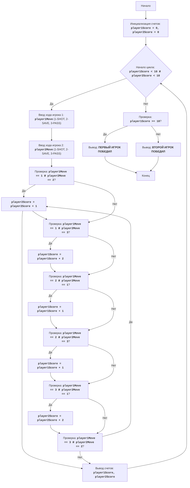

"""
הוֹקִי:
=================
רמת קושי: 5
-----------------
המשחק "הוֹקִי" הינו סימולציה פשוטה של משחק הוֹקִי בין שני שחקנים. המשחק מורכב ממספר סבבים, שבכל אחד מהם השחקנים לסירוגין בוחרים אחת משלוש פעולות: זריקה (SHOT), הגנה (SAVE) או מסירה (PASS). הפעולות של כל שחקן מושוות, ובהתאם לשילוב הפעולות מוענקות נקודות.
המשחק נמשך עד שאחד השחקנים יצבור 10 נקודות.

חוקי המשחק:
1.  משחקים שני שחקנים, כל אחד מהם מזין את המהלך שלו בכל סבב.
2.  המהלכים מוזנים בצורת קודים מספריים: 1 - זריקה, 2 - הגנה, 3 - מסירה.
3.  בכל סבב מושוות מהלכי השחקנים:
    *   אם שחקן אחד זורק והשני מגן, השחקן המגן מקבל נקודה אחת.
    *   אם שחקן אחד זורק והשני מוסר, השחקן הזורק מקבל 2 נקודות.
    *   אם שני השחקנים זורקים, לא מוענקות נקודות.
    *   אם שחקן אחד מגן והשני מוסר, השחקן המגן מקבל נקודה אחת.
    *   אם שני השחקנים בוחרים באותו מהלך, לא מוענקות נקודות.
4.  המשחק נמשך עד שאחד השחקנים יצבור 10 נקודות.
5.  השחקן הראשון שצבר 10 נקודות מוכרז כמנצח.
-----------------
אלגוריתם:
1.  לאתחל את הניקוד של כל שחקן לאפס.
2.  להתחיל לולאה "כל עוד הניקוד של השחקן הראשון קטן מ-10 וגם הניקוד של השחקן השני קטן מ-10":
    2.1 לבקש מהשחקן הראשון להזין מהלך (1 - זריקה, 2 - הגנה, 3 - מסירה).
    2.2 לבקש מהשחקן השני להזין מהלך (1 - זריקה, 2 - הגנה, 3 - מסירה).
    2.3 אם השחקן הראשון זורק (1), והשני מגן (2), להגדיל את הניקוד של השחקן השני ב-1.
    2.4 אם השחקן הראשון זורק (1), והשני מוסר (3), להגדיל את הניקוד של השחקן הראשון ב-2.
    2.5 אם השחקן הראשון מגן (2), והשני זורק (1), להגדיל את הניקוד של השחקן הראשון ב-1.
    2.6 אם השחקן הראשון מגן (2), והשני מוסר (3), להגדיל את הניקוד של השחקן הראשון ב-1.
    2.7 אם השחקן הראשון מוסר (3), והשני זורק (1), להגדיל את הניקוד של השחקן השני ב-2.
    2.8 אם השחקן הראשון מוסר (3), והשני מגן (2), להגדיל את הניקוד של השחקן השני ב-1.
    2.9 להציג את הניקוד הנוכחי.
3.  אם הניקוד של השחקן הראשון גדול או שווה ל-10, להציג הודעה "השחקן הראשון ניצח".
4.  אם הניקוד של השחקן השני גדול או שווה ל-10, להציג הודעה "השחקן השני ניצח".
-----------------
תרשים זרימה:

## מקרא:
    Start - התחלת התוכנית.
    InitializeScores - אתחול המשתנים player1Score ו-player2Score לאפס.
    GameLoopStart - תחילת לולאת המשחק, שנמשכת כל עוד הניקוד של שני השחקנים קטן מ-10.
    Player1Input - בקשה מהשחקן הראשון להזין מהלך (1-זריקה, 2-הגנה, 3-מסירה) ושמירתו במשתנה player1Move.
    Player2Input - בקשה מהשחקן השני להזין מהלך (1-זריקה, 2-הגנה, 3-מסירה) ושמירתו במשתנה player2Move.
    CheckMoves1 - בדיקה ששחקן 1 זרק (1), ושחקן 2 הגן (2).
    Player2ScoreInc1 - הגדלת הניקוד של השחקן השני ב-1.
    CheckMoves2 - בדיקה ששחקן 1 זרק (1), ושחקן 2 מסר (3).
    Player1ScoreInc2 - הגדלת הניקוד של השחקן הראשון ב-2.
    CheckMoves3 - בדיקה ששחקן 1 הגן (2), ושחקן 2 זרק (1).
    Player1ScoreInc1_1 - הגדלת הניקוד של השחקן הראשון ב-1.
    CheckMoves4 - בדיקה ששחקן 1 הגן (2), ושחקן 2 מסר (3).
    Player1ScoreInc1_2 - הגדלת הניקוד של השחקן הראשון ב-1.
    CheckMoves5 - בדיקה ששחקן 1 מסר (3), ושחקן 2 זרק (1).
    Player2ScoreInc2 - הגדלת הניקוד של השחקן השני ב-2.
    CheckMoves6 - בדיקה ששחקן 1 מסר (3), ושחקן 2 הגן (2).
    Player2ScoreInc1 - הגדלת הניקוד של השחקן השני ב-1.
    OutputScores - הצגת הניקוד הנוכחי של השחקנים.
    CheckWinner - בדיקה שהניקוד של השחקן הראשון גדול או שווה ל-10.
    OutputWinner1 - הצגת הודעה שהשחקן הראשון ניצח.
    OutputWinner2 - הצגת הודעה שהשחקן השני ניצח.
    End - סיום התוכנית.
"""

# אתחול ניקוד השחקנים
player1Score = 0
player2Score = 0

# לולאת המשחק הראשית
while player1Score < 10 and player2Score < 10:
    # בקשת הזנת מהלך מהשחקן הראשון
    try:
        player1Move = int(input("מהלך השחקן הראשון (1-זריקה, 2-הגנה, 3-מסירה): "))
        if player1Move < 1 or player1Move > 3:
          print("קלט לא תקין! יש להזין מספר בין 1 ל-3")
          continue
    except ValueError:
      print("קלט לא תקין! יש להזין מספר בין 1 ל-3")
      continue

    # בקשת הזנת מהלך מהשחקן השני
    try:
      player2Move = int(input("מהלך השחקן השני (1-זריקה, 2-הגנה, 3-מסירה): "))
      if player2Move < 1 or player2Move > 3:
          print("קלט לא תקין! יש להזין מספר בין 1 ל-3")
          continue
    except ValueError:
      print("קלט לא תקין! יש להזין מספר בין 1 ל-3")
      continue

    # בדיקה והענקת נקודות בהתאם למהלכים
    if player1Move == 1 and player2Move == 2:
        player2Score += 1
    elif player1Move == 1 and player2Move == 3:
        player1Score += 2
    elif player1Move == 2 and player2Move == 1:
        player1Score += 1
    elif player1Move == 2 and player2Move == 3:
        player1Score += 1
    elif player1Move == 3 and player2Move == 1:
        player2Score += 2
    elif player1Move == 3 and player2Move == 2:
        player2Score += 1

    # הצגת הניקוד הנוכחי
    print(f"ניקוד: שחקן 1 - {player1Score}, שחקן 2 - {player2Score}")

# הגדרת המנצח והצגת הודעה
if player1Score >= 10:
    print("השחקן הראשון ניצח")
else:
    print("השחקן השני ניצח")

"""
הסבר קוד:
1.  **אתחול משתנים**:
    *   `player1Score = 0`: מאתחל את הניקוד של השחקן הראשון לאפס.
    *   `player2Score = 0`: מאתחל את הניקוד של השחקן השני לאפס.
2.  **לולאת המשחק הראשית `while player1Score < 10 and player2Score < 10:`**:
    *   הלולאה נמשכת עד שהניקוד של לפחות אחד מהשחקנים יגיע ל-10.
    *   **הזנת מהלכי השחקנים**:
        *   מבקש את הזנת המהלך מהשחקן הראשון (1 - זריקה, 2 - הגנה, 3 - מסירה) ושומר אותה ב-`player1Move`.
        *   מבקש את הזנת המהלך מהשחקן השני (1 - זריקה, 2 - הגנה, 3 - מסירה) ושומר אותה ב-`player2Move`.
        *   **טיפול בחריגות**:
        *   בלוקים `try-except` מטפלים בשגיאות קלט אפשריות. אם המשתמש יזין מספר שאינו שלם, תוצג הודעת שגיאה.
    *   **בדיקה והענקת נקודות**:
        *   `if player1Move == 1 and player2Move == 2:`: אם השחקן הראשון זורק, והשני מגן, אז הניקוד של השחקן השני מוגדל ב-1.
        *   `elif player1Move == 1 and player2Move == 3:`: אם השחקן הראשון זורק, והשני מוסר, אז הניקוד של השחקן הראשון מוגדל ב-2.
        *   `elif player1Move == 2 and player2Move == 1:`: אם השחקן הראשון מגן, והשני זורק, אז הניקוד של השחקן הראשון מוגדל ב-1.
        *   `elif player1Move == 2 and player2Move == 3:`: אם השחקן הראשון מגן, והשני מוסר, אז הניקוד של השחקן הראשון מוגדל ב-1.
        *   `elif player1Move == 3 and player2Move == 1:`: אם השחקן הראשון מוסר, והשני זורק, אז הניקוד של השחקן השני מוגדל ב-2.
        *   `elif player1Move == 3 and player2Move == 2:`: אם השחקן הראשון מוסר, והשני מגן, אז הניקוד של השחקן השני מוגדל ב-1.
    *   **הצגת הניקוד הנוכחי**:
        *   `print(f"ניקוד: שחקן 1 - {player1Score}, שחקן 2 - {player2Score}")`: מציג את הניקוד הנוכחי של השחקנים.
3.  **הגדרת המנצח**:
    *   `if player1Score >= 10:`: בודק האם הניקוד של השחקן הראשון הגיע ל-10 או יותר.
        *   `print("השחקן הראשון ניצח")`: מציג הודעה על ניצחון השחקן הראשון.
    *   `else:`: אם התנאי לעיל אינו מתקיים, משמעות הדבר היא שהשחקן השני ניצח.
        *   `print("השחקן השני ניצח")`: מציג הודעה על ניצחון השחקן השני.
"""