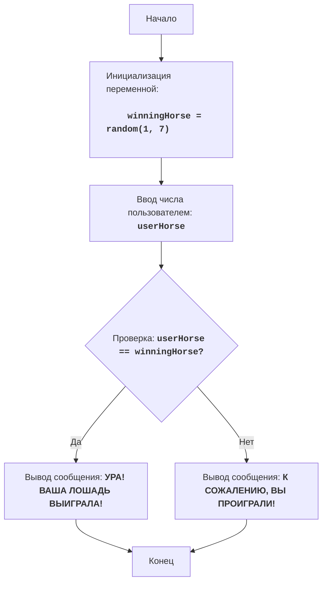

HORSES:
=================
רמת קושי: 3
-----------------
המשחק "מרוצי סוסים" הוא משחק פשוט שבו השחקן בוחר סוס, ולאחר מכן המחשב קובע באקראי איזה מהסוסים ינצח. השחקן מנצח או מפסיד בהתאם לבחירתו.

כללי המשחק:
1. המחשב מגריל מספר אקראי בין 1 ל-7 (מספר הסוס הזוכה).
2. השחקן מזין מספר סוס (בין 1 ל-7) בו הוא מעוניין לתמוך.
3. המשחק מודיע האם הסוס שנבחר על ידי השחקן ניצח.
-----------------
אלגוריתם:
1.  הגרל מספר שלם אקראי בין 1 ל-7 (מספר הסוס הזוכה) ושמור אותו במשתנה `winningHorse`.
2.  בקש מהמשתמש להזין מספר בין 1 ל-7 (מספר הסוס עליו הוא מהמר) ושמור אותו במשתנה `userHorse`.
3.  אם `userHorse` שווה ל-`winningHorse`, הדפס את ההודעה "הוֹרֵי! הַסּוּס שֶׁלְּךָ נִצַּח!".
4.  אחרת, הדפס את ההודעה "לְצַעֲרִינוּ, הִפְסַדְתָּ!".
5. סוף המשחק.
-----------------
דיאגרמת זרימה:

מקרא:
    Start - התחלת התוכנית.
    InitializeWinningHorse - אתחול המשתנה winningHorse (מספר הסוס הזוכה), מגריל מספר אקראי בין 1 ל-7.
    InputUserHorse - בקשת קלט מהמשתמש (מספר הסוס) ושמירתו במשתנה userHorse.
    CheckWinner - בדיקה האם המספר שהוזן על ידי המשתמש userHorse שווה למספר שהוגרל winningHorse.
    OutputWin - הדפסת הודעה על ניצחון אם המספרים שווים.
    OutputLose - הדפסת הודעה על הפסד אם המספרים אינם שווים.
    End - סיום התוכנית.

```python
import random

# מגרילים מספר אקראי בין 1 ל-7 (מספר הסוס הזוכה)
winningHorse = random.randint(1, 7)

# מבקשים מהמשתמש להזין מספר (מספר הסוס אותו הוא בוחר)
try:
    userHorse = int(input("בחר מספר סוס מ-1 עד 7: "))
    if userHorse < 1 or userHorse > 7:
      print("אנא בחר מספר סוס מ-1 עד 7.")
      exit()
except ValueError:
    print("אנא הזן מספר שלם בין 1 ל-7.")
    exit()


# בודקים האם המשתמש ניצח
if userHorse == winningHorse:
    print("הוֹרֵי! הַסּוּס שֶׁלְּךָ נִצַּח!") # הדפסת הודעת ניצחון
else:
    print("לְצַעֲרִינוּ, הִפְסַדְתָּ!") # הדפסת הודעת הפסד
```

"""
הסבר הקוד:
1.  **יבוא המודול `random`**:
   -  `import random`: מייבא את המודול `random`, המשמש ליצירת מספר אקראי.
2.  **הגרלת מספר הסוס הזוכה**:
    -   `winningHorse = random.randint(1, 7)`: מגריל מספר שלם אקראי בטווח בין 1 ל-7 ושומר אותו במשתנה `winningHorse`.
3.  **בקשת קלט של מספר הסוס מהמשתמש**:
    -   `try...except ValueError`: בלוק try-except מטפל בשגיאות קלט אפשריות. אם המשתמש יזין ערך שאינו מספר שלם, תודפס הודעת שגיאה.
    -   `userHorse = int(input("בחר מספר סוס מ-1 עד 7: "))`: מבקש מהמשתמש מספר וממיר אותו למספר שלם, ושומר את התוצאה ב-`userHorse`.
    -   `if userHorse < 1 or userHorse > 7:`: בודק האם המספר שהוזן נמצא בטווח התקין (1-7).
    -   `print("אנא בחר מספר סוס מ-1 עד 7.")`: מדפיס הודעת שגיאה אם המספר הוזן באופן שגוי.
    -   `exit()`: מסיים את ריצת התוכנית אם הקלט שגוי.
    -   `print("אנא הזן מספר שלם בין 1 ל-7.")`: מדפיס הודעת שגיאה אם הקלט אינו מספר שלם.
4.  **בדיקת התוצאה והדפסת ההודעה**:
    -   `if userHorse == winningHorse:`: בודק האם המספר שהוזן על ידי המשתמש שווה למספר שהוגרל.
    -   `print("הוֹרֵי! הַסּוּס שֶׁלְּךָ נִצַּח!")`: מדפיס הודעת ניצחון אם המספרים שווים.
    -   `else:`: אם המספרים אינם שווים.
    -    `print("לְצַעֲרִינוּ, הִפְסַדְתָּ!")`: מדפיס הודעת הפסד.
"""