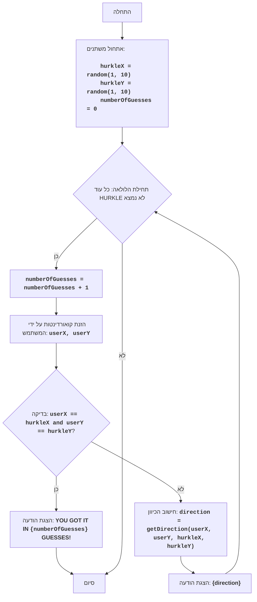

HURKLE:
=================
רמת קושי: 5
-----------------
המשחק "HURKLE" הוא משחק ניחוש מיקום של "HURKLE", אשר מוסתר על גבי מפה בגודל 10x10. השחקן מבצע מהלכים על ידי הזנת קואורדינטות, ומקבל רמזים לגבי מיקומו של HURKLE ביחס לניחושיו. מטרת המשחק היא למצוא את HURKLE במינימום מהלכים.
כללי המשחק:
1. HURKLE מתחבא על מפה בגודל 10x10. קואורדינטות HURKLE נבחרות באופן אקראי.
2. השחקן מבצע מהלכים על ידי הזנת קואורדינטות x ו-y.
3. לאחר כל מהלך, השחקן מקבל רמז המציין את הכיוון (צפון, דרום, מזרח, מערב, צפון-מזרח, דרום-מזרח, צפון-מערב, דרום-מערב) מהקואורדינטה שהוזנה על ידי השחקן ועד למיקומו של HURKLE.
4. המשחק נמשך עד אשר השחקן ינחש את מיקומו של HURKLE.
-----------------
אלגוריתם:
1.  יצירת קואורדינטות אקראיות עבור HURKLE (X ו-Y) בטווח 1 עד 10.
2.  הגדרת מספר המהלכים ל-0.
3.  התחלת לולאת המשחק:
    3.1. הגדלת מונה המהלכים ב-1.
    3.2. בקשת קואורדינטות X ו-Y מהשחקן.
    3.3. אם הקואורדינטות שהוזנו שוות לקואורדינטות HURKLE, הצגת הודעת ניצחון ומספר המהלכים. סיום המשחק.
    3.4. אחרת, קביעת הכיוון מהקואורדינטות שהוזנו ועד לקואורדינטות HURKLE והצגת הרמז (הכיוון).
4. חזרה על לולאת המשחק עד אשר HURKLE יימצא.
-----------------
תרשים זרימה:

מקרא:
    Start - תחילת התוכנית.
    InitializeVariables - אתחול משתנים: hurkleX ו-hurkleY (קואורדינטות HURKLE) נוצרות באופן אקראי מ-1 עד 10, numberOfGuesses (מספר הניסיונות) מוגדר ל-0.
    LoopStart - תחילת הלולאה, הנמשכת כל עוד HURKLE לא נמצא.
    IncreaseGuesses - הגדלת מונה מספר הניסיונות ב-1.
    InputCoordinates - בקשת קואורדינטות X ו-Y מהמשתמש ושמירתן במשתנים userX ו-userY.
    CheckWin - בדיקה האם הקואורדינטות userX ו-userY שהוזנו שוות לקואורדינטות HURKLE hurkleX ו-hurkleY.
    OutputWin - הצגת הודעה על ניצחון, אם הקואורדינטות תואמות, עם ציון מספר הניסיונות.
    End - סיום התוכנית.
    CalculateDirection - חישוב הכיוון מקואורדינטות המשתמש לקואורדינטות HURKLE.
    OutputDirection - הצגת הודעה עם הכיוון.
```python
import random

# פונקציה לקביעת הכיוון של HURKLE
def get_direction(user_x, user_y, hurkle_x, hurkle_y):
    """
    קובעת את הכיוון מקואורדינטות המשתמש לקואורדינטות HURKLE.
    Args:
        user_x (int): קואורדינטת ה-X שהוזנה על ידי המשתמש.
        user_y (int): קואורדינטת ה-Y שהוזנה על ידי המשתמש.
        hurkle_x (int): קואורדינטת ה-X של HURKLE.
        hurkle_y (int): קואורדינטת ה-Y של HURKLE.
    Returns:
        str: מחרוזת המייצגת את הכיוון.
    """
    if user_x < hurkle_x and user_y < hurkle_y:
        return "צפון-מזרח"
    elif user_x < hurkle_x and user_y > hurkle_y:
        return "דרום-מזרח"
    elif user_x > hurkle_x and user_y < hurkle_y:
        return "צפון-מערב"
    elif user_x > hurkle_x and user_y > hurkle_y:
        return "דרום-מערב"
    elif user_x < hurkle_x:
        return "מזרח"
    elif user_x > hurkle_x:
        return "מערב"
    elif user_y < hurkle_y:
        return "צפון"
    else:
        return "דרום"

# יצירת קואורדינטות אקראיות עבור HURKLE
hurkle_x = random.randint(1, 10)
hurkle_y = random.randint(1, 10)

# אתחול מונה המהלכים
numberOfGuesses = 0

# לולאת המשחק הראשית
while True:
    # הגדלת מונה המהלכים
    numberOfGuesses += 1

    # בקשת קואורדינטות מהמשתמש
    try:
        user_x = int(input("הזן קואורדינטת X (1-10): "))
        user_y = int(input("הזן קואורדינטת Y (1-10): "))
    except ValueError:
        print("אנא הזן מספרים שלמים.")
        continue

    # בדיקה האם המשתמש ניחש את מיקום HURKLE
    if user_x == hurkle_x and user_y == hurkle_y:
        print(f"מזל טוב! מצאת את HURKLE ב-{numberOfGuesses} מהלכים!")
        break

    # חישוב והצגת הכיוון
    direction = get_direction(user_x, user_y, hurkle_x, hurkle_y)
    print(direction)
```
"""
הסבר הקוד:
1.  **ייבוא המודול `random`**:
   -  `import random`: מייבא את המודול `random`, המשמש ליצירת מספרים אקראיים.
2.  **פונקציה `get_direction(user_x, user_y, hurkle_x, hurkle_y)`**:
    -   מגדירה פונקציה המקבלת את קואורדינטות המשתמש ו-HURKLE.
    -   קובעת את הכיוון מקואורדינטות המשתמש לקואורדינטות HURKLE ומחזירה מחרוזת עם הכיוון.
3.  **אתחול קואורדינטות HURKLE**:
    -   `hurkle_x = random.randint(1, 10)`: יוצרת קואורדינטת X אקראית עבור HURKLE מ-1 עד 10.
    -   `hurkle_y = random.randint(1, 10)`: יוצרת קואורדינטת Y אקראית עבור HURKLE מ-1 עד 10.
4.  **אתחול מספר הניסיונות**:
    -   `numberOfGuesses = 0`: מאתחלת את המשתנה `numberOfGuesses` לספירת מהלכי השחקן.
5.  **לולאת המשחק הראשית `while True:`**:
    -   לולאה אינסופית הנמשכת כל עוד השחקן לא ינחש את מיקום HURKLE (הפקודה `break` תבוצע).
    -   `numberOfGuesses += 1`: מגדילה את מונה הניסיונות ב-1 בכל איטרציה חדשה של הלולאה.
    -   **קלט נתונים**:
        -   `try...except ValueError`: בלוק try-except מטפל בשגיאות קלט אפשריות. אם המשתמש יזין מספרים שאינם שלמים, תוצג הודעת שגיאה.
        -   `user_x = int(input("הזן קואורדינטת X (1-10): "))`: מבקשת מהמשתמש את קואורדינטת ה-X וממירה אותה למספר שלם.
        -   `user_y = int(input("הזן קואורדינטת Y (1-10): "))`: מבקשת מהמשתמש את קואורדינטת ה-Y וממירה אותה למספר שלם.
    -   **תנאי ניצחון**:
        -   `if user_x == hurkle_x and user_y == hurkle_y:`: בודקת האם הקואורדינטות שהוזנו תואמות לקואורדינטות HURKLE.
        -   `print(f"מזל טוב! מצאת את HURKLE ב-{numberOfGuesses} מהלכים!")`: מציגה הודעה על ניצחון ומספר המהלכים.
        -   `break`: מביאה לסיום הלולאה (והמשחק) אם HURKLE נמצא.
     -   **חישוב והצגת הכיוון**:
        -    `direction = get_direction(user_x, user_y, hurkle_x, hurkle_y)`: קוראת לפונקציה `get_direction` על מנת לקבל את הכיוון.
        -    `print(direction)`: מציגה את הכיוון לשחקן.
"""