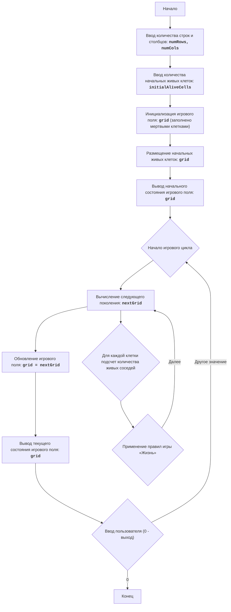

LIFE 2:
=================
מורכבות: 5
-----------------
משחק "החיים 2" הוא סימולציית אוטומט תאי, שפותחה על ידי ג'ון קונוויי. הוא מציג שדה של תאים, כאשר כל תא יכול להיות חי או מת. מצב תא בדור הבא תלוי במספר השכנים החיים בדור הנוכחי. המשחק מדגים כיצד כללים פשוטים יכולים להוביל להופעת תבניות מורכבות ומעניינות. השחקן יכול להגדיר תצורת התחלה של תאים חיים, ולצפות בהתפתחות התצורה הזו עם הזמן.
כללי המשחק:
1.  שדה המשחק מיוצג כרשת, כאשר כל תא יכול להיות חי (מסומן כ-'*') או מת (מסומן כרווח ' ').
2.  בתחילת המשחק המשתמש מתבקש להזין את מספר השורות והעמודות עבור שדה המשחק, וכן את מספר התאים החיים.
3.  לאחר הזנת הפרמטרים ההתחלתיים, השדה ממולא בתאים מתים, ולאחר מכן תאים חיים ממוקמים באופן אקראי, במספר שצוין על ידי המשתמש.
4.  לאחר אתחול השדה, התוכנה מציגה את מצב השדה ההתחלתי.
5.  איטרציות ממשיכות עד שהמשתמש יזין "0".
6.  עבור כל דור חדש:
    -   כל תא חי עם 2 או 3 שכנים חיים נשאר חי בדור הבא.
    -   כל תא חי עם פחות מ-2 שכנים חיים מת בדור הבא.
    -   כל תא חי עם יותר מ-3 שכנים חיים מת בדור הבא.
    -   כל תא מת נולד בדור הבא, אם יש לו בדיוק 3 שכנים חיים.
7.  השדה מוצג לאחר כל איטרציה.
-----------------
אלגוריתם:
1.  בקש מהמשתמש מספר שורות ועמודות עבור שדה המשחק.
2.  בקש מהמשתמש מספר תאים חיים התחלתי.
3.  אתחל את שדה המשחק כמטריצה, מלאה בתאים מתים (' ').
4.  מקם באופן אקראי את מספר התאים החיים שצוין על ידי המשתמש ('*') בשדה המשחק.
5.  הצג את מצב שדה המשחק ההתחלתי.
6.  הרץ לולאה אינסופית:
    6.1 חשב את הדור הבא של התאים:
        6.1.1 צור שדה חדש, על ידי העתקת השדה הנוכחי.
        6.1.2 עבור כל תא בשדה הנוכחי:
            6.1.2.1 ספור את מספר השכנים החיים.
            6.1.2.2 החל את כללי "החיים" כדי לקבוע את מצב התא בשדה החדש.
        6.1.3 החלף את השדה הנוכחי בשדה החדש.
    6.2 הצג את מצב שדה המשחק הנוכחי.
    6.3 בקש מהמשתמש קלט. אם הוכנס "0", סיים את המשחק, אחרת המשך.
-----------------
תרשים זרימה:

מקרא:
Start - התחלת התוכנית.
InputRowsCols - בקשת מספר שורות ועמודות לשדה המשחק מהמשתמש.
InputAliveCells - בקשת מספר התאים החיים ההתחלתי מהמשתמש.
InitializeGrid - אתחול שדה המשחק כמטריצה המלאה בתאים מתים (רווחים).
PlaceAliveCells - מיקום מספר התאים החיים שצוין (כוכביות) בשדה המשחק במיקומים אקראיים.
OutputGrid - הצגת מצב שדה המשחק ההתחלתי על המסך.
GameLoopStart - התחלת לולאת המשחק הראשית.
ComputeNextGeneration - חישוב הדור הבא של התאים על בסיס מצב השדה הנוכחי וכללי משחק "החיים".
CalculateNeighbors - עבור כל תא, ספירת מספר השכנים החיים.
ApplyRules - החלת כללי משחק «החיים» לקביעת מצב התא בדור הבא.
UpdateGrid - עדכון שדה המשחק הנוכחי, החלפתו בדור החדש.
OutputCurrentGrid - הצגת מצב שדה המשחק הנוכחי על המסך.
InputUserContinue - בקשה מהמשתמש להמשיך את המשחק (כל ערך למעט "0") או לצאת מהמשחק ("0").
End - סיום התוכנית.