LIFE:
=================
מורכבות: 7
-----------------
המשחק "החיים" (Game of Life) הוא סימולציה של אוטומט תאי, שפותח על ידי ג'ון קונוויי. שדה המשחק הוא רשת של תאים, שכל אחד מהם יכול להיות באחד משני מצבים: "חי" או "מת". מצב כל תא בדור הבא תלוי במצב שכניו בדור הנוכחי. מטרת המשחק היא להתבונן באבולוציה של תצורה ראשונית של תאים ולחקור תבניות מעניינות הנוצרות במהלך הסימולציה.

חוקי המשחק:
1.  שדה המשחק מורכב מתאים, שכל אחד מהם יכול להיות "חי" (מסומן באמצעות הסמל "*") או "מת" (מסומן באמצעות רווח).
2.  בתחילה השדה מאוכלס באופן אקראי או שנקבעת תצורה ספציפית של תאים.
3.  המעבר לדור הבא מתבצע על פי החוקים הבאים:
    -   תא חי עם פחות משני שכנים חיים מת מבדידות.
    -   תא חי עם שניים או שלושה שכנים חיים שורד לדור הבא.
    -   תא חי עם יותר משלושה שכנים חיים מת מצפיפות יתר.
    -   תא מת עם בדיוק שלושה שכנים חיים קם לתחייה.
4.  המשחק ממשיך למספר נתון של דורות.

-----------------
אלגוריתם:
1.  בקש מהמשתמש את מימדי השדה (מספר שורות ועמודות).
2.  בקש מהמשתמש את מספר הדורות לסימולציה.
3.  צור את הדור ההתחלתי:
    -   אם המשתמש הזין נתונים התחלתיים, השתמש בהם.
    -   אם לא, אכלס את השדה באופן אקראי בתאים חיים ומתים.
4.  עבור כל דור מ-1 ועד למספר הדורות שנקבע:
    4.1 הצג על המסך את הדור הנוכחי (מצב השדה).
    4.2 צור שדה חדש (הדור הבא), תוך יישום חוקי המשחק:
        -   עבור כל תא בשדה הנוכחי:
            -   ספור את מספר השכנים החיים.
            -   בהתאם למצב התא ומספר השכנים בדור הנוכחי, קבע את מצבו בשדה החדש לפי חוקי המשחק.
    4.3 עדכן את השדה הנוכחי באמצעות השדה החדש.
5.  עם סיום הסימולציה, הצג על המסך את המצב הסופי של השדה.

-----------------
דיאגרמת זרימה:

```mermaid
flowchart TD
    Start["Начало"] --> InputGridSize["Ввод размеров сетки: <code><b>rows, cols</b></code>"]
    InputGridSize --> InputGenerations["Ввод количества поколений: <code><b>generations</b></code>"]
    InputGenerations --> InputInitialConfig{"Ввод начальной конфигурации: <code><b>initial_config</b></code>"}
    InputInitialConfig --> CreateInitialGrid{"Создание начальной сетки: <code><b>grid</b></code>"}
    CreateInitialGrid --> LoopStart{"Начало цикла поколений: <code><b>for generation in range(generations)</b></code>"}
    LoopStart -- Да --> OutputCurrentGrid["Вывод текущей сетки: <code><b>grid</b></code>"]
    OutputCurrentGrid --> CreateNextGenerationGrid["Создание новой сетки: <code><b>next_grid</b></code>"]
    CreateNextGenerationGrid --> LoopCellsStart{"Начало цикла по клеткам: <code><b>for row in range(rows): for col in range(cols)</b></code>"}
    LoopCellsStart --> CountLiveNeighbours["Подсчет живых соседей: <code><b>live_neighbours</b></code>"]
    CountLiveNeighbours --> ApplyRules["Применение правил игры для определения состояния клетки в <code><b>next_grid</b></code>"]
    ApplyRules --> LoopCellsEnd{"Конец цикла по клеткам"}
    LoopCellsEnd --> UpdateCurrentGrid{"Обновление текущей сетки: <code><b>grid = next_grid</b></code>"}
    UpdateCurrentGrid --> LoopEnd{"Конец цикла поколений"}
     LoopEnd -- Да --> LoopStart
    LoopEnd -- Нет --> OutputFinalGrid["Вывод финальной сетки: <code><b>grid</b></code>"]
    OutputFinalGrid --> End["Конец"]

```

מקרא:
    Начало (Start) - תחילת התוכנית.
    Ввод размеров сетки (InputGridSize) - קליטת מימדי הרשת (מספר שורות ועמודות) מהמשתמש.
    Ввод количества поколений (InputGenerations) - קליטת מספר הדורות לסימולציה מהמשתמש.
    Ввод начальной конфигурации (InputInitialConfig) - קליטת התצורה ההתחלתית של התאים מהמשתמש.
    Создание начальной сетки (CreateInitialGrid) - יצירת הרשת ההתחלתית (grid) על בסיס המימדים שהוזנו והתצורה ההתחלתית. אם לא סופקה תצורה התחלתית, השדה מאוכלס באופן אקראי.
    Начало цикла поколений (LoopStart) - תחילת הלולאה המבצעת את מספר הדורות שנקבע.
    Вывод текущей сетки (OutputCurrentGrid) - הצגת מצב הרשת הנוכחי (grid) על המסך.
    Создание новой сетки (CreateNextGenerationGrid) - יצירת רשת חדשה (next_grid) שתייצג את הדור הבא.
    Начало цикла по клеткам (LoopCellsStart) - תחילת הלולאה עבור כל תא ברשת.
    Подсчет живых соседей (CountLiveNeighbours) - ספירת מספר השכנים החיים עבור התא הנוכחי.
    Применение правил игры (ApplyRules) - יישום חוקי המשחק (Conway's Game of Life) לקביעת מצב התא בדור הבא (next_grid) על בסיס מספר השכנים החיים ומצב התא הנוכחי.
    Конец цикла по клеткам (LoopCellsEnd) - סוף הלולאה עבור כל תא ברשת.
    Обновление текущей сетки (UpdateCurrentGrid) - עדכון הרשת הנוכחית (grid) באמצעות הרשת החדשה (next_grid).
    Конец цикла поколений (LoopEnd) - סוף לולאת הדורות. אם נותרו דורות נוספים, הלולאה חוזרת על עצמה.
    Вывод финальной сетки (OutputFinalGrid) - הצגת המצב הסופי של הרשת (grid) על המסך לאחר השלמת כל הדורות.
    Конец (End) - סוף התוכנית.