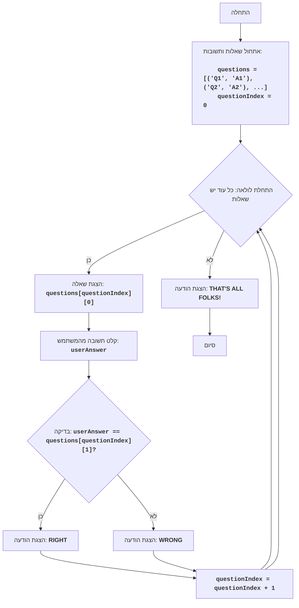

<LIT QZ>:
=================
מורכבות: 4
-----------------
המשחק "LIT QZ" הוא חידון שבו המחשב מציג שאלות והשחקן נדרש לענות עליהן. בגרסה המקורית של המשחק, השאלות והתשובות מקודדות כנתונים, אך אנו יכולים להפוך את החידון לאינטראקטיבי וניתן להרחבה יותר, כך שיהיה קל להוסיף שאלות ותשובות חדשות. המשחק בודק את ידיעות השחקן על ידי מעבר על סדרת שאלות.

כללי המשחק:
1. המחשב מציג שאלה.
2. השחקן מזין את תשובתו.
3. המחשב בודק את התשובה ומדווח אם היא נכונה.
4. המשחק נמשך עד שתמו כל השאלות.
5. בסיום המשחק, מוצגת הודעת סיום.
-----------------
אלגוריתם:
1. אתחול רשימת שאלות ותשובות.
2. הגדרת מונה השאלות ל-0.
3. התחלת לולאה "כל עוד יש שאלות":
   3.1. הצגת השאלה הנוכחית.
   3.2. קבלת קלט תשובה מהשחקן.
   3.3. השוואת התשובה שהוזנה עם התשובה הנכונה.
   3.4. אם התשובה נכונה, הצגת ההודעה "RIGHT".
   3.5. אם התשובה אינה נכונה, הצגת ההודעה "WRONG".
   3.6. הגדלת מונה השאלות ב-1.
4. הצגת ההודעה "THAT'S ALL FOLKS!"
5. סיום המשחק.
-----------------
תרשים זרימה:

מקרא:
    Start - התחלת התוכנית.
    InitializeQuestions - אתחול רשימת השאלות והתשובות, וכן הגדרת האינדקס ההתחלתי של השאלה ל-0.
    LoopStart - תחילת הלולאה, הנמשכת כל עוד יש שאלות ברשימה.
    DisplayQuestion - הצגת השאלה הנוכחית על המסך.
    InputAnswer - קבלת קלט תשובה מהמשתמש ושמירתו במשתנה userAnswer.
    CheckAnswer - בדיקה האם התשובה שהוזנה ב-userAnswer זהה לתשובה הנכונה מרשימת השאלות.
    OutputRight - הצגת ההודעה "RIGHT" אם התשובה נכונה.
    IncreaseIndex - הגדלת האינדקס של השאלה הנוכחית ב-1.
    OutputWrong - הצגת ההודעה "WRONG" אם התשובה אינה נכונה.
    OutputEnd - הצגת ההודעה "THAT'S ALL FOLKS!" לאחר סיום כל השאלות.
    End - סיום התוכנית.