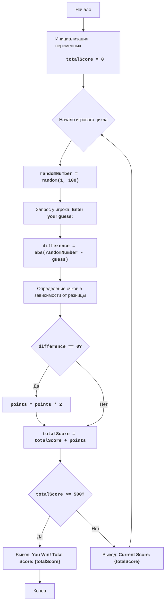

**משחק מספר אקראי:**
=================
רמת קושי: 6
-----------------
המשחק "NUMBER RANDOM NUMBER GAME" הוא משחק שבו השחקן מנסה לנחש מספר אקראי שנוצר על ידי המחשב. בניגוד למשחקים אחרים בהם ניתנים מספר ניסיונות, כאן לשחקן יש רק ניסיון אחד בכל משחק. נקודות מוענקות או נגרעות בהתאם למידת הקרבה של ניחוש השחקן למספר שנקבע. בנוסף, ישנה הזדמנות לקבל ג'קפוט, שמכפיל את כמות הנקודות. מטרת המשחק היא לצבור 500 נקודות.

כללי המשחק:
1. המחשב מייצר מספר אקראי בטווח שבין 1 ל-100.
2. השחקן מנחש פעם אחת.
3. נקודות מוענקות או נגרעות בהתאם למידת הקרבה של ניחוש השחקן למספר שנקבע:
    - הפרש 0: +100 נקודות (ג'קפוט, הנקודות מוכפלות)
    - הפרש מ-1 עד 5: +50 נקודות
    - הפרש מ-6 עד 10: +25 נקודות
    - הפרש מ-11 עד 20: -25 נקודות
    - הפרש מעל 20: -50 נקודות
4. השחקן מנצח אם הוא צובר 500 נקודות.

-----------------
אלגוריתם:
1. הגדר את כמות הנקודות ההתחלתית ל-0.
2. התחל את מחזור המשחק:
    2.1 יצר מספר אקראי בין 1 ל-100.
    2.2 בקש מהשחקן לנחש מספר.
    2.3 חשב את ההפרש בין המספר שנקבע לניחוש השחקן.
    2.4 קבע את כמות הנקודות שהשחקן יקבל בהתאם להפרש.
    2.5 אם השחקן ניחש את המספר, הכפל את כמות הנקודות.
    2.6 הוסף/גרע את הנקודות מסך הנקודות הכולל.
    2.7 אם סך הנקודות הכולל הוא 500 או יותר, הצג הודעת ניצחון וסיים את המשחק.
    2.8 הצג את סך הנקודות הנוכחי.
3. חזור לשלב 2.
4. אם המשחק הסתיים, צא מהמחזור.
-----------------
תרשים זרימה:

    
**מקרא**:
  Start - תחילת המשחק.
  InitializeScore - אתחול משתנה totalScore (סך הנקודות) ל-0.
  GameLoopStart - תחילת לולאת המשחק.
  GenerateRandomNumber - יצירת מספר אקראי בין 1 ל-100.
  GetGuess - בקשת ניחוש מהשחקן.
  CalculateDifference - חישוב ההפרש בין המספר שנקבע לניחוש השחקן.
  CalculatePoints - קביעת כמות הנקודות בהתאם להפרש.
  CheckJackpot - בדיקה האם ההפרש הוא 0 (ג'קפוט).
  DoublePoints - הכפלת כמות הנקודות במקרה של ג'קפוט.
  UpdateScore - עדכון סך הנקודות הכולל.
  CheckWin - בדיקה האם השחקן צבר 500 נקודות.
  OutputWin - הצגת הודעת ניצחון וסך הנקודות הכולל.
  End - סיום המשחק.
  OutputCurrentScore - הצגת סך הנקודות הנוכחי.
"""
import random

# אתחול סך הנקודות הכולל
totalScore = 0

# לולאת המשחק
while True:
    # יצירת מספר אקראי בין 1 ל-100
    randomNumber = random.randint(1, 100)
    
    # בקשת ניחוש מהשחקן
    try:
        guess = int(input("Enter your guess: "))
    except ValueError:
        print("Invalid input. Please enter a valid integer.")
        continue
    
    # חישוב ההפרש בין המספר שנקבע לניחוש השחקן
    difference = abs(randomNumber - guess)
    
    # קביעת כמות הנקודות בהתאם להפרש
    if difference == 0:
        points = 100
    elif difference <= 5:
        points = 50
    elif difference <= 10:
        points = 25
    elif difference <= 20:
        points = -25
    else:
        points = -50
    
    # אם השחקן ניחש את המספר, הכפלת כמות הנקודות
    if difference == 0:
        points *= 2

    # הוספת/גריעת נקודות מסך הנקודות הכולל
    totalScore += points
    
    # בדיקה האם השחקן ניצח
    if totalScore >= 500:
        print(f"You Win! Total Score: {totalScore}")
        break
        
    # הצגת סך הנקודות הנוכחי
    print(f"Current Score: {totalScore}")
"""
הסבר קוד:
1.  **ייבוא מודול `random`**:
    -   `import random`: מייבא את מודול `random`, המשמש ליצירת מספרים אקראיים.
2.  **אתחול משתנה `totalScore`**:
    -   `totalScore = 0`: מאתחל את המשתנה `totalScore` לאחסון סך הנקודות של השחקן, החל מ-0.
3.  **לולאה ראשית `while True`**:
    -   `while True:`: יוצר לולאה אינסופית, הנמשכת עד אשר תיעצר במפורש.
4.  **יצירת מספר אקראי**:
    -  `randomNumber = random.randint(1, 100)`: יוצר מספר שלם אקראי בטווח שבין 1 ל-100.
5.  **בקשת קלט מהמשתמש**:
    -  `try... except ValueError`:
        -  `guess = int(input("Enter your guess: "))`: מבקש מהשחקן לנחש מספר ומנסה להמיר אותו למספר שלם.
        -  `print("Invalid input. Please enter a valid integer.")`: אם הוזן קלט שאינו מספר שלם, מדפיס הודעת שגיאה.
        - `continue`: חוזר לתחילת הלולאה.
6. **חישוב ההפרש**:
    -   `difference = abs(randomNumber - guess)`: מחשב את הערך המוחלט של ההפרש בין המספר שנקבע לניחוש השחקן.
7.  **קביעת כמות הנקודות**:
    -   בלוק `if-elif-else` קובע את כמות הנקודות שהשחקן מקבל או מפסיד בהתאם להפרש:
        -   `if difference == 0:`: אם ההפרש שווה ל-0 (השחקן ניחש נכון), מוענקים 100 נקודות.
        -   `elif difference <= 5:`: אם ההפרש הוא בין 1 ל-5, מוענקים 50 נקודות.
        -   `elif difference <= 10:`: אם ההפרש הוא בין 6 ל-10, מוענקים 25 נקודות.
        -   `elif difference <= 20:`: אם ההפרש הוא בין 11 ל-20, נגרעים 25 נקודות.
        -   `else:`: אם ההפרש גדול מ-20, נגרעים 50 נקודות.
8.  **הכפלת נקודות במקרה של ג'קפוט**:
    -   `if difference == 0: points *= 2`: אם השחקן ניחש נכון, כמות הנקודות מוכפלת.
9.  **עדכון סך הנקודות הכולל**:
    -   `totalScore += points`: מוסיף (או גורע) את הנקודות שהוענקו מסך הנקודות הכולל של השחקן.
10. **בדיקת ניצחון**:
    - `if totalScore >= 500:`: אם סך הנקודות הכולל הוא 500 או יותר:
        -  `print(f"You Win! Total Score: {totalScore}")`: מדפיס הודעת ניצחון וסך הנקודות הכולל.
        -  `break`: יוצא מהלולאה, ומסיים את המשחק.
11. **הצגת סך הנקודות הנוכחי**:
    -   `print(f"Current Score: {totalScore}")`: מדפיס את סך הנקודות הנוכחי של השחקן לאחר כל ניסיון.
"""