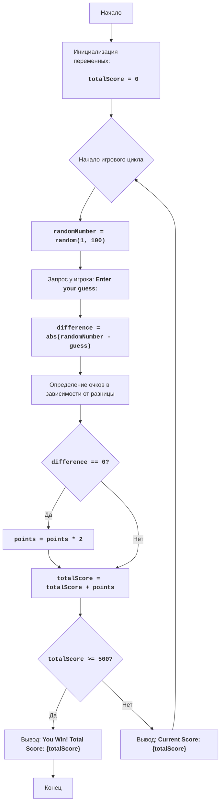

NUMBER RANDOM NUMBER GAME:
=================
מורכבות: 6
-----------------
המשחק "NUMBER RANDOM NUMBER GAME" הוא משחק שבו השחקן מנסה לנחש מספר אקראי שנוצר על ידי המחשב. בניגוד למשחקים אחרים שבהם ניתנים מספר ניסיונות, כאן לשחקן יש ניסיון אחד בלבד למשחק. נקודות נצברות או מופחתות בהתאם למידת הקרבה של ניחוש השחקן למספר הסודי. כמו כן, קיים סיכוי לזכות בג'קפוט, המכפיל את כמות הנקודות. מטרת המשחק היא לצבור 500 נקודות.

כללי המשחק:
1. המחשב מייצר מספר אקראי בטווח שבין 1 ל-100.
2. השחקן מבצע ניחוש אחד.
3. נקודות נצברות או מופחתות בהתאם למידת הקרבה של ניחוש השחקן למספר הסודי:
    - הפרש של 0: +100 נקודות (ג'קפוט, הנקודות מוכפלות)
    - הפרש מ-1 עד 5: +50 נקודות
    - הפרש מ-6 עד 10: +25 נקודות
    - הפרש מ-11 עד 20: -25 נקודות
    - הפרש מעל 20: -50 נקודות
4. השחקן מנצח אם הוא צובר 500 נקודות.

-----------------
אלגוריתם:
1. הגדרת כמות הנקודות ההתחלתית ל-0.
2. התחלת מחזור המשחק:
    2.1 ייצור מספר אקראי בין 1 ל-100.
    2.2 בקשת ניחוש מספר מהשחקן.
    2.3 חישוב ההפרש בין המספר הסודי לבין ניחוש השחקן.
    2.4 קביעת כמות הנקודות שהשחקן יקבל בהתאם להפרש.
    2.5 אם השחקן ניחש נכונה את המספר, הכפלת כמות הנקודות.
    2.6 הוספה/הפחתה של נקודות מהכמות הכוללת של הנקודות.
    2.7 אם הכמות הכוללת של הנקודות היא 500 או יותר, הצגת הודעת ניצחון וסיום המשחק.
    2.8 הצגת כמות הנקודות הנוכחית.
3. מעבר לשלב 2.
4. אם המשחק הסתיים, יציאה מהמחזור.
-----------------
תרשים זרימה:

    
**מקרא**:
  Start - תחילת המשחק.
  InitializeScore - אתחול המשתנה totalScore (כמות הנקודות הכוללת) ל-0.
  GameLoopStart - תחילת מחזור המשחק.
  GenerateRandomNumber - יצירת מספר אקראי מ-1 עד 100.
  GetGuess - בקשת ניחוש מספר מהשחקן.
  CalculateDifference - חישוב ההפרש בין המספר הסודי לבין ניחוש השחקן.
  CalculatePoints - קביעת כמות הנקודות בהתאם להפרש.
  CheckJackpot - בדיקה האם ההפרש הוא 0 (ג'קפוט).
  DoublePoints - הכפלת כמות הנקודות במקרה של ג'קפוט.
  UpdateScore - עדכון כמות הנקודות הכוללת.
  CheckWin - בדיקה האם השחקן צבר 500 נקודות.
  OutputWin - הצגת הודעת ניצחון וכמות הנקודות הכוללת.
  End - סוף המשחק.
  OutputCurrentScore - הצגת כמות הנקודות הנוכחית.
```python
import random

# Инициализация общего счета
totalScore = 0

# Игровой цикл
while True:
    # Генерируем случайное число от 1 до 100
    randomNumber = random.randint(1, 100)
    
    # Запрашиваем у игрока предположение числа
    try:
        guess = int(input("Enter your guess: "))
    except ValueError:
        print("Invalid input. Please enter a valid integer.")
        continue
    
    # Вычисляем разницу между загаданным числом и предположением игрока
    difference = abs(randomNumber - guess)
    
    # Определяем количество очков в зависимости от разницы
    if difference == 0:
        points = 100
    elif difference <= 5:
        points = 50
    elif difference <= 10:
        points = 25
    elif difference <= 20:
        points = -25
    else:
        points = -50
    
    # Если игрок угадал число, удваиваем количество очков
    if difference == 0:
        points *= 2

    # Добавляем/вычитаем очки из общего количества очков
    totalScore += points
    
    # Проверяем, выиграл ли игрок
    if totalScore >= 500:
        print(f"You Win! Total Score: {totalScore}")
        break
        
    # Выводим текущее количество очков
    print(f"Current Score: {totalScore}")
```
הסבר הקוד:
1.  **ייבוא המודול `random`**:
    -   `import random`: מייבא את המודול `random`, המשמש ליצירת מספרים אקראיים.
2.  **אתחול המשתנה `totalScore`**:
    -   `totalScore = 0`: מאתחל את המשתנה `totalScore` לאחסון כמות הנקודות הכוללת של השחקן, החל מ-0.
3.  **הלולאה הראשית `while True`**:
    -   `while True:`: יוצר לולאה אינסופית, הנמשכת עד שהיא נקטעת באופן מפורש.
4.  **יצירת מספר אקראי**:
    -  `randomNumber = random.randint(1, 100)`: מייצר מספר שלם אקראי בטווח שבין 1 ל-100.
5.  **בקשת קלט מהמשתמש**:
    -  `try... except ValueError`:
        -  `guess = int(input("Enter your guess: "))`: מבקש מהשחקן ניחוש מספר ומנסה להמיר אותו למספר שלם.
        -  `print("Invalid input. Please enter a valid integer.")`: אם הוזן ערך שאינו מספר שלם, מדפיס הודעת שגיאה.
        - `continue`:  חוזר לתחילת הלולאה.
6. **חישוב ההפרש**:
    -   `difference = abs(randomNumber - guess)`: מחשב את הערך המוחלט של ההפרש בין המספר הסודי לבין ניחוש השחקן.
7.  **קביעת כמות הנקודות**:
    -   בלוק ה-`if-elif-else` קובע את כמות הנקודות שהשחקן מקבל או מפסיד בהתאם להפרש:
        -   `if difference == 0:`: אם ההפרש שווה ל-0 (השחקן ניחש נכונה את המספר), נצברות 100 נקודות.
        -   `elif difference <= 5:`: אם ההפרש הוא מ-1 עד 5, נצברות 50 נקודות.
        -   `elif difference <= 10:`: אם ההפרש הוא מ-6 עד 10, נצברות 25 נקודות.
        -   `elif difference <= 20:`: אם ההפרש הוא מ-11 עד 20, מופחתות 25 נקודות.
        -   `else:`: אם ההפרש גדול מ-20, מופחתות 50 נקודות.
8.  **הכפלת נקודות במקרה של ג'קפוט**:
    -   `if difference == 0: points *= 2`: אם השחקן ניחש נכונה את המספר, כמות הנקודות מוכפלת.
9.  **עדכון הניקוד הכולל**:
    -   `totalScore += points`: מוסיף (או מפחית) את הנקודות שנצברו מהניקוד הכולל של השחקן.
10. **בדיקה אם השחקן ניצח**:
    - `if totalScore >= 500:`: אם כמות הנקודות הכוללת היא 500 או יותר:
        -  `print(f"You Win! Total Score: {totalScore}")`: מדפיס הודעת ניצחון ואת כמות הנקודות הכוללת.
        -  `break`: יוצא מהלולאה, ובכך מסיים את המשחק.
11. **הצגת הניקוד הנוכחי**:
    -   `print(f"Current Score: {totalScore}")`: מדפיס את הניקוד הנוכחי של השחקן לאחר כל ניסיון.