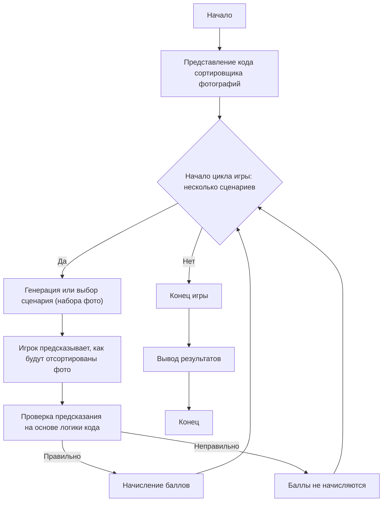

PHOTO SORTER:
=================
רמת קושי: 7
-----------------
המשחק "ממיין תמונות" הוא משחק לימודי הבוחן הבנה של פעולת תוכנית למיון תמונות לפי תאריך יצירתן. השחקן, שאין לו יכולת להריץ את הקוד ישירות, מנתח את התנהגותו ומנבא את תוצאת פעולת התוכנית עבור תרחישים ספציפיים. מטרת המשחק היא ללמוד להבין כיצד התוכנית מעבדת קבצים, מחלצת מטא-נתונים ומארגנת אותם בתיקיות.

כללי המשחק:
1. לשחקן מוצג תיאור של קוד למיון תמונות.
2. לשחקן מוצגים מספר תרחישים (סטים של קבצים עם תאריכי יצירה/צילום שונים).
3. עבור כל תרחיש, על השחקן לנבא כיצד התוכנית תמיין את התמונות, כלומר אילו קבצים ימוקמו באילו תיקיות, בהתבסס על הלוגיקה של הקוד.
4. השחקן מקבל נקודות עבור ניבויים נכונים.
5. המשחק מורכב ממספר סבבים, בכל פעם עם תרחיש חדש.
-----------------
האלגוריתם:
1. **הצגת הקוד:** לשחקן מוצג קוד Python הממיין תמונות לפי תאריך צילום (מ-EXIF) או תאריך יצירת קובץ.
2. **יצירת תרחיש:** נוצר או נבחר ידנית תרחיש, המהווה סט של קבצים (תמונות) עם תאריכי יצירה או נתוני EXIF שונים.
3. **ניבוי השחקן:** השחקן מנתח את הקוד ומנבא לאילו תיקיות ימוקמו הקבצים. לשם כך:
   - לנתח את הלוגיקה של הפונקציה `get_date`, שמנסה קודם לחלץ את התאריך מ-EXIF, ואם אין EXIF, אז משתמשת בתאריך יצירת הקובץ.
   - לנתח את הלוגיקה של הפונקציה `sort_photos`, שעוברת על כל הקבצים בתיקיית המקור, קובעת את תאריכם ומעבירה אותם לתיקייה עם תאריך זה.
4. **בדיקת הניבוי:** נכונות הניבוי מושווית לתוצאה הצפויה, בהתבסס על אלגוריתם התוכנית.
5. **הערכה:** השחקן מקבל נקודות עבור כל ניבוי נכון.
6. **חזרה:** שלבים 2-5 חוזרים על עצמם עבור מספר תרחישים.
7. **סיום:** המשחק מסתיים, ומסוכם מספר הנקודות הכולל.

-----------------
דיאגרמת זרימה:

מקרא:
   Start - תחילת המשחק.
    PresentCode - הצגת קוד מיון התמונות לשחקן.
    GameLoopStart - תחילת לולאת המשחק, הנמשכת עד שתמו התרחישים.
    GenerateScenario - יצירה או בחירה של תרחיש עם קבצים ותאריכיהם.
    PlayerPredict - השחקן מנבא לאילו תיקיות יועברו הקבצים.
    CheckPrediction - בדיקת הניבוי בהתבסס על לוגיקת הקוד.
    AwardPoints - הענקת נקודות עבור תשובה נכונה.
    NoPoints - נקודות אינן מוענקות עבור תשובה שגויה.
    EndGame - סיום המשחק.
    OutputScore - הצגת סך הנקודות.
    End - סיום התוכנית.
"""

import os
import shutil
from PIL import Image
from PIL.ExifTags import TAGS
from datetime import datetime

# הנתיב לתיקיית התמונות
source_folder = "/path/to/photos"
destination_folder = "/path/to/sorted_photos"

# קבלת תאריך הצילום מטא-נתונים או תאריך יצירת הקובץ
def get_date(photo_path):
    try:
        # מנסים לקבל תאריך מ-EXIF
        image = Image.open(photo_path)
        exif_data = image._getexif()
        if exif_data:
            for tag, value in exif_data.items():
                if TAGS.get(tag) == "DateTimeOriginal":
                    return value.split(" ")[0].replace(":", "-")
    except Exception as e:
        print(f"# שגיאה בקריאת EXIF עבור {photo_path}: {e}")

    # אם EXIF אינו זמין, משתמשים בתאריך יצירת הקובץ
    try:
        creation_time = os.path.getctime(photo_path)
        return datetime.fromtimestamp(creation_time).strftime("%Y-%m-%d")
    except Exception as e:
        print(f"# שגיאה בקבלת תאריך יצירה עבור {photo_path}: {e}")
        return "unknown"

# מיון תמונות
def sort_photos():
    for filename in os.listdir(source_folder):
        file_path = os.path.join(source_folder, filename)

        # בודקים אם הקובץ הוא תמונה
        if os.path.isfile(file_path) and filename.lower().endswith((".jpg", ".jpeg", ".png")):
            date_folder_name = get_date(file_path)

            # יוצרים תיקייה לפי התאריך
            date_folder = os.path.join(destination_folder, date_folder_name)
            os.makedirs(date_folder, exist_ok=True)

            # מעבירים את הקובץ
            shutil.move(file_path, os.path.join(date_folder, filename))
            print(f"{filename} → {date_folder}")

# מפעילים את המיון
# sort_photos()

"""
הסבר הקוד:

1.  **ייבוא מודולים:**
    *   `os`: לעבודה עם מערכת הקבצים (נתיבים, יצירת ספריות וכו').
    *   `shutil`: לפעולות על קבצים (העברה).
    *   `PIL (Pillow)`: לעבודה עם תמונות והמטא-נתונים שלהן (EXIF).
    *   `datetime`: לעבודה עם תאריכים.

2.  **נתיבי בסיס:**
    *   `source_folder`: הנתיב לתיקייה בה שמורות התמונות.
    *   `destination_folder`: הנתיב לתיקייה אליה יועברו התמונות הממוינות.

3.  **הפונקציה `get_date(photo_path)`:**
    *   מנסה לקבל את תאריך הצילום מנתוני ה-EXIF של התמונה.
        *   פותחת את התמונה באמצעות `PIL`.
        *   מקבלת את נתוני ה-EXIF (`_getexif()`).
        *   מחפשת את התגית `DateTimeOriginal` ב-EXIF. אם נמצאה, מחזירה את התאריך.
    *   אם נתוני EXIF לא נמצאו או אירעה שגיאה, משתמשת בתאריך יצירת הקובץ.
    *   מחזירה את התאריך בפורמט 'YYYY-MM-DD' או 'unknown', אם לא ניתן היה לקבל תאריך.

4.  **הפונקציה `sort_photos()`:**
    *   עוברת על כל הקבצים בתיקייה `source_folder`.
    *   בודקת אם הקובץ הוא תמונה (לפי סיומת: `.jpg`, `.jpeg`, `.png`).
    *   מקבלת את תאריך הצילום או היצירה של הקובץ, באמצעות `get_date()`.
    *   יוצרת תיקייה בשם התאריך שהתקבל (לדוגמה, `2023-10-26`) בתוך `destination_folder` (אם תיקייה כזו אינה קיימת, היא תיווצר).
    *   מעבירה את קובץ התמונה לתיקייה שנוצרה.
    *   מדפיסה למסוף מידע על העברת הקובץ.

5.  **הפעלת המיון:**
    *   קריאה לפונקציה `sort_photos()` להפעלת תהליך המיון.

**נקודות חשובות:**

*   **EXIF:** מטא-נתונים של תמונות מכילים מידע על הצילום (תאריך, שעה, פרמטרי מצלמה וכו').
*   **טיפול בשגיאות:** הקוד מטפל בשגיאות אפשריות בעת קריאת EXIF או קבלת תאריך יצירה.
*   **אבטחה:** חשוב לא להריץ את הסקריפט ישירות מבלי להבין את פעולתו, מכיוון שהוא מעביר קבצים.

**כיצד להשתמש במשחק:**

1.  **הצגת הקוד:** הציגו לשחקן את הקוד המוצג (הוא כלול בתיאור המשחק).
2.  **יצירת תרחישים:** צרו מספר סטים של קבצים עם תאריכי יצירה ו-EXIF שונים. לדוגמה:
    *   **תרחיש 1:** קובץ עם EXIF (2023-10-26), קובץ ללא EXIF (תאריך יצירה 2023-10-27).
    *   **תרחיש 2:** קובץ עם EXIF (2023-10-25), קובץ ללא EXIF (תאריך יצירה 2023-10-25).
    *   **תרחיש 3:** קובץ עם EXIF (2023-11-01), קובץ ללא EXIF, וקובץ נוסף ללא EXIF (תאריך יצירה 2023-10-31).
3.  **ניבוי:** שאלו את השחקן לאילו תיקיות יועברו הקבצים.
4.  **בדיקה:** השוו את הניבויים לתוצאות הצפויות בהתבסס על לוגיקת הקוד.
"""

**דוגמת תרחיש משחק**

1.  **הצגת הקוד:** לשחקן מראים את הקוד שימיין את התמונות.
2.  **תרחיש 1:**
    *   `photo1.jpg`: עם תאריך צילום ב-EXIF: 2023-11-05.
    *   `photo2.jpg`: ללא EXIF, תאריך יצירת קובץ: 2023-11-06.
    *   `photo3.png`: ללא EXIF, תאריך יצירת קובץ: 2023-11-05.
    
    **שאלה לשחקן:** לאילו תיקיות יועברו הקבצים `photo1.jpg`, `photo2.jpg`, `photo3.png`?
    
    **תשובה צפויה:**
    *   `photo1.jpg` יהיה בתיקייה "2023-11-05".
    *   `photo2.jpg` יהיה בתיקייה "2023-11-06".
    *   `photo3.png` יהיה בתיקייה "2023-11-05".

3.  **תרחיש 2:**
    *   `image1.jpg`: עם תאריך צילום ב-EXIF: 2023-12-20
    *   `image2.jpg`: ללא EXIF, תאריך יצירת קובץ: 2023-12-20
    
    **שאלה לשחקן:** לאילו תיקיות יועברו הקבצים `image1.jpg`, `image2.jpg`?
    
    **תשובה צפויה:**
    *   `image1.jpg` יהיה בתיקייה "2023-12-20".
    *  `image2.jpg` יהיה בתיקייה "2023-12-20".

דוגמה זו מדגימה כיצד ניתן להפוך את הקוד למשחק לימודי, שבו השחקן מנבא את התנהגות התוכנית, ולא מתקיים אינטראקציה ישירה איתה.