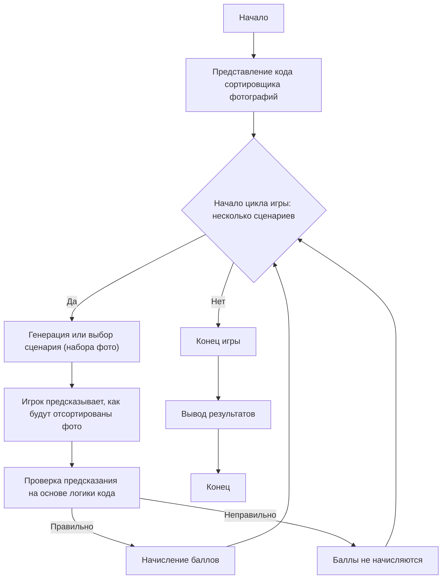

PHOTO SORTER:
=================
רמת קושי: 7
-----------------
המשחק "ממיין התמונות" הוא משחק לימודי הבוחן הבנה של פעולת תוכנה למיון תמונות לפי תאריך יצירתן. השחקן, ללא יכולת להריץ את הקוד ישירות, מנתח את התנהגותו וחוזה את תוצאת פעולת התוכנה עבור תרחישים ספציפיים. מטרת המשחק היא ללמוד להבין כיצד התוכנה מעבדת קבצים, מחלצת מטא-דאטה ומארגנת אותם בתיקיות.

כללי המשחק:
1. לשחקן מסופק תיאור של קוד למיון תמונות.
2. לשחקן מוצגים מספר תרחישים (אוספים של קבצים עם תאריכי יצירה/צילום שונים).
3. עבור כל תרחיש, על השחקן לחזות כיצד התוכנה תמיין את התמונות, כלומר לאילו תיקיות יוכנסו אילו קבצים, על בסיס לוגיקת פעולת הקוד.
4. השחקן מקבל נקודות עבור חיזויים נכונים.
5. המשחק מורכב ממספר סבבים, כל פעם עם תרחיש חדש.
-----------------
אלגוריתם:
1. **הצגת הקוד:** לשחקן מסופק קוד Python הממיין תמונות לפי תאריך הצילום (מתוך EXIF) או תאריך יצירת הקובץ.
2. **יצירת תרחיש:** נוצר או נבחר ידנית תרחיש, המייצג אוסף של קבצים (תמונות) עם תאריכי יצירה או נתוני EXIF שונים.
3. **חיזוי השחקן:** השחקן מנתח את הקוד וחוזה לאילו תיקיות יוכנסו הקבצים. לשם כך:
   - יש לנתח את לוגיקת הפונקציה `get_date`, המנסה תחילה לחלץ את התאריך מתוך EXIF, ואם אין EXIF, משתמשת בתאריך יצירת הקובץ.
   - יש לנתח את לוגיקת הפונקציה `sort_photos`, הסורקת את כל הקבצים בתיקיית המקור, קובעת את תאריכם ומעבירה אותם לתיקייה עם תאריך זה.
4. **בדיקת החיזוי:** נכונות החיזוי מושווית לתוצאה הצפויה, המבוססת על אלגוריתם התוכנה.
5. **הערכה:** השחקן מקבל נקודות עבור כל חיזוי נכון.
6. **חזרה:** שלבים 2-5 חוזרים על עצמם עבור מספר תרחישים.
7. **סיום:** המשחק מסתיים, ומספר הנקודות הכולל מוצג.

-----------------
תרשים זרימה:

מקרא:
   Start - התחלת המשחק.
    PresentCode - הצגת קוד ממיין התמונות לשחקן.
    GameLoopStart - תחילת מחזור המשחק, הנמשך עד שנגמרים התרחישים.
    GenerateScenario - יצירה או בחירה של תרחיש עם קבצים ותאריכיהם.
    PlayerPredict - השחקן חוזה לאילו תיקיות יגיעו הקבצים.
    CheckPrediction - בדיקת החיזוי על בסיס לוגיקת פעולת הקוד.
    AwardPoints - צבירת נקודות עבור תשובה נכונה.
    NoPoints - נקודות אינן נצברות עבור תשובה שגויה.
    EndGame - סיום המשחק.
    OutputScore - הצגת מספר הנקודות הכולל.
    End - סיום התוכנית.
"""

import os
import shutil
from PIL import Image
from PIL.ExifTags import TAGS
from datetime import datetime

# נתיב לתיקיית התמונות
source_folder = "/path/to/photos"
destination_folder = "/path/to/sorted_photos"

# קבלת תאריך הצילום מתוך מטא-דאטה או תאריך יצירת הקובץ
def get_date(photo_path):
    try:
        # מנסים לקבל את התאריך מתוך EXIF
        image = Image.open(photo_path)
        exif_data = image._getexif()
        if exif_data:
            for tag, value in exif_data.items():
                if TAGS.get(tag) == "DateTimeOriginal":
                    return value.split(" ")[0].replace(":", "-")
    except Exception as e:
        print(f"שגיאה בקריאת EXIF עבור {photo_path}: {e}")

    # אם EXIF אינו זמין, משתמשים בתאריך יצירת הקובץ
    try:
        creation_time = os.path.getctime(photo_path)
        return datetime.fromtimestamp(creation_time).strftime("%Y-%m-%d")
    except Exception as e:
        print(f"שגיאה בקבלת תאריך יצירה עבור {photo_path}: {e}")
        return "unknown"

# מיון התמונות
def sort_photos():
    for filename in os.listdir(source_folder):
        file_path = os.path.join(source_folder, filename)

        # בודקים האם הקובץ הוא תמונה
        if os.path.isfile(file_path) and filename.lower().endswith((".jpg", ".jpeg", ".png")):
            date_folder_name = get_date(file_path)

            # יוצרים תיקייה לפי התאריך
            date_folder = os.path.join(destination_folder, date_folder_name)
            os.makedirs(date_folder, exist_ok=True)

            # מעבירים את הקובץ
            shutil.move(file_path, os.path.join(date_folder, filename))
            print(f"{filename} → {date_folder}")

# מריצים את המיון
# sort_photos()

"""
הסבר הקוד:

1.  **ייבוא מודולים:**
    *   `os`: לעבודה עם מערכת הקבצים (נתיבים, יצירת ספריות, וכו').
    *   `shutil`: לפעולות על קבצים (העברה).
    *   `PIL (Pillow)`: לעבודה עם תמונות ומטא-דאטה שלהן (EXIF).
    *   `datetime`: לעבודה עם תאריכים.

2.  **נתיבים התחלתיים:**
    *   `source_folder`: נתיב לתיקייה שבה מאוחסנות התמונות.
    *   `destination_folder`: נתיב לתיקייה שאליה יועברו התמונות הממוינות.

3.  **פונקציה `get_date(photo_path)`:**
    *   מנסה לקבל את תאריך הצילום מתוך נתוני EXIF של התמונה.
        *   פותחת את התמונה באמצעות `PIL`.
        *   מקבלת את נתוני ה-EXIF (`_getexif()`).
        *   מחפשת את התגית `DateTimeOriginal` ב-EXIF. אם מוצאת, מחזירה את התאריך.
    *   אם נתוני EXIF לא נמצאו או אירעה שגיאה, משתמשת בתאריך יצירת הקובץ.
    *   מחזירה את התאריך בפורמט 'YYYY-MM-DD' או 'unknown' אם לא ניתן לקבל תאריך.

4.  **פונקציה `sort_photos()`:**
    *   עוברת על כל הקבצים בתיקייה `source_folder`.
    *   בודקת האם הקובץ הוא תמונה (לפי סיומת: `.jpg`, `.jpeg`, `.png`).
    *   מקבלת את תאריך הצילום או היצירה של הקובץ, באמצעות `get_date()`.
    *   יוצרת תיקייה בשם התאריך שהתקבל (לדוגמה, `2023-10-26`) בתוך `destination_folder` (אם תיקייה כזו אינה קיימת, היא תיווצר).
    *   מעבירה את קובץ התמונה לתיקייה שנוצרה.
    *   מציגה בקונסולה מידע על העברת הקובץ.

5.  **הפעלת המיון:**
    *   קריאה לפונקציה `sort_photos()` להפעלת תהליך המיון.

**נקודות חשובות:**

*   **EXIF:** מטא-דאטה של תמונות מכיל מידע על הצילום (תאריך, שעה, פרמטרי מצלמה, וכו').
*   **טיפול בשגיאות:** הקוד מטפל בשגיאות אפשריות בקריאת EXIF או בקבלת תאריך יצירה.
*   **זהירות:** חשוב לא להריץ סקריפט זה ישירות מבלי להבין את פעולתו, מכיוון שהוא מעביר קבצים.

**כיצד להשתמש במשחק:**

1.  **הצגת הקוד:** הראו לשחקן את הקוד המוצג (הוא כלול בתיאור המשחק).
2.  **יצירת תרחישים:** גיבשו מספר סטים של קבצים עם תאריכי יצירה ו-EXIF שונים. לדוגמה:
    *   **תרחיש 1:** קובץ עם EXIF (2023-10-26), קובץ ללא EXIF (תאריך יצירה 2023-10-27).
    *   **תרחיש 2:** קובץ עם EXIF (2023-10-25), קובץ ללא EXIF (תאריך יצירה 2023-10-25).
    *   **תרחיש 3:** קובץ עם EXIF (2023-11-01), קובץ ללא EXIF, וקובץ ללא EXIF (תאריך יצירה 2023-10-31).
3.  **חיזוי:** שאלו את השחקן לאילו תיקיות יוכנסו הקבצים.
4.  **בדיקה:** השוו את החיזויים לתוצאות הצפויות על בסיס לוגיקת הקוד.
"""

**דוגמת תרחיש משחק**

1.  **הצגת קוד:** לשחקן מראים את הקוד שימיין את התמונות.
2.  **תרחיש 1:**
    *   `photo1.jpg`: עם תאריך צילום EXIF 2023-11-05.
    *   `photo2.jpg`: ללא EXIF, תאריך יצירת קובץ 2023-11-06.
    *   `photo3.png`: ללא EXIF, תאריך יצירת קובץ 2023-11-05.
    
    **שאלה לשחקן:** לאילו תיקיות יגיעו הקבצים `photo1.jpg`, `photo2.jpg`, `photo3.png`?
    
    **תשובה צפויה:**
    *   `photo1.jpg` יהיה בתיקייה "2023-11-05".
    *   `photo2.jpg` יהיה בתיקייה "2023-11-06".
    *   `photo3.png` יהיה בתיקייה "2023-11-05".

3.  **תרחיש 2:**
    *   `image1.jpg`: עם תאריך צילום EXIF 2023-12-20
    *   `image2.jpg`: ללא EXIF, תאריך יצירת קובץ 2023-12-20
    
    **שאלה לשחקן:** לאילו תיקיות יגיעו הקבצים `image1.jpg`, `image2.jpg`?
    
    **תשובה צפויה:**
    *   `image1.jpg` יהיה בתיקייה "2023-12-20".
    *  `image2.jpg` יהיה בתיקייה "2023-12-20".

דוגמה זו ממחישה כיצד ניתן להפוך קוד למשחק לימודי, שבו השחקן חוזה את התנהגות התוכנית, במקום לבצע אינטראקציה ישירה איתה.