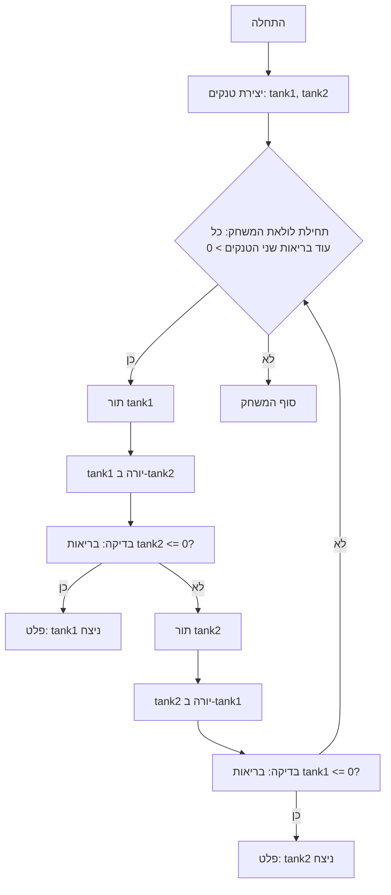

# טנקים (משחק טקסט)
=================
רמת מורכבות: 3
-----------------
משחק טקסט פשוט בו שני טנקים יורים זה על זה לסירוגין עד שאחד מהם מושמד.

## כללים

1.  לשני הטנקים מאפיינים: בריאות, נזק ושריון.
2.  הטנקים יורים זה על זה לסירוגין.
3.  הנזק נגרם באופן אקראי בטווח נתון.
4.  לטנק-על יש בריאות ושריון מוגברים.
5.  המשחק מסתיים כאשר בריאותו של אחד הטנקים מגיעה ל-0.
-----------------
## אלגוריתם:

1. יצירת מחלקות עבור `Tank` ו-`SuperTank`, שיש להן מאפיינים `model`, `armor`, `min_damage`, `max_damage`, ו-`health`.
2. מימוש מתודה `health_down` להפחתת בריאות הטנק.
3. מימוש מתודה `shot` לגרימת נזק ליריב.
4. יצירת מתודה `calculate_damage` לחישוב נזק אקראי.
5. בחלק הראשי של התוכנית, יצירת מופעים של הטנקים.
6. ארגון לולאה בה הטנקים יורים זה על זה לסירוגין, עד שאחד הטנקים מושמד (בריאות 0).
7. הדפסת הודעת ניצחון כאשר אחד הטנקים מושמד.
-----------------
## דיאגרמת זרימה:


**מקרא**:
  Start - תחילת המשחק.
  CreateTanks - יצירת מופעים של טנקים (tank1 ו-tank2).
  GameLoopStart - תחילת לולאת המשחק (כל עוד בריאות שני הטנקים > 0).
  Tank1Turn - תור הטנק tank1.
  Tank1Shot - tank1 יורה ב-tank2.
  CheckTank2Health - בדיקה: בריאות tank2 <= 0?
   OutputTank1Win - פלט הודעה על ניצחון tank1.
  Tank2Turn - תור הטנק tank2.
  Tank2Shot - tank2 יורה ב-tank1.
  CheckTank1Health - בדיקה: בריאות tank1 <= 0?
   OutputTank2Win - פלט הודעה על ניצחון tank2.
  End - סוף המשחק.
"""
## דוגמת ריצת התוכנית
```
מתחיל קרב טנקים!
ל-T-34 שריון קדמי של 50 מ"מ עם 100 נקודות בריאות ונזק בטווח של 20 עד 30 יחידות
לטייגר שריון קדמי של 80 מ"מ עם 150 נקודות בריאות ונזק בטווח של 25 עד 35 יחידות
    
T-34:
פגיעה ישירה, ליריב טייגר נותרו 120 נקודות בריאות
    
טייגר:
מפקד, פגעו בצוות ה-T-34, נותרו לנו 77 נקודות בריאות
    
T-34:
פגיעה ישירה, ליריב טייגר נותרו 87 נקודות בריאות
   
טייגר:
מפקד, פגעו בצוות ה-T-34, נותרו לנו 49 נקודות בריאות
    
T-34:
צוות הטנק טייגר הושמד
    
ה-T-34 ניצח!
```
## מגבלות אפשריות
- ממשק טקסטואלי.
- אינטראקציה מוגבלת עם המשתמש (צפייה בתוצאות בלבד).
```