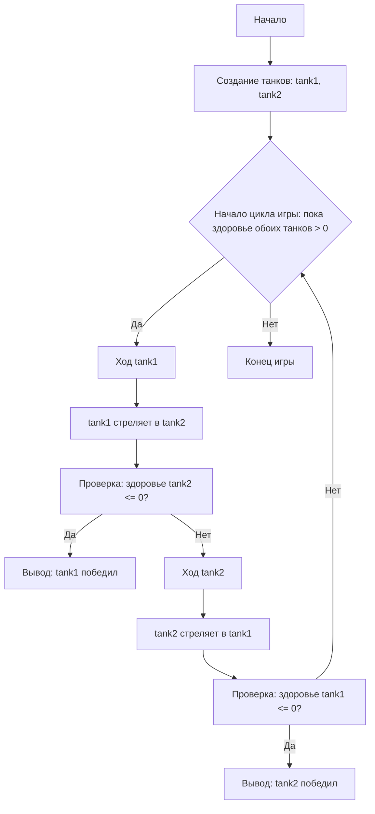

# טנקים (משחק טקסט)
=================
מורכבות: 3
-----------------
משחק טקסט פשוט שבו שני טנקים מחליפים יריות זה עם זה עד שאחד מהם מושמד.

## כללים

1.  לשני הטנקים יש מאפיינים: בריאות, נזק ושריון.
2.  הטנקים יורים זה בזה בתורם.
3.  הנזק נגרם באופן אקראי בטווח מוגדר מראש.
4.  לסופר-טנק יש בריאות ושריון משופרים.
5.  המשחק מסתיים כאשר רמת הבריאות של אחד הטנקים מגיעה ל-0.
-----------------
## אלגוריתם:

1. צור מחלקות עבור `Tank` ו-`SuperTank`, בעלות המאפיינים `model`, `armor`, `min_damage`, `max_damage`, ו-`health`.
2. הטמע שיטה (`method`) בשם `health_down` להפחתת בריאות הטנק.
3. הטמע שיטה (`method`) בשם `shot` לגרימת נזק ליריב.
4. צור שיטה (`method`) בשם `calculate_damage` לחישוב נזק אקראי.
5. בחלק הראשי של התוכנית, צור מופעים (instances) של הטנקים.
6. ארגן לולאה שבה הטנקים ירו זה בזה בתורם, עד שאחד הטנקים יושמד (בריאות 0).
7. הצג הודעת ניצחון כאשר אחד הטנקים יושמד.
-----------------
## דיאגרמת זרימה:


**מקרא**:
  Start - תחילת המשחק.
  CreateTanks - יצירת מופעים של הטנקים (tank1 ו-tank2).
  GameLoopStart - תחילת לולאת המשחק (כל עוד הבריאות של שני הטנקים > 0).
  Tank1Turn - תורו של הטנק tank1.
  Tank1Shot - tank1 יורה ב-tank2.
  CheckTank2Health - בדיקה: האם בריאות tank2 <= 0?
   OutputTank1Win - הצגת הודעה על ניצחון tank1.
  Tank2Turn - תורו של הטנק tank2.
  Tank2Shot - tank2 יורה ב-tank1.
  CheckTank1Health - בדיקה: האם בריאות tank1 <= 0?
   OutputTank2Win - הצגת הודעה על ניצחון tank2.
  End - סוף המשחק.

## דוגמה לריצת התוכנית
```
מתחיל קרב טנקים!
ל-T-34 יש שריון חזית בעובי 50 מ"מ עם 100 יח' בריאות ונזק בטווח של 20 עד 30 יחידות
לטיגר יש שריון חזית בעובי 80 מ"מ עם 150 יח' בריאות ונזק בטווח של 25 עד 35 יחידות
    
T-34:
בדיוק למטרה, ליריב טיגר נותרו 120 יחידות בריאות
    
טיגר:
מפקד, צוות T-34 נפגע, נותרו לנו 77 נקודות בריאות
    
T-34:
בדיוק למטרה, ליריב טיגר נותרו 87 יחידות בריאות
   
טיגר:
מפקד, צוות T-34 נפגע, נותרו לנו 49 נקודות בריאות
    
T-34:
צוות טנק טיגר הושמד
    
T-34 ניצח!
```
## מגבלות אפשריות
- ממשק טקסטואלי.
- אינטראקציה מוגבלת עם המשתמש (צפייה בתוצאות בלבד).
```